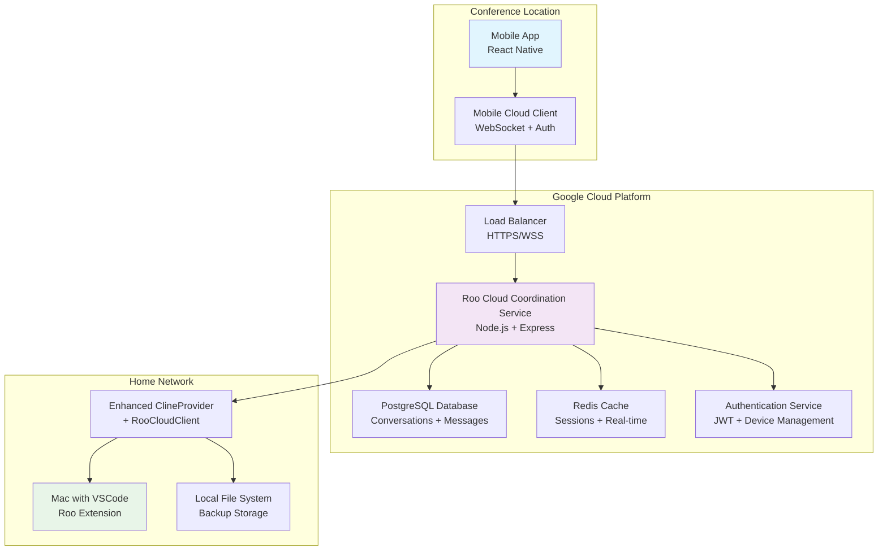

# Architecture Update Summary

**Document Version**: 1.0  
**Last Updated**: June 22, 2025  
**Status**: Complete

---

## 🎯 **Overview**

This document summarizes the comprehensive architecture updates made to capture the detailed cloud-first approach for Roo's cross-device functionality, specifically addressing the "conference remote control" scenario where users can control their home development environment from mobile devices.

## 📋 **Documents Updated**

### **1. New Cloud Architecture Document**

**File**: `https://github.com/tim-gameplan/Roo-Code/blob/main/docs/architecture/cloud-architecture.md`  
**Status**: ✅ Created

**Key Additions**:

- Complete cloud topology with Google Cloud VM coordination service
- Real-world scenario documentation (phone at conference controlling Mac at home)
- Detailed component architecture for mobile app, cloud service, and home extension
- WebSocket protocol design with message types and authentication flow
- Database schema extensions for device management and command queuing
- Security implementation with end-to-end encryption
- Performance specifications and monitoring requirements
- Deployment architecture and operational procedures

**Critical Components Documented**:

- **Roo Cloud Coordination Service (RCCS)**: Node.js service running on Google Cloud VM
- **Mobile App Architecture**: React Native app with cloud client integration
- **Enhanced Extension Architecture**: Modified ClineProvider with cloud connectivity
- **Database Extensions**: Device tracking, session management, command queuing
- **Network Architecture**: Firewall rules, load balancing, security measures

### **2. Enhanced TASK-007: Database Integration & Sync**

**File**: `https://github.com/tim-gameplan/Roo-Code/blob/main/https://github.com/tim-gameplan/Roo-Code/blob/main/docs/tasks/TASK_007_DATABASE_INTEGRATION_SYNC.md`  
**Status**: ✅ Updated

**Key Additions**:

- **TASK-007.3**: Cloud Coordination Service implementation
- **TASK-007.4**: Extension Cloud Integration with RooCloudClient
- **TASK-007.5**: Performance Optimization with Redis caching
- Detailed WebSocket server implementation for device coordination
- Message relay system for routing commands between devices
- Command queue management for offline device scenarios
- Hybrid storage system maintaining backward compatibility
- Cloud migration strategy for existing local installations

**New Technical Components**:

- `RooCloudClient`: WebSocket client for cloud connection in extension
- `DeviceRelay`: Message routing between mobile and desktop devices
- `HybridStorage`: Local + cloud storage with conflict resolution
- `CloudMigration`: Migration system for existing local tasks

### **3. Enhanced TASK-005: Mobile-First Extension Communication**

**File**: `https://github.com/tim-gameplan/Roo-Code/blob/main/https://github.com/tim-gameplan/Roo-Code/blob/main/docs/tasks/TASK_005_MOBILE_FIRST_EXTENSION_COMMUNICATION.md`  
**Status**: ✅ Updated

**Key Additions**:

- Cloud integration architecture section
- Real-world scenario mapping (conference remote control)
- Integration points with Roo Cloud Coordination Service
- Mobile app connection flow through cloud service
- Real-time update streaming from Mac → Cloud → Mobile

**Architecture Integration**:

- Mobile App connects to Cloud Service via WebSocket
- Cloud Service routes commands to Home Mac via persistent connection
- Home Mac executes Roo tasks and streams results back through cloud
- Real-time updates flow seamlessly across all devices

---

## 🏗️ **Complete System Architecture**

### **System Topology**



### **Data Flow Example: Conference Remote Control**

1. **Phone → Cloud VM**: User sends "Create React component"
2. **Cloud VM → Mac**: Routes command via WebSocket
3. **Mac**: Executes Roo task locally (file operations, AI calls)
4. **Mac → Cloud VM**: Streams tool execution results
5. **Cloud VM → Phone**: Real-time updates of progress

---

## 🔧 **Technical Implementation Details**

### **Cloud Service Architecture**

```typescript
// Cloud VM Service Structure
/roo-cloud-service/
├── src/
│   ├── api/           # REST endpoints for device registration
│   ├── websocket/     # Real-time WebSocket server
│   ├── relay/         # Message routing between devices
│   ├── auth/          # Device authentication & sessions
│   ├── database/      # PostgreSQL operations
│   ├── cache/         # Redis operations
│   └── monitoring/    # Health checks & metrics
├── migrations/        # Database schema migrations
├── config/           # Environment configurations
└── scripts/          # Deployment and maintenance scripts
```

### **Enhanced Extension Architecture**

```typescript
// Enhanced Extension Architecture
/src/
├── core/
│   ├── webview/
│   │   └── ClineProvider.ts        # Enhanced with cloud connectivity
│   ├── cloud/                      # NEW: Cloud integration
│   │   ├── RooCloudClient.ts       # WebSocket client for cloud connection
│   │   ├── RemoteCommandHandler.ts # Handle commands from mobile devices
│   │   ├── CloudSyncManager.ts     # Sync local state with cloud
│   │   ├── DeviceRegistration.ts   # Register this device with cloud
│   │   └── ConnectionMonitor.ts    # Monitor cloud connection health
│   ├── task-persistence/           # ENHANCED: Hybrid storage
│   │   ├── apiMessages.ts          # Enhanced with cloud sync
│   │   ├── taskMessages.ts         # Enhanced with cloud sync
│   │   ├── CloudStorage.ts         # NEW: Cloud storage interface
│   │   └── HybridStorage.ts        # NEW: Local + cloud storage manager
│   └── hybrid-storage/             # NEW: Backward compatibility
│       ├── LocalFileManager.ts     # Manage existing local files
│       ├── CloudMigration.ts       # Migrate local tasks to cloud
│       └── ConflictResolver.ts     # Resolve local vs cloud conflicts
```

### **Database Schema Extensions**

```sql
-- Enhanced device tracking
CREATE TABLE devices (
    id UUID PRIMARY KEY DEFAULT gen_random_uuid(),
    user_id UUID REFERENCES users(id) ON DELETE CASCADE,
    device_id VARCHAR(100) UNIQUE NOT NULL,
    device_name VARCHAR(200) NOT NULL,
    device_type VARCHAR(20) NOT NULL, -- 'mobile', 'desktop'
    platform VARCHAR(50) NOT NULL,
    capabilities JSONB DEFAULT '{}',
    public_key TEXT, -- For end-to-end encryption
    last_seen TIMESTAMP DEFAULT NOW(),
    status VARCHAR(20) DEFAULT 'offline',
    created_at TIMESTAMP DEFAULT NOW(),
    updated_at TIMESTAMP DEFAULT NOW()
);

-- Command queue for offline devices
CREATE TABLE command_queue (
    id UUID PRIMARY KEY DEFAULT gen_random_uuid(),
    target_device_id UUID REFERENCES devices(id) ON DELETE CASCADE,
    source_device_id UUID REFERENCES devices(id) ON DELETE CASCADE,
    command_type VARCHAR(50) NOT NULL,
    command_data JSONB NOT NULL,
    priority INTEGER DEFAULT 0,
    created_at TIMESTAMP DEFAULT NOW(),
    expires_at TIMESTAMP,
    status VARCHAR(20) DEFAULT 'pending',
    retry_count INTEGER DEFAULT 0,
    max_retries INTEGER DEFAULT 3
);
```

---

## 🔄 **Message Protocol Design**

### **WebSocket Message Types**

```typescript
enum MessageType {
	// Device Management
	DEVICE_REGISTER = "device_register",
	DEVICE_STATUS = "device_status",
	DEVICE_DISCONNECT = "device_disconnect",

	// Remote Commands
	USER_MESSAGE = "user_message",
	ABORT_TASK = "abort_task",
	NEW_TASK = "new_task",
	PAUSE_TASK = "pause_task",

	// Tool Execution
	TOOL_START = "tool_start",
	TOOL_PROGRESS = "tool_progress",
	TOOL_COMPLETE = "tool_complete",
	TOOL_ERROR = "tool_error",

	// File Operations
	FILE_CHANGE = "file_change",
	FILE_CREATE = "file_create",
	FILE_DELETE = "file_delete",

	// System Events
	CONVERSATION_UPDATE = "conversation_update",
	SYNC_STATUS = "sync_status",
	ERROR = "error",
}
```

### **Authentication Flow**

```typescript
interface DeviceRegistration {
	deviceId: string
	deviceName: string
	deviceType: "mobile" | "desktop"
	platform: string
	capabilities: DeviceCapabilities
	publicKey: string // For end-to-end encryption
}

interface AuthenticationToken {
	jwt: string
	refreshToken: string
	expiresAt: number
	deviceId: string
	userId: string
	permissions: Permission[]
}
```

---

## 🚀 **Deployment Architecture**

### **Google Cloud Platform Setup**

```yaml
# Cloud VM Configuration
vm_instance:
    machine_type: "e2-standard-4" # 4 vCPUs, 16GB RAM
    disk_size: "100GB"
    disk_type: "pd-ssd"
    region: "us-central1"
    zones: ["us-central1-a", "us-central1-b"]

load_balancer:
    type: "Application Load Balancer"
    ssl_certificate: "managed"
    health_check: "/health"
    backend_timeout: "30s"

# Cloud SQL PostgreSQL
database:
    tier: "db-custom-2-8192" # 2 vCPUs, 8GB RAM
    storage_size: "100GB"
    storage_type: "SSD"
    backup_enabled: true
    backup_retention: "7 days"
    high_availability: true

# Redis Memorystore
cache:
    tier: "STANDARD_HA"
    memory_size: "4GB"
    region: "us-central1"
    auth_enabled: true
    transit_encryption: true
```

---

## 📊 **Performance Specifications**

### **Latency Requirements**

- **Command Routing**: <500ms from mobile to desktop
- **Real-time Updates**: <200ms for tool execution updates
- **File Sync**: <2 seconds for file changes
- **Connection Recovery**: <5 seconds for reconnection

### **Throughput Requirements**

- **Concurrent Users**: 1,000+ simultaneous connections
- **Messages per Second**: 10,000+ message routing capacity
- **Data Transfer**: 100MB/s aggregate bandwidth
- **Database Operations**: 1,000+ queries per second

### **Reliability Requirements**

- **Uptime**: 99.9% service availability
- **Data Durability**: 99.999999999% (11 9's)
- **Message Delivery**: At-least-once delivery guarantee
- **Connection Recovery**: Automatic reconnection with exponential backoff

---

## 🔒 **Security Architecture**

### **Network Security**

- **TLS 1.3**: All connections encrypted in transit
- **Certificate Pinning**: Mobile apps pin cloud service certificates
- **DDoS Protection**: Cloud Load Balancer with DDoS mitigation
- **Rate Limiting**: Per-user and per-IP rate limits
- **Geo-blocking**: Optional geographic access restrictions

### **Application Security**

- **Device Authentication**: PKI-based device registration
- **Session Management**: JWT with refresh tokens
- **Token Rotation**: Automatic every 24 hours
- **Access Control**: Role-based permissions
- **Audit Logging**: All actions logged

### **Data Protection**

- **Encryption**: AES-256 for sensitive data
- **Key Management**: Google Cloud KMS
- **Data Retention**: Configurable retention policies
- **GDPR Compliance**: Right to delete support

---

## 🔍 **Monitoring and Observability**

### **Application Metrics**

```typescript
interface CloudServiceMetrics {
	connections: {
		activeConnections: number
		connectionRate: number
		disconnectionRate: number
		averageSessionDuration: number
	}
	messages: {
		messagesPerSecond: number
		messageLatency: number
		messageDeliveryRate: number
		queueDepth: number
	}
	devices: {
		onlineDevices: number
		devicesByType: Record<string, number>
		averageDevicesPerUser: number
	}
	performance: {
		cpuUtilization: number
		memoryUtilization: number
		networkThroughput: number
		databaseConnections: number
	}
}
```

### **Alerting Rules**

- **High Latency**: Alert if message routing >1 second
- **Connection Issues**: Alert if connection failure rate >5%
- **Database Performance**: Alert if query time >500ms
- **Memory Usage**: Alert if memory usage >80%
- **Disk Space**: Alert if disk usage >85%

---

## 📋 **Implementation Roadmap**

### **Phase 1: Infrastructure Setup (Week 1)**

1. **Deploy Cloud Infrastructure**

    - Set up Google Cloud project
    - Deploy PostgreSQL and Redis
    - Configure networking and security
    - Set up monitoring and alerting

2. **Deploy Cloud Service**
    - Deploy Roo Cloud Coordination Service
    - Configure load balancer and SSL
    - Set up health checks
    - Deploy to staging environment

### **Phase 2: Extension Integration (Week 2)**

1. **Enhance Roo Extension**

    - Implement RooCloudClient
    - Add hybrid storage support
    - Integrate remote command handling
    - Maintain backward compatibility

2. **Testing and Validation**
    - Test cloud connectivity
    - Validate message routing
    - Test offline scenarios
    - Performance testing

### **Phase 3: Mobile App Development (Week 3)**

1. **Develop Mobile Application**

    - Implement mobile cloud client
    - Create real-time UI components
    - Add device management features
    - Test cross-device scenarios

2. **Production Deployment**
    - Deploy to production environment
    - Configure monitoring and alerting
    - Set up backup and recovery
    - User acceptance testing

---

## ✅ **Documentation Completeness**

### **Architecture Coverage**

- [x] **Cloud Service Architecture**: Complete with detailed component breakdown
- [x] **Database Schema**: Enhanced with device management and queuing
- [x] **Extension Integration**: Detailed cloud client implementation
- [x] **Mobile App Architecture**: Complete mobile-first design
- [x] **Security Implementation**: Comprehensive security measures
- [x] **Performance Specifications**: Detailed latency and throughput requirements
- [x] **Deployment Architecture**: Production-ready cloud deployment
- [x] **Monitoring Strategy**: Complete observability framework

### **Real-World Scenario Coverage**

- [x] **Conference Remote Control**: Detailed data flow and component interaction
- [x] **Network Architecture**: NAT traversal and cloud relay patterns
- [x] **Offline Handling**: Command queuing and reconnection strategies
- [x] **Multi-Device Support**: Device registration and session management
- [x] **Security Considerations**: End-to-end encryption and access control

### **Implementation Guidance**

- [x] **Technical Specifications**: Complete TypeScript interfaces and schemas
- [x] **Database Migrations**: SQL schema definitions and indexes
- [x] **API Protocols**: WebSocket message types and authentication flows
- [x] **Deployment Scripts**: Infrastructure as code and configuration
- [x] **Testing Strategy**: Comprehensive testing approach for all components

---

## 🎯 **Key Achievements**

1. **Complete Architecture Documentation**: All components of the cloud-first architecture are now fully
