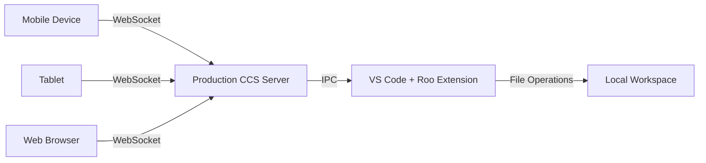

# RCCS First Run Test Plan

## Remote Cross-Device Communication System - Initial Testing & Validation

**Created:** 2025-06-30  
**Branch:** `first-run-testing`  
**Purpose:** Comprehensive first-time testing of the complete RCCS system

---

## 🎯 What is RCCS?

The **Remote Cross-Device Communication System (RCCS)** enables users to access and control their Roo-Code VS Code extension from any device (mobile, tablet, desktop) through a web interface. Think of it as "remote desktop for your AI coding assistant."

### Core User Experience



**What Users Can Do:**

- Chat with Roo from their phone while away from computer
- Start coding tasks remotely and monitor progress
- Access conversation history across all devices
- Seamlessly hand off between devices
- Collaborate with team members on shared sessions

---

## 🏗️ System Architecture Overview

### Components We Built

1. **Production CCS Server** (`production-ccs/`)

    - Node.js/Express backend with TypeScript
    - PostgreSQL database for persistence
    - Redis for session management
    - WebSocket server for real-time communication
    - REST API for device management

2. **Docker Infrastructure** (`docker/`)

    - Development environment with PostgreSQL + Redis
    - Production deployment configuration
    - Database migrations and health checks

3. **VS Code Extension Integration** (`src/`)
    - Modified ClineProvider for remote sessions
    - IPC communication with CCS server
    - Headless operation support

### Key Features Implemented

- **Authentication & Authorization**: JWT-based user management
- **Real-time Communication**: WebSocket protocol for instant updates
- **Cross-device Synchronization**: Message and state sync across devices
- **File Management**: Remote file operations and workspace sync
- **Session Management**: Multi-device session coordination
- **Command Queue**: Reliable task execution and progress tracking
- **Workflow Orchestration**: Advanced automation and scheduling

---

## 🧪 Testing Strategy

### Phase 1: Infrastructure Validation (Day 1)

**Goal**: Verify all backend services start and communicate properly

### Phase 2: Core Functionality (Day 2-3)

**Goal**: Test basic user workflows and real-time features

### Phase 3: Integration Testing (Day 4-5)

**Goal**: End-to-end testing with VS Code extension

### Phase 4: Multi-device & Edge Cases (Day 6+)

**Goal**: Advanced scenarios and production readiness

---

## 📋 Phase 1: Infrastructure Validation

### Prerequisites

- Docker and Docker Compose installed
- Node.js 18+ and pnpm installed
- VS Code with Roo extension
- Git access to your fork repository

### Step 1.1: Environment Setup

```bash
# 1. Start Docker infrastructure
cd docker/development
./scripts/start-dev.sh

# 2. Verify database connectivity
docker exec -it rccs-postgres psql -U rccs_user -d rccs_dev -c "\dt"

# 3. Verify Redis connectivity
docker exec -it rccs-redis redis-cli ping
```

**Expected Results:**

- ✅ PostgreSQL shows all migration tables
- ✅ Redis responds with "PONG"
- ✅ No Docker container errors

**If Issues Found:**

- Create GitHub issue with label `infrastructure`
- Document in `docs/testing/known-issues.md`
- Check Docker logs: `docker-compose logs`

### Step 1.2: Production CCS Server Startup

```bash
# 1. Install dependencies
cd production-ccs
pnpm install

# 2. Set up environment
cp .env.example .env
# Edit .env with your database credentials

# 3. Run database migrations
pnpm run migrate

# 4. Start the server
pnpm run dev
```

**Expected Results:**

- ✅ Server starts on port 3001
- ✅ Database connection successful
- ✅ WebSocket server listening
- ✅ Health check endpoint responds: `curl http://localhost:3001/health`

**If Issues Found:**

- Check TypeScript compilation errors
- Verify database connection string
- Create GitHub issue with label `backend`

### Step 1.3: Basic API Testing

```bash
# Test health endpoint
curl http://localhost:3001/health

# Test user registration
curl -X POST http://localhost:3001/api/auth/register \
  -H "Content-Type: application/json" \
  -d '{"username":"testuser","email":"test@example.com","password":"testpass123"}'

# Test user login
curl -X POST http://localhost:3001/api/auth/login \
  -H "Content-Type: application/json" \
  -d '{"email":"test@example.com","password":"testpass123"}'
```

**Expected Results:**

- ✅ Health check returns 200 OK
- ✅ User registration succeeds
- ✅ Login returns JWT token

**Success Criteria for Phase 1:**

- [ ] All Docker services running
- [ ] Database migrations applied
- [ ] CCS server starts without errors
- [ ] Basic API endpoints respond correctly
- [ ] No critical errors in logs

---

## 📋 Phase 2: Core Functionality Testing

### Step 2.1: WebSocket Connection Testing

Create test client to verify WebSocket functionality:

```javascript
// test-websocket-client.js
const WebSocket = require("ws")

const ws = new WebSocket("ws://localhost:3001")

ws.on("open", function open() {
	console.log("✅ WebSocket connected")

	// Test authentication
	ws.send(
		JSON.stringify({
			type: "AUTHENTICATE",
			payload: { token: "YOUR_JWT_TOKEN_HERE" },
		}),
	)
})

ws.on("message", function message(data) {
	console.log("📨 Received:", JSON.parse(data))
})

ws.on("error", function error(err) {
	console.error("❌ WebSocket error:", err)
})
```

**Expected Results:**

- ✅ WebSocket connection establishes
- ✅ Authentication succeeds
- ✅ Server responds to ping messages

### Step 2.2: User Authentication Flow

Test complete authentication workflow:

1. **Registration**: Create new user account
2. **Login**: Authenticate and receive JWT
3. **Token Validation**: Access protected endpoints
4. **Session Management**: Multiple device sessions

**Test Script:**

```bash
# Run authentication test suite
cd production-ccs
pnpm test -- --grep "authentication"
```

### Step 2.3: Database Operations

Verify all CRUD operations work correctly:

```bash
# Run database integration tests
pnpm test -- --grep "database"

# Manual verification
psql -U rccs_user -d rccs_dev -c "SELECT * FROM users;"
psql -U rccs_user -d rccs_dev -c "SELECT * FROM conversations;"
```

**Expected Results:**

- ✅ User data persists correctly
- ✅ Conversation history saves
- ✅ File sync metadata stored
- ✅ No foreign key constraint errors

### Step 2.4: Real-time Message Sync

Test message synchronization between multiple clients:

1. Open two WebSocket connections
2. Send message from client A
3. Verify client B receives message
4. Test message persistence in database

**Success Criteria for Phase 2:**

- [ ] WebSocket connections stable
- [ ] Authentication flow complete
- [ ] Database operations successful
- [ ] Real-time sync working
- [ ] No data loss or corruption

---

## 📋 Phase 3: VS Code Extension Integration

### Step 3.1: Extension Modification

Verify the VS Code extension can communicate with CCS:

1. **Start VS Code** with Roo extension
2. **Enable Remote Mode** in extension settings
3. **Connect to CCS** server
4. **Test IPC Communication**

**Configuration:**

```json
// VS Code settings.json
{
	"roo.remoteMode": true,
	"roo.ccsServerUrl": "http://localhost:3001",
	"roo.enableIPC": true
}
```

### Step 3.2: End-to-End Workflow Testing

**Test Scenario: Remote Task Execution**

1. **Mobile Client**: Connect via WebSocket
2. **Submit Prompt**: "Create a simple React component"
3. **VS Code Extension**: Receives task via IPC
4. **Task Execution**: Roo processes the request
5. **Real-time Updates**: Mobile client sees progress
6. **Completion**: Final result synced to all devices

**Verification Points:**

- ✅ Prompt reaches VS Code extension
- ✅ Task executes normally
- ✅ Progress updates stream to mobile
- ✅ Files created in workspace
- ✅ Conversation history preserved

### Step 3.3: Multi-device Session Testing

**Test Scenario: Device Handoff**

1. **Start Task** on mobile device
2. **Switch to Desktop** mid-execution
3. **Continue Task** from desktop browser
4. **Monitor Progress** from tablet
5. **Complete Task** and verify sync

**Expected Behavior:**

- ✅ Session state transfers seamlessly
- ✅ No duplicate task execution
- ✅ All devices show consistent state
- ✅ File changes visible everywhere

**Success Criteria for Phase 3:**

- [ ] VS Code extension connects to CCS
- [ ] IPC communication functional
- [ ] End-to-end task execution works
- [ ] Multi-device sessions stable
- [ ] No data inconsistencies

---

## 📋 Phase 4: Advanced Testing & Edge Cases

### Step 4.1: Performance Testing

**Load Testing:**

- 10 concurrent WebSocket connections
- 100 messages per minute per connection
- Monitor memory usage and response times

**Stress Testing:**

- Large file operations (>10MB)
- Long-running tasks (>30 minutes)
- Network interruption recovery

### Step 4.2: Security Testing

**Authentication Security:**

- Invalid JWT token handling
- Session timeout behavior
- Cross-origin request validation

**Input Validation:**

- SQL injection attempts
- XSS prevention
- File path traversal protection

### Step 4.3: Error Handling & Recovery

**Network Failures:**

- WebSocket disconnection/reconnection
- Database connection loss
- Redis unavailability

**Application Errors:**

- Invalid message formats
- Corrupted session data
- File system permission issues

**Success Criteria for Phase 4:**

- [ ] System handles expected load
- [ ] Security vulnerabilities addressed
- [ ] Graceful error recovery
- [ ] No data loss during failures
- [ ] Performance within acceptable limits

---

## 🐛 Issue Tracking & Resolution

### GitHub Integration

**Issue Labels:**

- `first-run-testing` - Issues found during initial testing
- `infrastructure` - Docker, database, environment issues
- `backend` - Production CCS server problems
- `frontend` - WebSocket client issues
- `integration` - VS Code extension integration
- `performance` - Speed, memory, scalability issues
- `security` - Authentication, authorization, validation
- `bug` - Confirmed defects
- `enhancement` - Improvements identified during testing

**Issue Template:**

```markdown
## Issue Description

Brief description of the problem

## Testing Phase

- [ ] Phase 1: Infrastructure
- [ ] Phase 2: Core Functionality
- [ ] Phase 3: Integration
- [ ] Phase 4: Advanced Testing

## Steps to Reproduce

1. Step one
2. Step two
3. Step three

## Expected Behavior

What should happen

## Actual Behavior

What actually happened

## Environment

- OS:
- Node.js version:
- Docker version:
- Browser (if applicable):

## Logs/Screenshots

Attach relevant logs or screenshots

## Priority

- [ ] Critical (blocks testing)
- [ ] High (major functionality affected)
- [ ] Medium (workaround available)
- [ ] Low (minor issue)
```

### Resolution Workflow

1. **Identify Issue** during testing
2. **Create GitHub Issue** with appropriate labels
3. **Assign Priority** based on impact
4. **Document Workaround** if available
5. **Fix and Test** the solution
6. **Update Documentation** if needed
7. **Close Issue** when resolved

---

## 📊 Testing Metrics & Success Criteria

### Performance Benchmarks

**Response Times:**

- API endpoints: < 200ms
- WebSocket message delivery: < 100ms
- Database queries: < 50ms
- File operations: < 1s

**Reliability:**

- WebSocket connection uptime: > 99%
- Database transaction success: > 99.9%
- Zero data loss during normal operations
- Graceful degradation during failures

**Scalability:**

- Support 50+ concurrent connections
- Handle 1000+ messages per minute
- Process files up to 100MB
- Maintain performance with 10,000+ conversation history

### User Experience Metrics

**Functionality:**

- All core workflows complete successfully
- Cross-device sync works reliably
- No critical bugs in primary use cases
- Error messages are clear and actionable

**Usability:**

- Setup process takes < 30 minutes
- Common tasks complete in < 5 clicks
- System recovers from errors automatically
- Documentation is clear and complete

---

## 🚀 Getting Started Checklist

### Before You Begin

- [ ] Read this entire test plan
- [ ] Set up GitHub issue tracking
- [ ] Prepare test environment (Docker, Node.js, etc.)
- [ ] Create `docs/testing/current-test-session.md`
- [ ] Notify team members about testing start

### Daily Testing Routine

1. **Start of Day:**

    - Update `current-test-session.md` with today's goals
    - Check GitHub issues for any blockers
    - Verify test environment is clean

2. **During Testing:**

    - Document issues immediately in GitHub
    - Update test progress in real-time
    - Take screenshots of errors/successes

3. **End of Day:**
    - Summarize progress in `test-results-log.md`
    - Commit any fixes or documentation updates
    - Plan next day's testing focus

### Emergency Procedures

**If System Won't Start:**

1. Check Docker container status
2. Verify database connectivity
3. Review recent code changes
4. Create critical GitHub issue
5. Escalate to team if needed

**If Data Loss Occurs:**

1. Stop all testing immediately
2. Document exact steps that led to loss
3. Create critical GitHub issue
4. Backup current state before continuing
5. Implement additional safeguards

---

## 📚 Reference Links

- **Main Documentation**: `docs/feature-2-remote-ui-srs.md`
- **Architecture Overview**: `docs/system-architecture.md`
- **Development Setup**: `docs/development-setup-guide.md`
- **GitHub Project**: [Your Fork Repository]
- **Docker Documentation**: `docker/README.md`
- **API Specifications**: `docs/feature-2-api-specifications.md`

---

## 🎯 Next Steps After Testing

1. **Create Production Deployment Plan**
2. **Set Up Monitoring & Alerting**
3. **Prepare User Documentation**
4. **Plan Beta User Recruitment**
5. **Establish Support Procedures**

---

**Testing Framework Created:** 2025-06-30  
**Estimated Testing Duration:** 5-7 days  
**Team Collaboration:** GitHub Issues + Documentation  
**Success Metric:** All phases complete with < 5 critical issues
