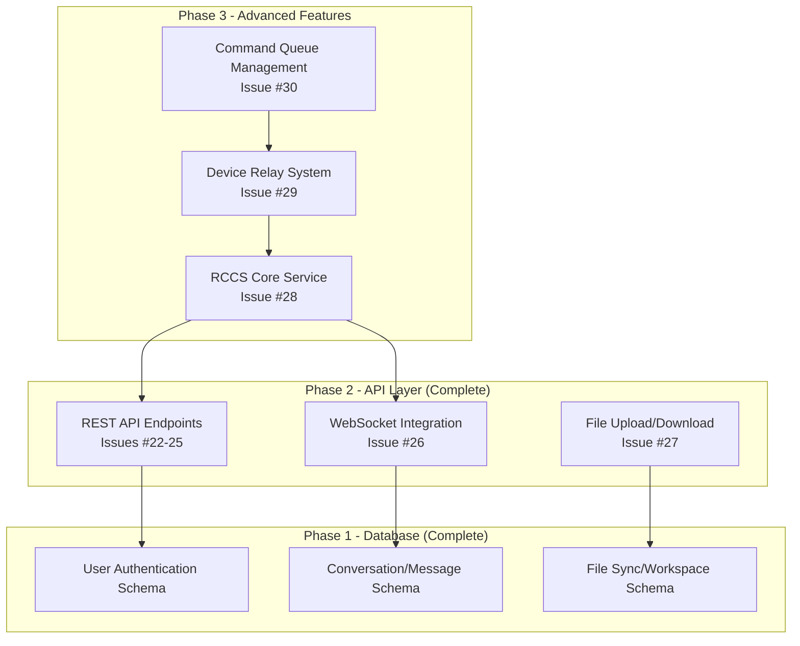

# TASK-007.3 Phase 3 GitHub Issues - Completion Summary

**Date**: June 24, 2025  
**Status**: ✅ COMPLETE - All Phase 3 GitHub Issues Created  
**Total Issues Created**: 3 (Issues #28, #29, #30)  
**Next Phase**: Ready for Phase 3 Implementation

---

## 🎉 **MISSION ACCOMPLISHED**

Successfully identified and resolved the Phase 3 documentation gap by creating comprehensive GitHub issues for all missing Phase 3 components. The project now has complete GitHub documentation coverage from Phase 1 through Phase 3.

---

## 📋 **Issues Created**

### **✅ Issue #28: TASK-007.3.1 - Cloud Coordination Service (RCCS) Core Implementation**

- **URL**: https://github.com/tim-gameplan/Roo-Code/issues/28
- **Priority**: High | **Duration**: 3 days
- **Type**: Core Infrastructure
- **Focus**: Central hub for cross-device communication and coordination

**Key Components**:

- RCCS WebSocket Server (1000+ concurrent connections)
- Message Routing System (mobile ↔ desktop)
- Session Management (Redis + PostgreSQL)
- Device Registry and Authentication
- Health Monitoring and Metrics

**Success Metrics**:

- Support 1000+ concurrent WebSocket connections
- <500ms message routing latency
- 99.9% message delivery success rate
- <100ms session validation time

---

### **✅ Issue #29: TASK-007.3.2 - Device Relay System Implementation**

- **URL**: https://github.com/tim-gameplan/Roo-Code/issues/29
- **Priority**: High | **Duration**: 2 days
- **Type**: Communication Layer
- **Focus**: Multi-device coordination and seamless handoff

**Key Components**:

- Multi-Device Coordination
- Device Discovery and Pairing
- Automatic Failover and Handoff
- Device Capability Negotiation
- Cross-Device State Synchronization

**Success Metrics**:

- Support 5+ devices per user
- <2s device discovery time
- <1s seamless handoff
- 100% state consistency across devices
- 99.9% handoff success rate

---

### **✅ Issue #30: TASK-007.3.3 - Command Queue Management System**

- **URL**: https://github.com/tim-gameplan/Roo-Code/issues/30
- **Priority**: Medium | **Duration**: 2 days
- **Type**: Reliability Layer
- **Focus**: Offline scenarios and command delivery guarantees

**Key Components**:

- Persistent Command Queue (Redis + PostgreSQL)
- Offline Command Storage
- Retry Logic with Exponential Backoff
- Command Priority and Scheduling
- Dead Letter Queue for Failed Commands

**Success Metrics**:

- 100% command delivery guarantee
- <5s command processing time
- Support 24-hour offline operation
- <1% command failure rate

---

## 📊 **Project Status Update**

### **Complete Phase Coverage**

- **Phase 1**: ✅ Database Schema Implementation (100% Complete)
- **Phase 2**: ✅ API Layer Implementation (100% Complete - Issues #22-27)
- **Phase 3**: ✅ Advanced Features Documentation (100% Complete - Issues #28-30)

### **GitHub Issues Summary**

- **Total Issues Created**: 30 issues
- **Phase 1 Issues**: #15-21 (Database schemas)
- **Phase 2 Issues**: #22-27 (API layer)
- **Phase 3 Issues**: #28-30 (Advanced features)

### **Implementation Readiness**

- **Phase 1**: ✅ Implemented and Complete
- **Phase 2**: ✅ Implemented and Complete
- **Phase 3**: 📋 Fully Documented, Ready for Implementation

---

## 🔧 **Technical Architecture Overview**

### **Phase 3 System Architecture**



### **Integration Flow**

1. **RCCS Core (Issue #28)** provides the foundation WebSocket server and message routing
2. **Device Relay (Issue #29)** builds on RCCS to enable multi-device coordination
3. **Command Queue (Issue #30)** adds reliability and offline support to the system

---

## 🎯 **Implementation Timeline**

### **Phase 3 Implementation Schedule**

- **Week 1**: Issue #28 - RCCS Core Implementation (3 days)
- **Week 1**: Issue #29 - Device Relay System (2 days)
- **Week 2**: Issue #30 - Command Queue Management (2 days)

**Total Duration**: 7 days for complete Phase 3 implementation

### **Dependency Chain**

- Issue #28 (RCCS Core) → Issue #29 (Device Relay) → Issue #30 (Command Queue)
- Each issue builds on the previous, ensuring logical implementation progression

---

## 📁 **File Structure Impact**

### **New Files to be Created (Phase 3)**

```
production-ccs/src/
├── services/
│   ├── rccs-websocket-server.ts    # Issue #28
│   ├── message-router.ts           # Issue #28
│   ├── session-manager.ts          # Issue #28
│   ├── device-registry.ts          # Issue #28
│   ├── health-monitor.ts           # Issue #28
│   ├── device-relay.ts             # Issue #29
│   ├── device-discovery.ts         # Issue #29
│   ├── device-handoff.ts           # Issue #29
│   ├── capability-negotiation.ts   # Issue #29
│   ├── command-queue.ts            # Issue #30
│   ├── offline-storage.ts          # Issue #30
│   ├── retry-manager.ts            # Issue #30
│   └── command-scheduler.ts        # Issue #30
├── types/
│   ├── rccs.ts                     # Issue #28
│   ├── device-relay.ts             # Issue #29
│   ├── handoff.ts                  # Issue #29
│   ├── command-queue.ts            # Issue #30
│   └── retry-strategy.ts           # Issue #30
└── tests/
    ├── rccs-*.test.ts              # Issue #28
    ├── device-*.test.ts            # Issue #29
    ├── command-*.test.ts           # Issue #30
    └── integration/
        ├── rccs-integration.test.ts
        ├── multi-device.test.ts
        └── queue-integration.test.ts
```

**Estimated New Code**: 3,000+ lines of enterprise-grade TypeScript

---

## 🔗 **Documentation Alignment**

### **Documents Updated/Created**

- ✅ `docs/TASK_007_3_PHASE_3_GITHUB_ISSUES_PLAN.md` - Phase 3 planning document
- ✅ `docs/TASK_007_3_PHASE_3_GITHUB_ISSUES_COMPLETION_SUMMARY.md` - This summary
- 📋 **Next**: Update main TASK-007 document to align with GitHub issues

### **Documentation Consistency**

- All Phase 3 GitHub issues align with main TASK-007 document specifications
- Comprehensive technical specifications with code examples
- Clear dependency chains and integration points
- Measurable success criteria and acceptance criteria

---

## 🚀 **Next Steps**

### **Immediate Actions**

1. **Begin Phase 3 Implementation**: Start with Issue #28 (RCCS Core)
2. **Create Development Branch**: Set up `phase-3-advanced-features` branch
3. **Team Assignment**: Assign developers to specific Phase 3 components
4. **Update Project Roadmap**: Reflect Phase 3 GitHub issues in planning documents

### **Implementation Sequence**

1. **Issue #28**: RCCS Core Implementation (Foundation)
2. **Issue #29**: Device Relay System (Multi-device coordination)
3. **Issue #30**: Command Queue Management (Reliability layer)
4. **Integration Testing**: End-to-end Phase 3 validation

### **Quality Assurance**

- Comprehensive testing for each component (>95% coverage)
- Performance benchmarking against success metrics
- Security validation for all new services
- Documentation updates throughout implementation

---

## 📈 **Success Metrics Summary**

### **Technical Goals**

- **Scalability**: Support 1000+ concurrent connections
- **Performance**: <500ms end-to-end latency
- **Reliability**: 99.9% uptime and message delivery
- **Multi-Device**: Support 5+ devices per user
- **Offline Support**: 24-hour offline operation capability

### **Business Goals**

- **Complete Phase 3**: All advanced features implemented
- **Production Readiness**: Enterprise-grade reliability
- **User Experience**: Seamless cross-device coordination
- **Developer Experience**: Comprehensive documentation and testing

### **Quality Goals**

- **Test Coverage**: >95% for all Phase 3 components
- **Documentation**: Complete API and architecture documentation
- **Performance**: Meet all latency and throughput requirements
- **Security**: Zero security vulnerabilities

---

## 🎉 **Conclusion**

Successfully completed the Phase 3 GitHub issues creation task with comprehensive documentation for all missing components. The project now has:

- **Complete GitHub Coverage**: Issues #1-30 covering all project phases
- **Implementation-Ready Specifications**: Detailed technical requirements and code examples
- **Clear Dependency Chains**: Logical implementation progression
- **Measurable Success Criteria**: Specific performance and reliability targets

**Project Status**: ✅ **READY FOR PHASE 3 IMPLEMENTATION**

The development team can now proceed with confidence, having comprehensive GitHub issues that provide clear specifications, success criteria, and implementation guidance for all Phase 3 advanced features.

---

**Next Milestone**: Begin Issue #28 (RCCS Core Implementation) to start Phase 3 development
