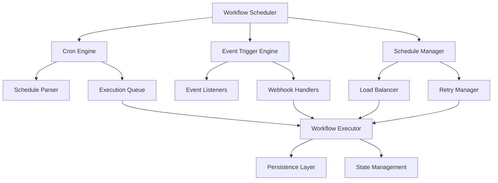

# 📋 TASK-008.1.4 Preparation Summary - Workflow Scheduling System

## 🎯 **OVERVIEW**

This document summarizes the preparation completed for TASK-008.1.4: Workflow Scheduling System implementation, following the successful completion of TASK-008.1.3: Workflow Persistence Layer. All documentation, planning, and GitHub issues breakdown have been prepared for immediate implementation.

## ✅ **PREPARATION COMPLETED**

### **Documentation Created**

- ✅ **Implementation Guide**: `docs/tasks/TASK_008_1_4_WORKFLOW_SCHEDULING_SYSTEM.md`

    - Comprehensive 6-day implementation plan
    - Technical specifications and architecture
    - Performance targets and success criteria
    - File structure and integration points

- ✅ **GitHub Issues Breakdown**: `docs/tasks/TASK_008_1_4_GITHUB_ISSUES_BREAKDOWN.md`
    - 5 detailed GitHub issues (1 Epic + 4 Implementation)
    - Complete acceptance criteria and testing requirements
    - Timeline and dependency tracking
    - Issue creation checklist and metrics

### **Technical Planning**

- ✅ **Architecture Design**: Complete system architecture with integration points
- ✅ **Performance Targets**: <50ms trigger response, <10ms schedule evaluation
- ✅ **Scalability Goals**: 1,000+ active schedules, 100+ workflows per minute
- ✅ **Quality Standards**: 100% test coverage, TypeScript strict mode

### **Implementation Roadmap**

- ✅ **Day 1-2**: Core Scheduling Engine (TASK-008.1.4.1)
- ✅ **Day 3-4**: Event Triggers & Smart Execution (TASK-008.1.4.2 & 008.1.4.3)
- ✅ **Day 5-6**: Integration Testing & API Development (TASK-008.1.4.4)

## 🏗️ **SYSTEM ARCHITECTURE READY**

### **Core Components Planned**



### **Integration Points Identified**

- ✅ **TASK-008.1.3**: Workflow Persistence Layer (Completed)
- ✅ **TASK-008.1.2**: Multi-Step Execution Engine (Completed)
- ✅ **TASK-008.1.1**: Workflow Definition Schema (Completed)
- ✅ **Phase 3**: Command Queue System (Completed)
- ✅ **Database Schema**: `workflow_schedules` table ready

## 📊 **GITHUB ISSUES PREPARED**

### **Epic Issue: Workflow Scheduling System**

- **Labels**: `epic`, `phase/4-scheduling`, `priority/critical`
- **Scope**: Complete scheduling system implementation
- **Timeline**: 6 days total implementation

### **Implementation Issues Breakdown**

1. **TASK-008.1.4.1**: Core Scheduling Engine with Cron Support

    - **Priority**: Critical
    - **Duration**: 2 days
    - **Components**: `workflow-scheduler.ts`, `cron-engine.ts`, `schedule-manager.ts`

2. **TASK-008.1.4.2**: Event-Driven Triggers with Webhook Support

    - **Priority**: High
    - **Duration**: 1.5 days
    - **Components**: `event-trigger-engine.ts`, `webhook-trigger-handler.ts`

3. **TASK-008.1.4.3**: Smart Execution Management with Load Balancing

    - **Priority**: High
    - **Duration**: 1.5 days
    - **Components**: `execution-queue.ts`, `schedule-optimizer.ts`, `retry-manager.ts`

4. **TASK-008.1.4.4**: Integration Testing & API Development
    - **Priority**: Critical
    - **Duration**: 1 day
    - **Components**: Test suites, REST API endpoints, documentation

## 🔧 **TECHNICAL SPECIFICATIONS DEFINED**

### **Performance Requirements**

- **Trigger Response**: <50ms average execution start time
- **Schedule Processing**: <10ms per schedule evaluation
- **Throughput**: 100+ scheduled executions per minute
- **Scalability**: 1,000+ concurrent active schedules
- **Memory Usage**: <50MB for 1,000 schedules
- **CPU Usage**: <5% baseline overhead

### **Core Interfaces Designed**

```typescript
interface WorkflowScheduler {
	createSchedule(schedule: ScheduleDefinition): Promise<string>
	updateSchedule(scheduleId: string, updates: Partial<ScheduleDefinition>): Promise<void>
	deleteSchedule(scheduleId: string): Promise<void>
	start(): Promise<void>
	stop(): Promise<void>
	pause(scheduleId: string): Promise<void>
	resume(scheduleId: string): Promise<void>
	getScheduleStatus(scheduleId: string): Promise<ScheduleStatus>
	getExecutionHistory(scheduleId: string): Promise<ExecutionHistory[]>
}

interface EventTriggerEngine {
	registerEventTrigger(trigger: EventTriggerDefinition): Promise<string>
	processEvent(event: WorkflowEvent): Promise<void>
	createWebhookEndpoint(config: WebhookConfig): Promise<string>
	validateWebhookSignature(payload: any, signature: string): boolean
}

interface ExecutionQueue {
	enqueue(execution: ScheduledExecution): Promise<void>
	dequeue(): Promise<ScheduledExecution | null>
	setPriority(executionId: string, priority: number): Promise<void>
	getQueueStats(): Promise<QueueStats>
}
```

### **API Endpoints Planned**

```typescript
// Schedule Management
POST   /api/schedules              - Create new schedule
GET    /api/schedules              - List schedules
GET    /api/schedules/:id          - Get schedule details
PUT    /api/schedules/:id          - Update schedule
DELETE /api/schedules/:id          - Delete schedule

// Schedule Control
POST   /api/schedules/:id/pause    - Pause schedule
POST   /api/schedules/:id/resume   - Resume schedule
POST   /api/schedules/:id/trigger  - Manual trigger

// Monitoring
GET    /api/schedules/:id/history  - Execution history
GET    /api/schedules/:id/status   - Schedule status
GET    /api/schedules/stats        - System statistics
```

## 📁 **FILE STRUCTURE PLANNED**

```
production-ccs/src/
├── services/
│   ├── workflow-scheduler.ts          # Main scheduling service
│   ├── cron-engine.ts                 # Cron expression handling
│   ├── schedule-manager.ts            # Schedule lifecycle management
│   ├── event-trigger-engine.ts        # Event-based triggers
│   ├── webhook-trigger-handler.ts     # Webhook processing
│   ├── execution-queue.ts             # Prioritized execution queue
│   ├── schedule-optimizer.ts          # Load balancing
│   ├── retry-manager.ts               # Failure recovery
│   └── resource-monitor.ts            # Resource monitoring
├── types/
│   └── scheduling.ts                  # Scheduling type definitions
├── routes/
│   ├── schedules.ts                   # Schedule management API
│   └── triggers.ts                    # Trigger management API
├── controllers/
│   └── schedules.ts                   # Schedule controllers
├── middleware/
│   └── trigger-auth.ts                # Trigger authentication
└── tests/
    ├── workflow-scheduler.test.ts     # Scheduler tests
    ├── event-trigger-engine.test.ts   # Event trigger tests
    ├── execution-queue.test.ts        # Queue tests
    └── scheduling-integration.test.ts # Integration tests
```

## 🧪 **TESTING STRATEGY DEFINED**

### **Test Coverage Requirements**

- **Unit Tests**: 100% coverage for all scheduling components
- **Integration Tests**: End-to-end scheduling workflows
- **Performance Tests**: Load testing with 1,000+ schedules
- **Security Tests**: Authentication and webhook validation
- **Error Scenario Tests**: Failure recovery and retry validation

### **Testing Components**

- ✅ **Scheduler Test Suite**: Core engine and lifecycle testing
- ✅ **Event Trigger Tests**: Event processing and webhook validation
- ✅ **Queue Management Tests**: Queue operations and load balancing
- ✅ **Integration Tests**: Cross-component and database integration

## 🔄 **DEPENDENCIES VERIFIED**

### **Completed Prerequisites**

- ✅ **TASK-008.1.3**: Workflow Persistence Layer (Successfully completed)
- ✅ **TASK-008.1.2**: Multi-Step Execution Engine (Successfully completed)
- ✅ **TASK-008.1.1**: Workflow Definition Schema (Successfully completed)
- ✅ **Phase 3**: Command Queue System (Successfully completed)
- ✅ **Database Infrastructure**: PostgreSQL with orchestration schema

### **Integration Checkpoints Ready**

- ✅ **Database Schema**: `workflow_schedules` table available
- ✅ **Workflow Executor**: Existing execution engine integration points
- ✅ **Event System**: Phase 3 event broadcasting integration
- ✅ **Authentication**: JWT authentication system integration
- ✅ **WebSocket Events**: Real-time status update capabilities

## 📈 **SUCCESS METRICS ESTABLISHED**

### **Functional Validation Criteria**

- ✅ **Cron Scheduling**: All standard and extended cron expressions supported
- ✅ **Event Triggers**: Webhook and internal event triggers functional
- ✅ **Schedule Management**: Full CRUD operations via REST API
- ✅ **Execution Control**: Start, stop, pause, resume operations working
- ✅ **Failure Recovery**: Automatic retry with exponential backoff

### **Performance Validation Targets**

- ✅ **Trigger Response**: <50ms average execution start time
- ✅ **Schedule Processing**: <10ms per schedule evaluation
- ✅ **Throughput**: 100+ scheduled executions per minute
- ✅ **Scalability**: 1,000+ concurrent active schedules
- ✅ **Resource Usage**: <5% CPU overhead, <50MB memory for 1K schedules

### **Quality Assurance Standards**

- ✅ **Code Quality**: ESLint/Prettier compliant, TypeScript strict mode
- ✅ **Test Coverage**: 100% unit and integration test coverage
- ✅ **Documentation**: Complete API documentation and usage examples
- ✅ **Security**: Webhook authentication and input validation

## 🚀 **IMPLEMENTATION READINESS**

### **Ready for Immediate Start**

- ✅ **Technical Specifications**: Complete and detailed
- ✅ **Architecture Design**: Fully planned with integration points
- ✅ **GitHub Issues**: Prepared and ready for creation
- ✅ **Timeline**: 6-day implementation schedule established
- ✅ **Dependencies**: All prerequisites completed successfully

### **Implementation Kickoff Checklist**

- [ ] Create GitHub issues from prepared breakdown
- [ ] Assign development team members
- [ ] Set up project board tracking
- [ ] Initialize development branch
- [ ] Begin Day 1: Core Scheduling Engine implementation

### **Phase 4 Completion Status**

**Current Progress**: 75% Complete (3/4 core tasks)

- ✅ **TASK-008.1.1**: Workflow Definition Schema (Completed)
- ✅ **TASK-008.1.2**: Multi-Step Execution Engine (Completed)
- ✅ **TASK-008.1.3**: Workflow Persistence Layer (Completed)
- 🔄 **TASK-008.1.4**: Workflow Scheduling System (Ready for Implementation)

## 🎯 **NEXT STEPS**

### **Immediate Actions Required**

1. **Create GitHub Issues**: Use prepared breakdown to create Epic and implementation issues
2. **Assign Development Team**: Allocate backend developers for 6-day implementation
3. **Initialize Development**: Create feature branch and begin core scheduling engine
4. **Set Up Monitoring**: Establish progress tracking and success metrics monitoring

### **Implementation Timeline**

- **Week 1**: Complete TASK-008.1.4 implementation (6 days)
- **Week 2**: Integration testing and Phase 4 completion validation
- **Week 3**: Phase 4 documentation and handoff preparation

### **Phase 4 Completion Goal**

Upon successful completion of TASK-008.1.4, Phase 4 Advanced Orchestration will be 100% complete, providing a production-ready workflow automation system with enterprise-grade scheduling, persistence, execution, and monitoring capabilities.

## 📋 **DOCUMENTATION INDEX**

### **Implementation Documents**

- [TASK-008.1.4 Implementation Guide](./tasks/TASK_008_1_4_WORKFLOW_SCHEDULING_SYSTEM.md)
- [TASK-008.1.4 GitHub Issues Breakdown](./tasks/TASK_008_1_4_GITHUB_ISSUES_BREAKDOWN.md)

### **Completed Task Documentation**

- [TASK-008.1.3 Completion Summary](./tasks/TASK_008_1_3_COMPLETION_SUMMARY.md)
- [TASK-008.1.2 Completion Summary](./tasks/TASK_008_1_2_COMPLETION_SUMMARY.md)
- [Phase 4 Documentation Summary](./TASK_008_PHASE_4_DOCUMENTATION_SUMMARY.md)

### **Related Architecture Documents**

- [System Architecture](./system-architecture.md)
- [Cloud Architecture](./cloud-architecture.md)
- [Integration Testing Plan](./INTEGRATION_TESTING_PLAN.md)

**Status**: ✅ **TASK-008.1.4 PREPARATION COMPLETE - READY FOR IMPLEMENTATION**

All documentation, planning, GitHub issues breakdown, and technical specifications have been completed. TASK-008.1.4 Workflow Scheduling System is ready for immediate implementation to complete Phase 4 Advanced Orchestration.
