# Real-Time Communication System - Complete Architecture

## 📋 Document Information

**Document Version:** 1.0  
**Last Updated:** December 22, 2024  
**Author:** Real-Time Communication Team  
**Status:** Draft - Implementation Ready  
**Related Task:** TASK-005.1.3 - Real-Time Communication Features

## 🎯 Executive Summary

This document defines the complete architecture for our real-time communication system, integrating all services into a unified, event-driven platform. The architecture supports mobile-first communication with sub-100ms latency, 99.9% reliability, and seamless cross-device synchronization.

### System Capabilities

- **Unified Event-Driven Architecture** - All services communicate through centralized event broadcasting
- **Mobile-First Design** - Optimized for mobile network conditions and battery life
- **Real-Time Coordination** - Typing indicators, session management, and presence updates
- **Bulletproof Reliability** - 99.9% uptime with automatic failover and recovery
- **Production-Ready Monitoring** - Complete observability and alerting

## 🏗️ System Architecture Overview

### High-Level Architecture

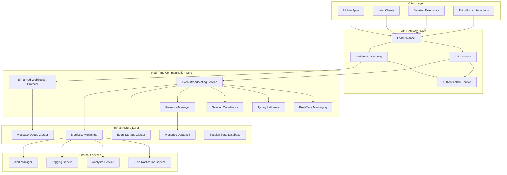

### Service Integration Architecture

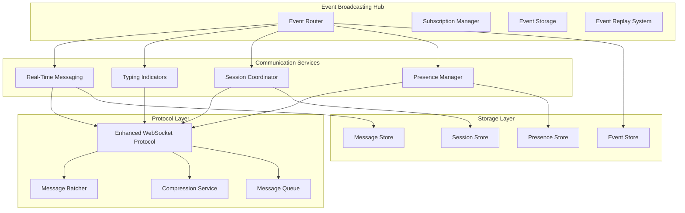

## 🔧 Service Integration Specifications

### Event-Driven Communication Flow

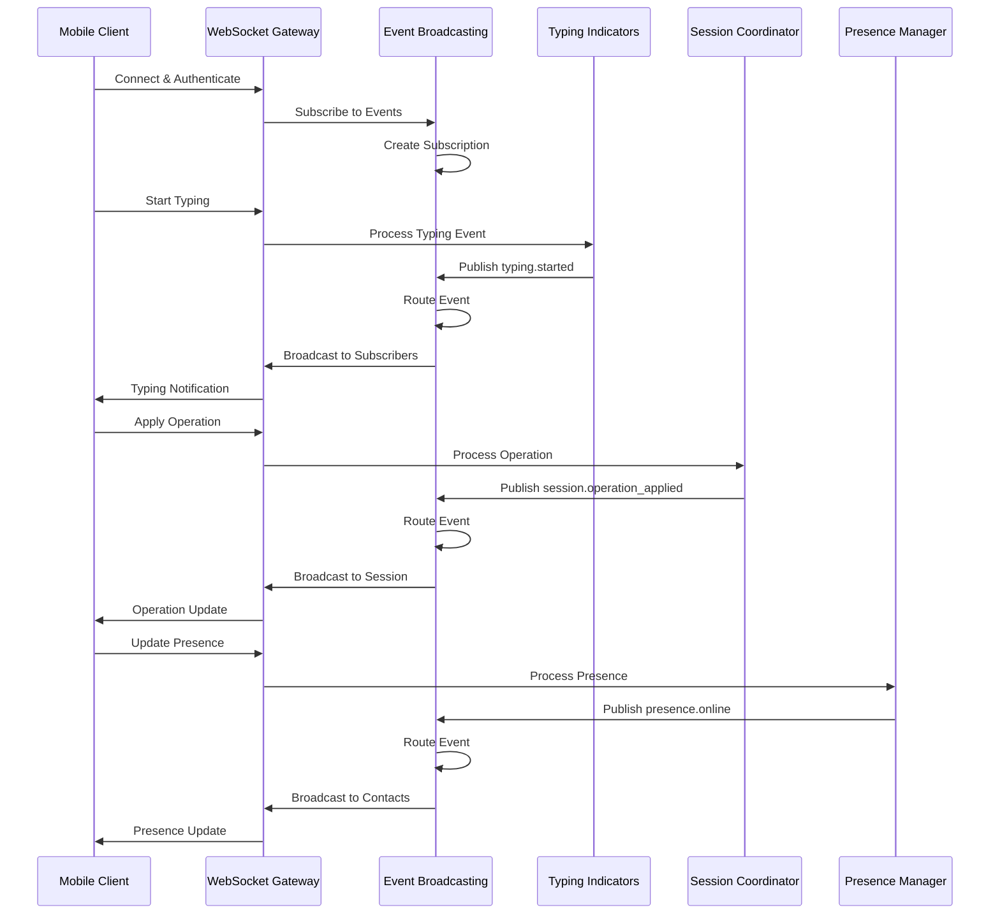

### Cross-Service Data Flow

```typescript
interface ServiceIntegrationFlow {
	// Typing Indicators → Event Broadcasting
	typingFlow: {
		input: TypingEvent
		processing: "typing-indicators-service"
		output: RealTimeEvent
		distribution: "event-broadcasting-service"
		targets: "session-participants"
		latency: "<30ms"
	}

	// Session Coordinator → Event Broadcasting
	sessionFlow: {
		input: SessionOperation
		processing: "session-coordinator-service"
		output: RealTimeEvent
		distribution: "event-broadcasting-service"
		targets: "session-participants"
		latency: "<75ms"
		reliability: "99.9%"
	}

	// Presence Manager → Event Broadcasting
	presenceFlow: {
		input: PresenceUpdate
		processing: "presence-manager-service"
		output: RealTimeEvent
		distribution: "event-broadcasting-service"
		targets: "user-connections"
		latency: "<100ms"
	}

	// Real-Time Messaging → Event Broadcasting
	messagingFlow: {
		input: Message
		processing: "real-time-messaging-service"
		output: RealTimeEvent
		distribution: "event-broadcasting-service"
		targets: "message-recipients"
		latency: "<100ms"
		reliability: "99.9%"
	}
}
```

## 📊 Performance Architecture

### Latency Distribution Strategy

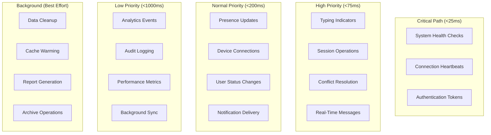

### Throughput Architecture

```typescript
interface ThroughputSpecifications {
	// Event Broadcasting Service
	eventBroadcasting: {
		eventsPerSecond: 500
		maxEventsPerSecond: 2000
		concurrentSubscriptions: 10000
		maxSubscriptions: 50000
	}

	// Typing Indicators Service
	typingIndicators: {
		typingEventsPerSecond: 200
		maxTypingEventsPerSecond: 1000
		concurrentTypingSessions: 1000
		maxTypingSessions: 5000
	}

	// Session Coordinator Service
	sessionCoordinator: {
		operationsPerSecond: 100
		maxOperationsPerSecond: 500
		concurrentSessions: 500
		maxSessions: 2000
	}

	// Presence Manager Service
	presenceManager: {
		presenceUpdatesPerSecond: 50
		maxPresenceUpdatesPerSecond: 200
		concurrentUsers: 5000
		maxUsers: 20000
	}

	// Real-Time Messaging Service
	realTimeMessaging: {
		messagesPerSecond: 1000
		maxMessagesPerSecond: 5000
		concurrentConversations: 2000
		maxConversations: 10000
	}
}
```

### Resource Allocation Strategy

```typescript
interface ResourceAllocation {
	// CPU allocation per service
	cpuAllocation: {
		eventBroadcasting: "40%" // Highest load - event routing
		enhancedWebSocket: "25%" // Network I/O intensive
		realTimeMessaging: "15%" // Message processing
		sessionCoordinator: "10%" // Operation processing
		typingIndicators: "5%" // Lightweight events
		presenceManager: "5%" // Status updates
	}

	// Memory allocation per service
	memoryAllocation: {
		eventBroadcasting: "2GB" // Event storage and queues
		enhancedWebSocket: "1GB" // Connection management
		sessionCoordinator: "512MB" // Session state
		realTimeMessaging: "512MB" // Message buffers
		presenceManager: "256MB" // Presence data
		typingIndicators: "256MB" // Typing state
	}

	// Network bandwidth allocation
	networkAllocation: {
		eventBroadcasting: "60%" // Event distribution
		enhancedWebSocket: "30%" // Client connections
		realTimeMessaging: "5%" // Message delivery
		otherServices: "5%" // Monitoring, health checks
	}
}
```

## 🔐 Security Architecture

### Authentication and Authorization Flow

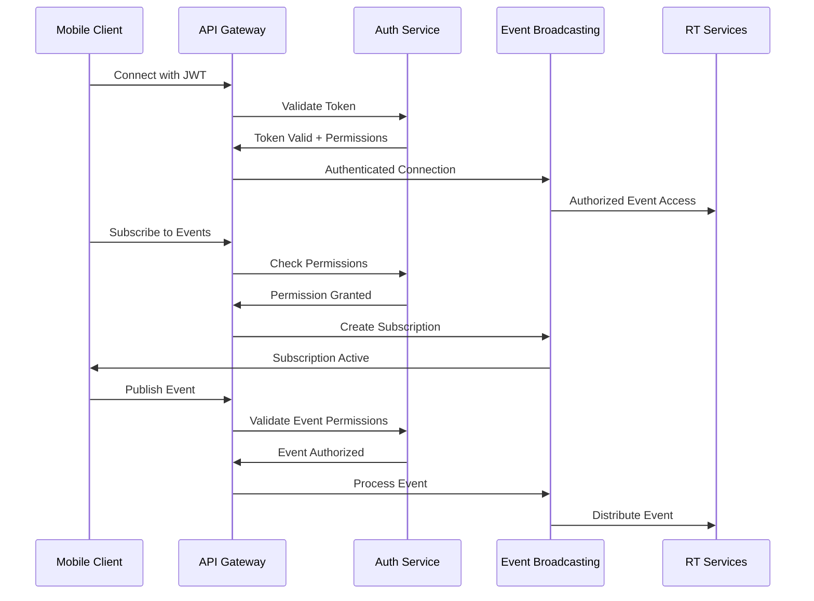

### Security Layers

```typescript
interface SecurityArchitecture {
	// Authentication layer
	authentication: {
		protocol: "JWT"
		tokenExpiration: "1h"
		refreshTokenExpiration: "7d"
		multiFactorAuth: boolean
		deviceFingerprinting: boolean
	}

	// Authorization layer
	authorization: {
		model: "RBAC" // Role-Based Access Control
		permissions: {
			eventPublish: string[]
			eventSubscribe: string[]
			sessionAccess: string[]
			presenceView: string[]
		}
		scopeValidation: boolean
	}

	// Transport security
	transport: {
		encryption: "TLS 1.3"
		certificateValidation: boolean
		websocketSecurity: "WSS"
		headerValidation: boolean
	}

	// Data security
	data: {
		eventEncryption: boolean
		payloadSanitization: boolean
		contentFiltering: boolean
		auditLogging: boolean
	}

	// Rate limiting
	rateLimiting: {
		perUser: "1000 requests/minute"
		perDevice: "500 requests/minute"
		perIP: "2000 requests/minute"
		burstAllowance: 50
	}
}
```

## 📈 Scalability Architecture

### Horizontal Scaling Strategy

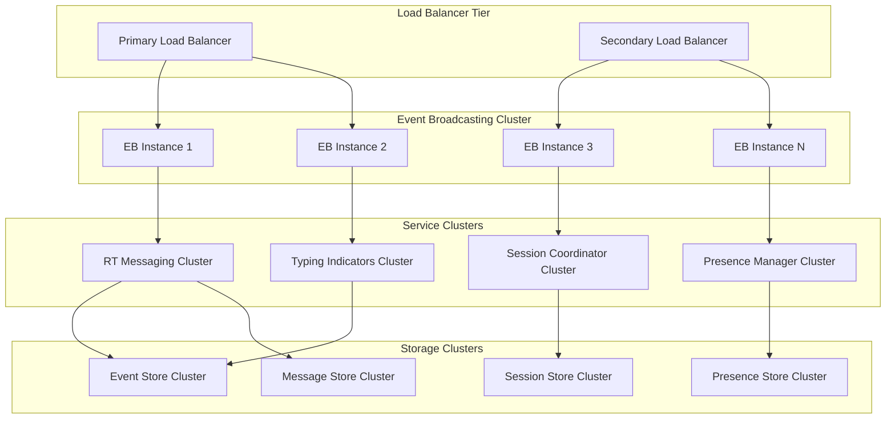

### Auto-Scaling Configuration

```typescript
interface AutoScalingConfig {
	// Event Broadcasting Service scaling
	eventBroadcasting: {
		minInstances: 2
		maxInstances: 10
		targetCPU: 70
		targetMemory: 80
		scaleUpCooldown: "5m"
		scaleDownCooldown: "10m"
		metrics: ["cpu", "memory", "eventThroughput", "latency"]
	}

	// WebSocket Gateway scaling
	websocketGateway: {
		minInstances: 3
		maxInstances: 15
		targetConnections: 1000
		targetCPU: 60
		scaleUpCooldown: "3m"
		scaleDownCooldown: "8m"
		metrics: ["connections", "cpu", "networkIO"]
	}

	// Service cluster scaling
	serviceClusters: {
		minInstances: 1
		maxInstances: 5
		targetCPU: 75
		targetMemory: 85
		scaleUpCooldown: "5m"
		scaleDownCooldown: "15m"
		metrics: ["cpu", "memory", "requestRate"]
	}
}
```

## 🔍 Monitoring and Observability Architecture

### Metrics Collection Strategy

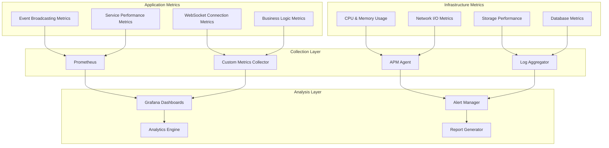

### Observability Stack

```typescript
interface ObservabilityStack {
	// Metrics collection
	metrics: {
		collector: "Prometheus"
		retention: "30d"
		scrapeInterval: "15s"
		alertRules: string[]
	}

	// Logging
	logging: {
		aggregator: "ELK Stack"
		retention: "7d"
		logLevel: "info"
		structuredLogging: boolean
	}

	// Tracing
	tracing: {
		system: "Jaeger"
		samplingRate: 0.1
		retention: "3d"
		spanTags: string[]
	}

	// Dashboards
	dashboards: {
		platform: "Grafana"
		updateInterval: "5s"
		alerting: boolean
		customDashboards: string[]
	}
}
```

## 🚀 Deployment Architecture

### Container Orchestration

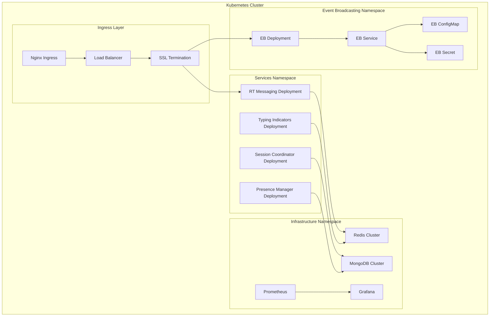

### Deployment Strategy

```typescript
interface DeploymentStrategy {
	// Rolling deployment
	rollingUpdate: {
		maxUnavailable: "25%"
		maxSurge: "25%"
		progressDeadlineSeconds: 600
		revisionHistoryLimit: 10
	}

	// Health checks
	healthChecks: {
		livenessProbe: {
			httpGet: "/health"
			initialDelaySeconds: 30
			periodSeconds: 10
			timeoutSeconds: 5
			failureThreshold: 3
		}
		readinessProbe: {
			httpGet: "/ready"
			initialDelaySeconds: 5
			periodSeconds: 5
			timeoutSeconds: 3
			failureThreshold: 3
		}
	}

	// Resource limits
	resources: {
		requests: {
			cpu: "100m"
			memory: "128Mi"
		}
		limits: {
			cpu: "500m"
			memory: "512Mi"
		}
	}
}
```

## 🔄 Data Flow Architecture

### Event Processing Pipeline

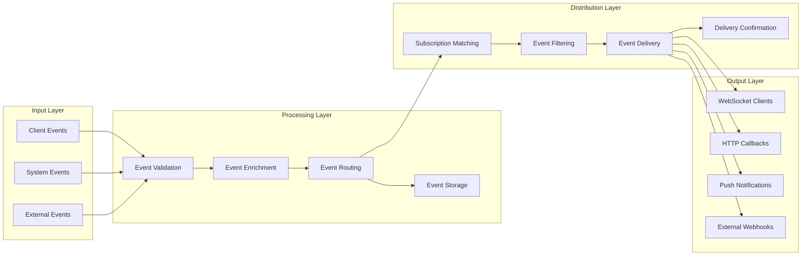

### Data Consistency Model

```typescript
interface DataConsistencyModel {
	// Event ordering
	eventOrdering: {
		strategy: "per-session-ordering"
		conflictResolution: "last-writer-wins"
		versionVectors: boolean
		causalConsistency: boolean
	}

	// State synchronization
	stateSynchronization: {
		model: "eventual-consistency"
		convergenceTime: "<5s"
		conflictDetection: boolean
		automaticResolution: boolean
	}

	// Data replication
	dataReplication: {
		strategy: "master-slave"
		replicationFactor: 3
		consistencyLevel: "quorum"
		readPreference: "primary-preferred"
	}
}
```

## 🧪 Testing Architecture

### Testing Strategy Pyramid

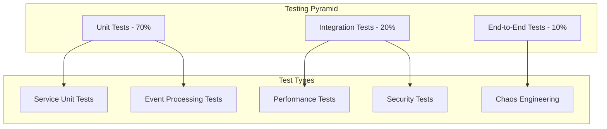

### Test Environment Architecture

```typescript
interface TestEnvironmentArchitecture {
	// Unit testing
	unitTesting: {
		framework: "Jest"
		coverage: ">90%"
		mocking: "comprehensive"
		parallelExecution: boolean
	}

	// Integration testing
	integrationTesting: {
		framework: "Jest + Supertest"
		testContainers: boolean
		databaseFixtures: boolean
		networkSimulation: boolean
	}

	// Performance testing
	performanceTesting: {
		framework: "Artillery.js"
		loadProfiles: string[]
		latencyTargets: Record<string, number>
		throughputTargets: Record<string, number>
	}

	// End-to-end testing
	e2eTesting: {
		framework: "Playwright"
		crossBrowser: boolean
		mobileSimulation: boolean
		networkConditions: string[]
	}
}
```

## 📋 Implementation Roadmap

### Phase 1: Core Infrastructure (Days 1-3)

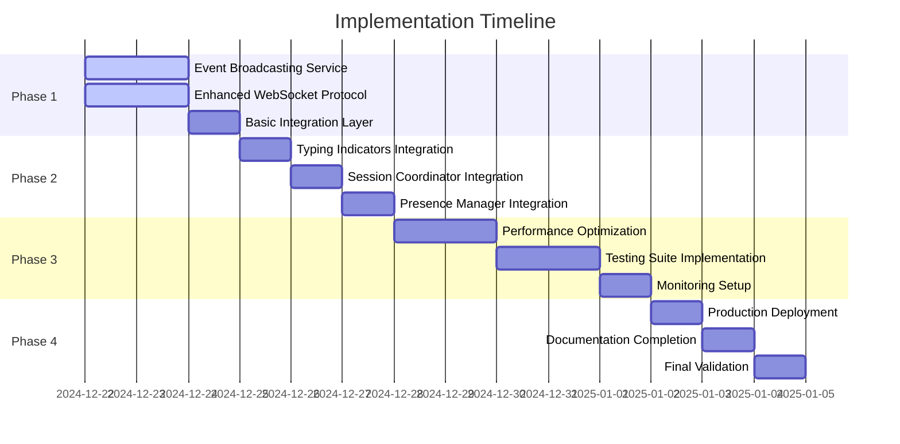

### Implementation Priorities

```typescript
interface ImplementationPriorities {
	// Critical path items
	criticalPath: [
		"Event Broadcasting Service Core",
		"WebSocket Protocol Enhancement",
		"Service Integration Layer",
		"Basic Event Routing",
	]

	// High priority features
	highPriority: [
		"Typing Indicators Integration",
		"Session Coordinator Integration",
		"Performance Optimization",
		"Error Handling",
	]

	// Medium priority features
	mediumPriority: [
		"Presence Manager Integration",
		"Advanced Filtering",
		"Event Replay System",
		"Monitoring Dashboard",
	]

	// Low priority features
	lowPriority: ["Advanced Analytics", "Custom Event Types", "External Integrations", "Advanced Security Features"]
}
```

## 🔧 Configuration Management

### Environment Configuration

```typescript
interface EnvironmentConfiguration {
	// Development environment
	development: {
		eventBroadcasting: {
			port: 3001
			logLevel: "debug"
			metricsEnabled: true
			storageProvider: "memory"
		}
		services: {
			enableAllServices: true
			mockExternalDependencies: true
			fastFailover: false
		}
	}

	// Staging environment
	staging: {
		eventBroadcasting: {
			port: 3001
			logLevel: "info"
			metricsEnabled: true
			storageProvider: "redis"
		}
		services: {
			enableAllServices: true
			mockExternalDependencies: false
			fastFailover: true
		}
	}

	// Production environment
	production: {
		eventBroadcasting: {
			port: 3001
			logLevel: "warn"
			metricsEnabled: true
			storageProvider: "redis-cluster"
		}
		services: {
			enableAllServices: true
			mockExternalDependencies: false
			fastFailover: true
		}
	}
}
```

### Feature Flags

```typescript
interface FeatureFlags {
	// Core features
	coreFeatures: {
		eventBroadcasting: boolean
		typingIndicators: boolean
		sessionCoordination: boolean
		presenceManagement: boolean
	}

	// Advanced features
	advancedFeatures: {
		eventReplay: boolean
		advancedFiltering: boolean
		customEventTypes: boolean
		externalIntegrations: boolean
	}

	// Performance features
	performanceFeatures: {
		eventCompression: boolean
		batchProcessing: boolean
		connectionPooling: boolean
		caching: boolean
	}

	// Security features
	securityFeatures: {
		eventEncryption: boolean
		advancedAuth: boolean
		rateLimiting: boolean
		auditLogging: boolean
	}
}
```

## 📚 API Integration Patterns

### Service-to-Service Communication

```typescript
interface ServiceCommunicationPatterns {
	// Synchronous communication
	synchronous: {
		protocol: "HTTP/REST"
		timeout: "5s"
		retryPolicy: {
			maxRetries: 3
			backoffStrategy: "exponential"
			maxBackoffTime: "30s"
		}
		circuitBreaker: {
			failureThreshold: 5
			timeout: "60s"
			halfOpenMaxCalls: 3
		}
	}

	// Asynchronous communication
	asynchronous: {
		protocol: "Event Broadcasting"
		deliveryGuarantee: "at-least-once"
		ordering: "per-session"
		durability: boolean
	}

	// Streaming communication
	streaming: {
		protocol: "WebSocket"
		heartbeat: "30s"
		reconnection: {
			enabled: boolean
			maxAttempts: 10
			backoffStrategy: "exponential"
		}
	}
}
```

### External API Integration

```typescript
interface ExternalAPIIntegration {
	// Push notification services
	pushNotifications: {
		providers: ["FCM", "APNS", "Web Push"]
		fallbackStrategy: "round-robin"
		retryPolicy: {
			maxRetries: 3
			backoffMultiplier: 2
		}
	}

	// Analytics services
	analytics: {
		providers: ["Custom Analytics", "Google Analytics"]
		batchSize: 100
		flushInterval: "30s"
		sampling: 0.1
	}

	// Monitoring services
	monitoring: {
		providers: ["Prometheus", "DataDog", "New Relic"]
		metricsInterval: "15s"
		alerting: boolean
	}
}
```

## 🔍 Troubleshooting Architecture

### Error Handling Strategy

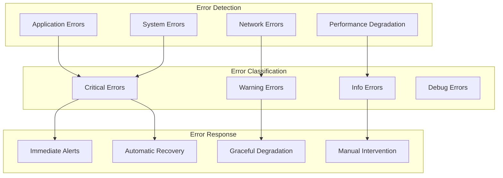

### Recovery Procedures

```typescript
interface RecoveryProcedures {
	// Automatic recovery
	automaticRecovery: {
		serviceRestart: {
			enabled: boolean
			maxAttempts: 3
			cooldownPeriod: "5m"
		}
		connectionRecovery: {
			enabled: boolean
			reconnectInterval: "1s"
			maxReconnectAttempts: 10
		}
		dataRecovery: {
			enabled: boolean
			backupInterval: "1h"
			retentionPeriod: "7d"
		}
	}

	// Manual recovery
	manualRecovery: {
		escalationProcedures: string[]
		contactInformation: Record<string, string>
		recoveryPlaybooks: string[]
	}
}
```

## 📖 Documentation Standards

### API Documentation

```typescript
interface APIDocumentationStandards {
	// OpenAPI specification
	openAPI: {
		version: "3.0.3"
		format: "YAML"
		validation: boolean
		codeGeneration: boolean
	}

	// Documentation requirements
	documentation: {
		endpointDescription: "required"
		requestExamples: "required"
		responseExamples: "required"
		errorCodes: "required"
		rateLimits: "required"
	}

	// Code examples
	codeExamples: {
		languages: ["TypeScript", "JavaScript", "Python", "Java"]
		frameworks: ["React", "Vue", "Angular", "React Native"]
		platforms: ["Web", "Mobile", "Desktop"]
	}
}
```

### Architecture Documentation

```typescript
interface ArchitectureDocumentationStandards {
	// Diagram standards
	diagrams: {
		tool: "Mermaid"
		types: ["sequence", "flowchart", "gantt", "class"]
		updateFrequency: "on-change"
		versionControl: boolean
	}

	// Documentation structure
	structure: {
		overview: "required"
		technicalSpecs: "required"
		integrationGuides: "required"
		troubleshooting: "required"
		examples: "required"
	}
}
```

---

## 📝 Document Revision History

| Version | Date       | Author                       | Changes                                     |
| ------- | ---------- | ---------------------------- | ------------------------------------------- |
| 1.0     | 2024-12-22 | Real-Time Communication Team | Initial complete architecture specification |

---

**Document Status:** ✅ Complete - Ready for Implementation  
**Next Steps:** Implement Event Broadcasting Service and begin service integration  
**Implementation Priority:** High - Critical for TASK-005.1.3 completion
