# Roo Cloud Architecture

**Document Version**: 1.0  
**Last Updated**: June 22, 2025  
**Status**: Planning Phase

---

## 🎯 **Overview**

This document defines the complete cloud architecture for Roo's cross-device functionality, enabling users to control their home development environment remotely from mobile devices through a cloud coordination service.

## 🏗️ **System Topology**


## 📱 **Real-World Scenario: Conference Remote Control**

### **Scenario Setup**

- **User**: At a conference with mobile phone
- **Home Setup**: Mac with VSCode + Roo running on home network
- **Cloud Infrastructure**: Google Cloud VM running coordination service
- **Goal**: Full remote control of home Roo instance

### **Component Distribution**

#### **Mobile Device (Conference Location)**

```typescript
// Mobile App Architecture
/roo-mobile-app/
├── src/
│   ├── screens/
│   │   ├── DeviceSelector.tsx      # Choose which home device to control
│   │   ├── ConversationView.tsx    # Real-time conversation display
│   │   ├── RemoteControls.tsx      # Send commands, abort tasks
│   │   └── ConnectionStatus.tsx    # Network status, device health
│   ├── services/
│   │   ├── MobileCloudClient.ts    # WebSocket connection to cloud
│   │   ├── DeviceManager.ts        # Manage registered devices
│   │   ├── AuthService.ts          # Device authentication
│   │   └── OfflineManager.ts       # Handle disconnections
│   └── components/
│       ├── MessageBubble.tsx       # Display conversation messages
│       ├── ToolExecutionView.tsx   # Show real-time tool execution
│       ├── FileChangeView.tsx      # Display file modifications
│       └── TerminalOutput.tsx      # Show terminal command results
```

#### **Google Cloud VM (Coordination Service)**

```typescript
// Cloud Service Architecture
/roo-cloud-service/
├── src/
│   ├── api/
│   │   ├── devices.ts              # Device registration endpoints
│   │   ├── conversations.ts        # Conversation management
│   │   ├── auth.ts                 # Authentication endpoints
│   │   └── health.ts               # Health check endpoints
│   ├── websocket/
│   │   ├── ConnectionManager.ts    # Manage WebSocket connections
│   │   ├── MessageRouter.ts        # Route messages between devices
│   │   ├── SessionManager.ts       # Handle device sessions
│   │   └── EventBroadcaster.ts     # Real-time event distribution
│   ├── relay/
│   │   ├── CommandRelay.ts         # Relay commands from mobile to desktop
│   │   ├── ResponseRelay.ts        # Stream responses back to mobile
│   │   ├── ConflictResolver.ts     # Handle simultaneous commands
│   │   └── QueueManager.ts         # Queue commands when devices offline
│   ├── database/
│   │   ├── ConversationService.ts  # Conversation persistence
│   │   ├── MessageService.ts       # Message storage and retrieval
│   │   ├── DeviceService.ts        # Device registration and status
│   │   └── SyncService.ts          # Cross-device synchronization
│   ├── cache/
│   │   ├── SessionCache.ts         # Redis session management
│   │   ├── MessageCache.ts         # Cache recent messages
│   │   ├── DeviceStatusCache.ts    # Cache device online status
│   │   └── PubSubManager.ts        # Real-time pub/sub events
│   └── security/
│       ├── DeviceAuth.ts           # Device authentication logic
│       ├── MessageEncryption.ts    # End-to-end message encryption
│       ├── RateLimiter.ts          # Prevent abuse
│       └── AccessControl.ts        # Permission management
├── migrations/                     # Database schema migrations
├── config/                         # Environment configurations
└── monitoring/                     # Health checks and metrics
```

#### **Home Mac (Enhanced Roo Extension)**

```typescript
// Enhanced Extension Architecture
/src/
├── core/
│   ├── webview/
│   │   └── ClineProvider.ts        # Enhanced with cloud connectivity
│   ├── cloud/                      # NEW: Cloud integration
│   │   ├── RooCloudClient.ts       # WebSocket client for cloud connection
│   │   ├── RemoteCommandHandler.ts # Handle commands from mobile devices
│   │   ├── CloudSyncManager.ts     # Sync local state with cloud
│   │   ├── DeviceRegistration.ts   # Register this device with cloud
│   │   └── ConnectionMonitor.ts    # Monitor cloud connection health
│   ├── task-persistence/           # ENHANCED: Hybrid storage
│   │   ├── apiMessages.ts          # Enhanced with cloud sync
│   │   ├── taskMessages.ts         # Enhanced with cloud sync
│   │   ├── CloudStorage.ts         # NEW: Cloud storage interface
│   │   └── HybridStorage.ts        # NEW: Local + cloud storage manager
│   └── hybrid-storage/             # NEW: Backward compatibility
│       ├── LocalFileManager.ts     # Manage existing local files
│       ├── CloudMigration.ts       # Migrate local tasks to cloud
│       └── ConflictResolver.ts     # Resolve local vs cloud conflicts
```

---

## 🔄 **Data Flow Examples**

### **Example 1: Send Command from Phone**


### **Example 2: Real-time File Changes**


### **Example 3: Connection Recovery**

```mermaid
sequenceDiagram
    participant Phone as Mobile App
    participant Cloud as Cloud VM
    participant Mac as Home Mac

    Note over Phone,Mac: Normal operation
    Phone->>Cloud: Send command
    Cloud->>Mac: Route command
    Mac--xCloud: Connection lost (network issue)
    Cloud->>Cloud: Queue pending responses
    Cloud->>Phone: Notify: "Device disconnected"
    Phone->>Phone: Show "Device Offline" state
    Mac->>Cloud: Reconnect WebSocket
    Cloud->>Mac: Send queued commands
    Mac->>Cloud: Send queued responses
    Cloud->>Phone: Notify: "Device reconnected"
    Phone->>Phone: Resume real-time updates
```



---

## 🔧 **Technical Implementation Details**

### **WebSocket Protocol Design**

#### **Message Types**

```typescript
// Base message structure
interface CloudMessage {
	id: string
	type: MessageType
	timestamp: number
	sourceDeviceId: string
	targetDeviceId?: string
	userId: string
	payload: any
	encryption?: EncryptionMetadata
}

// Message types for different operations
enum MessageType {
	// Device Management
	DEVICE_REGISTER = "device_register",
	DEVICE_STATUS = "device_status",
	DEVICE_DISCONNECT = "device_disconnect",

	// Remote Commands
	USER_MESSAGE = "user_message",
	ABORT_TASK = "abort_task",
	NEW_TASK = "new_task",
	PAUSE_TASK = "pause_task",

	// Tool Execution
	TOOL_START = "tool_start",
	TOOL_PROGRESS = "tool_progress",
	TOOL_COMPLETE = "tool_complete",
	TOOL_ERROR = "tool_error",

	// File Operations
	FILE_CHANGE = "file_change",
	FILE_CREATE = "file_create",
	FILE_DELETE = "file_delete",

	// System Events
	CONVERSATION_UPDATE = "conversation_update",
	SYNC_STATUS = "sync_status",
	ERROR = "error",
}
```

#### **Authentication Flow**

```typescript
// Device registration and authentication
interface DeviceRegistration {
	deviceId: string
	deviceName: string
	deviceType: "mobile" | "desktop"
	platform: string
	capabilities: DeviceCapabilities
	publicKey: string // For end-to-end encryption
}

interface AuthenticationToken {
	jwt: string
	refreshToken: string
	expiresAt: number
	deviceId: string
	userId: string
	permissions: Permission[]
}
```

### **Database Schema Extensions**

#### **Device Management Tables**

```sql
-- Enhanced device tracking
CREATE TABLE devices (
    id UUID PRIMARY KEY DEFAULT gen_random_uuid(),
    user_id UUID REFERENCES users(id) ON DELETE CASCADE,
    device_id VARCHAR(100) UNIQUE NOT NULL,
    device_name VARCHAR(200) NOT NULL,
    device_type VARCHAR(20) NOT NULL, -- 'mobile', 'desktop'
    platform VARCHAR(50) NOT NULL,
    capabilities JSONB DEFAULT '{}',
    public_key TEXT, -- For end-to-end encryption
    last_seen TIMESTAMP DEFAULT NOW(),
    status VARCHAR(20) DEFAULT 'offline', -- 'online', 'offline', 'suspended'
    created_at TIMESTAMP DEFAULT NOW(),
    updated_at TIMESTAMP DEFAULT NOW(),
    INDEX(user_id, status, last_seen),
    INDEX(device_id, status)
);

-- Real-time connection tracking
CREATE TABLE device_sessions (
    id UUID PRIMARY KEY DEFAULT gen_random_uuid(),
    device_id UUID REFERENCES devices(id) ON DELETE CASCADE,
    session_token VARCHAR(255) UNIQUE NOT NULL,
    websocket_id VARCHAR(100),
    ip_address INET,
    user_agent TEXT,
    connected_at TIMESTAMP DEFAULT NOW(),
    last_activity TIMESTAMP DEFAULT NOW(),
    status VARCHAR(20) DEFAULT 'active',
    INDEX(device_id, status, connected_at),
    INDEX(session_token),
    INDEX(websocket_id)
);

-- Command queue for offline devices
CREATE TABLE command_queue (
    id UUID PRIMARY KEY DEFAULT gen_random_uuid(),
    target_device_id UUID REFERENCES devices(id) ON DELETE CASCADE,
    source_device_id UUID REFERENCES devices(id) ON DELETE CASCADE,
    command_type VARCHAR(50) NOT NULL,
    command_data JSONB NOT NULL,
    priority INTEGER DEFAULT 0,
    created_at TIMESTAMP DEFAULT NOW(),
    expires_at TIMESTAMP,
    status VARCHAR(20) DEFAULT 'pending',
    retry_count INTEGER DEFAULT 0,
    max_retries INTEGER DEFAULT 3,
    INDEX(target_device_id, status, priority, created_at),
    INDEX(expires_at)
);
```

### **Security Implementation**

#### **End-to-End Encryption**

```typescript
interface MessageEncryption {
	encryptMessage: (message: any, recipientPublicKey: string) => EncryptedMessage
	decryptMessage: (encrypted: EncryptedMessage, privateKey: string) => any
	generateKeyPair: () => KeyPair
	rotateKeys: (deviceId: string) => Promise<void>
}

interface EncryptedMessage {
	encryptedData: string
	encryptionMethod: string
	keyId: string
	signature: string
}
```

#### **Access Control**

```typescript
interface Permission {
	resource: string // 'conversations', 'files', 'commands'
	action: string // 'read', 'write', 'execute'
	scope: string // 'own', 'shared', 'all'
}

interface AccessControl {
	checkPermission: (userId: string, deviceId: string, permission: Permission) => boolean
	grantPermission: (userId: string, deviceId: string, permission: Permission) => Promise<void>
	revokePermission: (userId: string, deviceId: string, permission: Permission) => Promise<void>
	revokeDevice: (userId: string, deviceId: string) => Promise<void>
}
```

---

## 🚀 **Deployment Architecture**

### **Google Cloud Platform Setup**

#### **Compute Resources**

```yaml
# Cloud VM Configuration
vm_instance:
    machine_type: "e2-standard-4" # 4 vCPUs, 16GB RAM
    disk_size: "100GB"
    disk_type: "pd-ssd"
    region: "us-central1"
    zones: ["us-central1-a", "us-central1-b"]

load_balancer:
    type: "Application Load Balancer"
    ssl_certificate: "managed"
    health_check: "/health"
    backend_timeout: "30s"
```

#### **Database Configuration**

```yaml
# Cloud SQL PostgreSQL
database:
    tier: "db-custom-2-8192" # 2 vCPUs, 8GB RAM
    storage_size: "100GB"
    storage_type: "SSD"
    backup_enabled: true
    backup_retention: "7 days"
    high_availability: true
    region: "us-central1"

# Redis Memorystore
cache:
    tier: "STANDARD_HA"
    memory_size: "4GB"
    region: "us-central1"
    auth_enabled: true
    transit_encryption: true
```

### **Network Configuration**

#### **Firewall Rules**

```yaml
# Firewall configuration
firewall_rules:
    - name: "allow-websocket"
      direction: "INGRESS"
      ports: ["443", "80"]
      source_ranges: ["0.0.0.0/0"]
      target_tags: ["roo-cloud-service"]

    - name: "allow-database"
      direction: "INGRESS"
      ports: ["5432"]
      source_tags: ["roo-cloud-service"]
      target_tags: ["roo-database"]

    - name: "allow-redis"
      direction: "INGRESS"
      ports: ["6379"]
      source_tags: ["roo-cloud-service"]
      target_tags: ["roo-cache"]
```

#### **Network Topology**


---

## 📊 **Performance Specifications**

### **Latency Requirements**

- **Command Routing**: <500ms from mobile to desktop
- **Real-time Updates**: <200ms for tool execution updates
- **File Sync**: <2 seconds for file changes
- **Connection Recovery**: <5 seconds for reconnection

### **Throughput Requirements**

- **Concurrent Users**: 1,000+ simultaneous connections
- **Messages per Second**: 10,000+ message routing capacity
- **Data Transfer**: 100MB/s aggregate bandwidth
- **Database Operations**: 1,000+ queries per second

### **Reliability Requirements**

- **Uptime**: 99.9% service availability
- **Data Durability**: 99.999999999% (11 9's)
- **Message Delivery**: At-least-once delivery guarantee
- **Connection Recovery**: Automatic reconnection with exponential backoff

---

## 🔍 **Monitoring and Observability**

### **Application Metrics**

```typescript
interface CloudServiceMetrics {
	connections: {
		activeConnections: number
		connectionRate: number
		disconnectionRate: number
		averageSessionDuration: number
	}
	messages: {
		messagesPerSecond: number
		messageLatency: number
		messageDeliveryRate: number
		queueDepth: number
	}
	devices: {
		onlineDevices: number
		devicesByType: Record<string, number>
		averageDevicesPerUser: number
	}
	performance: {
		cpuUtilization: number
		memoryUtilization: number
		networkThroughput: number
		databaseConnections: number
	}
}
```

### **Health Checks**

```typescript
interface HealthCheck {
	database: {
		status: "healthy" | "degraded" | "unhealthy"
		responseTime: number
		connectionCount: number
	}
	cache: {
		status: "healthy" | "degraded" | "unhealthy"
		hitRate: number
		memoryUsage: number
	}
	websocket: {
		status: "healthy" | "degraded" | "unhealthy"
		activeConnections: number
		messageQueueDepth: number
	}
}
```

### **Alerting Rules**

- **High Latency**: Alert if message routing >1 second
- **Connection Issues**: Alert if connection failure rate >5%
- **Database Performance**: Alert if query time >500ms
- **Memory Usage**: Alert if memory usage >80%
- **Disk Space**: Alert if disk usage >85%

---

## 🔒 **Security Architecture**

### **Network Security**

- **TLS 1.3**: All connections encrypted in transit
- **Certificate Pinning**: Mobile apps pin cloud service certificates
- **DDoS Protection**: Cloud Load Balancer with DDoS mitigation
- **Rate Limiting**: Per-user and per-IP rate limits
- **Geo-blocking**: Optional geographic access restrictions

### **Application Security**

```typescript
interface SecurityMeasures {
	authentication: {
		deviceRegistration: "PKI-based"
		sessionManagement: "JWT with refresh tokens"
		tokenRotation: "Automatic every 24 hours"
		multiFactorAuth: "Optional TOTP support"
	}
	authorization: {
		accessControl: "Role-based permissions"
		devicePermissions: "Granular device capabilities"
		commandValidation: "Server-side validation"
		auditLogging: "All actions logged"
	}
	dataProtection: {
		encryption: "AES-256 for sensitive data"
		keyManagement: "Google Cloud KMS"
		dataRetention: "Configurable retention policies"
		rightToDelete: "GDPR compliance"
	}
}
```

### **Compliance**

- **GDPR**: EU data protection compliance
- **SOC 2**: Security and availability controls
- **ISO 27001**: Information security management
- **CCPA**: California privacy compliance

---

## 🚀 **Migration Strategy**

### **Phase 1: Infrastructure Setup (Week 1)**

1. **Deploy Cloud Infrastructure**

    - Set up Google Cloud project
    - Deploy PostgreSQL and Redis
    - Configure networking and security
    - Set up monitoring and alerting

2. **Deploy Cloud Service**
    - Deploy Roo Cloud Coordination Service
    - Configure load balancer and SSL
    - Set up health checks
    - Deploy to staging environment

### **Phase 2: Extension Integration (Week 2)**

1. **Enhance Roo Extension**

    - Implement RooCloudClient
    - Add hybrid storage support
    - Integrate remote command handling
    - Maintain backward compatibility

2. **Testing and Validation**
    - Test cloud connectivity
    - Validate message routing
    - Test offline scenarios
    - Performance testing

### **Phase 3: Mobile App Development (Week 3)**

1. **Develop Mobile Application**

    - Implement mobile cloud client
    - Create real-time UI components
    - Add device management features
    - Test cross-device scenarios

2. **Production Deployment**
    - Deploy to production environment
    - Configure monitoring and alerting
    - Set up backup and recovery
    - User acceptance testing

---

## 📋 **Operational Procedures**

### **Deployment Process**

```bash
# Cloud service deployment
./scripts/deploy-cloud-service.sh --env production --region us-central1

# Database migration
./scripts/migrate-database.sh --target latest --env production

# Extension update
./scripts/package-extension.sh --version 2.0.0 --include-cloud

# Mobile app release
./scripts/build-mobile-app.sh --platform ios,android --env production
```

### **Backup and Recovery**

- **Database Backups**: Automated daily backups with 30-day retention
- **Point-in-Time Recovery**: 7-day point-in-time recovery window
- **Cross-Region Replication**: Backup replication to secondary region
- **Disaster Recovery**: RTO: 4 hours, RPO: 1 hour

### **Scaling Procedures**

- **Horizontal Scaling**: Auto-scaling based on CPU and connection count
- **Database Scaling**: Read replicas for query performance
- **Cache Scaling**: Redis cluster for high availability
- **Load Balancing**: Multi-zone load balancing for reliability

---

## 📚 **Related Documentation**

- [TASK-005: Mobile-First Extension Communication](./tasks/TASK_005_MOBILE_FIRST_EXTENSION_COMMUNICATION.md)
- [TASK-006: Cross-Device Authentication](./tasks/TASK_006_CROSS_DEVICE_AUTHENTICATION.md)
- [TASK-007: Database Integration & Sync](./tasks/TASK_007_DATABASE_INTEGRATION_SYNC.md)
- [TASK-008: Mobile Application Development](./tasks/TASK_008_MOBILE_APPLICATION_DEVELOPMENT.md)
- [System Architecture](./system-architecture.md)
- [API Specifications](./feature-2-api-specifications.md)

---

**Document Maintained By**: Architecture Team  
**Review Schedule**: Weekly during implementation  
**Next Review**: June 29, 2025
