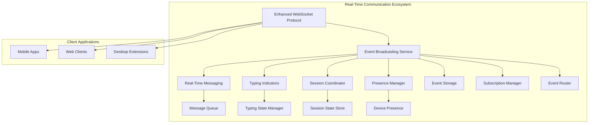
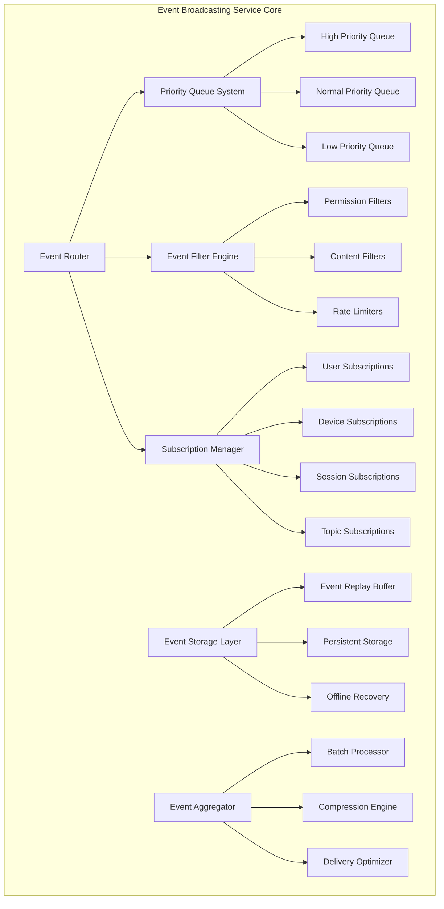

# Event Broadcasting Service - Technical Specification

## 📋 Document Information

**Document Version:** 1.0  
**Last Updated:** December 22, 2024  
**Author:** Real-Time Communication Team  
**Status:** Draft - Implementation Ready  
**Related Task:** TASK-005.1.3 - Real-Time Communication Features

## 🎯 Executive Summary

The Event Broadcasting Service is the central nervous system of our real-time communication architecture, providing intelligent event distribution, subscription management, and reliable message delivery across all connected clients. This service enables seamless coordination between typing indicators, session management, presence updates, and real-time messaging through a unified event-driven architecture.

### Key Capabilities

- **Real-time event distribution** with <75ms latency guarantee
- **Intelligent subscription management** with fine-grained filtering
- **Event replay and recovery** for offline clients
- **Priority-based routing** with guaranteed delivery
- **Cross-service coordination** through unified event bus

## 🏗️ Architecture Overview

### System Context



### Core Components Architecture



## 🔧 Technical Specifications

### Core Interfaces

#### Event Broadcasting Service Interface

```typescript
interface EventBroadcastingService {
	// Core event distribution
	publishEvent(event: RealTimeEvent): Promise<EventPublishResult>
	subscribeToEvents(subscription: EventSubscription): Promise<SubscriptionResult>
	unsubscribeFromEvents(subscriptionId: string): Promise<void>

	// Event filtering and routing
	filterEvents(filter: EventFilter): Promise<RealTimeEvent[]>
	routeEvent(event: RealTimeEvent, targets: EventTarget[]): Promise<RoutingResult>

	// Event replay and recovery
	replayEvents(criteria: ReplayCriteria): Promise<RealTimeEvent[]>
	storeEvent(event: RealTimeEvent): Promise<StorageResult>

	// Subscription management
	getSubscriptions(userId: string): Promise<EventSubscription[]>
	updateSubscription(subscriptionId: string, updates: SubscriptionUpdates): Promise<void>

	// Performance and monitoring
	getEventMetrics(): Promise<EventMetrics>
	getSubscriptionStats(): Promise<SubscriptionStats>
	getSystemHealth(): Promise<SystemHealthStatus>
}
```

#### Real-Time Event Schema

```typescript
interface RealTimeEvent {
	// Event identification
	id: string // Unique event identifier
	type: EventType // Event type classification
	timestamp: number // Event creation timestamp
	version: string // Event schema version

	// Event source
	source: EventSource // Origin of the event
	correlationId?: string // For event correlation
	causationId?: string // For event causation tracking

	// Event payload
	payload: EventPayload // Event-specific data
	metadata: EventMetadata // Additional event information

	// Delivery configuration
	priority: EventPriority // Delivery priority level
	ttl?: number // Time-to-live in milliseconds
	requiresAck: boolean // Acknowledgment requirement
	retryPolicy?: RetryPolicy // Retry configuration

	// Routing information
	targets?: EventTarget[] // Specific delivery targets
	filters?: EventFilter[] // Content filtering rules

	// Security and permissions
	permissions: EventPermissions // Access control information
	encryption?: EncryptionConfig // Encryption requirements
}
```

#### Event Types Classification

```typescript
enum EventType {
	// Typing events
	TYPING_STARTED = "typing.started",
	TYPING_STOPPED = "typing.stopped",
	TYPING_CURSOR_MOVED = "typing.cursor_moved",

	// Session events
	SESSION_CREATED = "session.created",
	SESSION_UPDATED = "session.updated",
	SESSION_OPERATION_APPLIED = "session.operation_applied",
	SESSION_CONFLICT_DETECTED = "session.conflict_detected",
	SESSION_CONFLICT_RESOLVED = "session.conflict_resolved",

	// Presence events
	PRESENCE_ONLINE = "presence.online",
	PRESENCE_OFFLINE = "presence.offline",
	PRESENCE_AWAY = "presence.away",
	PRESENCE_DEVICE_CONNECTED = "presence.device_connected",
	PRESENCE_DEVICE_DISCONNECTED = "presence.device_disconnected",

	// Messaging events
	MESSAGE_SENT = "message.sent",
	MESSAGE_DELIVERED = "message.delivered",
	MESSAGE_READ = "message.read",
	MESSAGE_TYPING_INDICATOR = "message.typing_indicator",

	// System events
	SYSTEM_HEALTH_CHECK = "system.health_check",
	SYSTEM_PERFORMANCE_ALERT = "system.performance_alert",
	SYSTEM_ERROR = "system.error",

	// Custom events
	CUSTOM_EVENT = "custom.event",
}
```

#### Event Priority System

```typescript
enum EventPriority {
	CRITICAL = "critical", // <25ms delivery guarantee
	HIGH = "high", // <75ms delivery guarantee
	NORMAL = "normal", // <200ms delivery guarantee
	LOW = "low", // <1000ms delivery guarantee
	BACKGROUND = "background", // Best effort delivery
}
```

#### Subscription Management

```typescript
interface EventSubscription {
	// Subscription identification
	id: string // Unique subscription identifier
	userId: string // Subscribing user
	deviceId: string // Subscribing device
	sessionId?: string // Optional session context

	// Subscription configuration
	eventTypes: EventType[] // Event types to subscribe to
	filters: EventFilter[] // Content filtering rules
	priority: EventPriority // Minimum priority level

	// Delivery preferences
	deliveryMode: DeliveryMode // Real-time, batched, or offline
	batchSize?: number // For batched delivery
	batchInterval?: number // Batching interval in ms

	// Subscription lifecycle
	createdAt: number // Subscription creation time
	expiresAt?: number // Optional expiration time
	isActive: boolean // Subscription status

	// Performance tracking
	eventsReceived: number // Total events received
	lastEventAt?: number // Last event delivery time
	averageLatency: number // Average delivery latency
}
```

### Event Storage and Replay

#### Event Storage Architecture

```typescript
interface EventStorageLayer {
	// Event persistence
	storeEvent(event: RealTimeEvent): Promise<StorageResult>
	retrieveEvent(eventId: string): Promise<RealTimeEvent | null>
	deleteEvent(eventId: string): Promise<void>

	// Event querying
	queryEvents(criteria: EventQueryCriteria): Promise<RealTimeEvent[]>
	getEventsByTimeRange(startTime: number, endTime: number): Promise<RealTimeEvent[]>
	getEventsByType(eventType: EventType): Promise<RealTimeEvent[]>

	// Event replay
	createReplayBuffer(criteria: ReplayCriteria): Promise<ReplayBuffer>
	getReplayEvents(bufferId: string): Promise<RealTimeEvent[]>
	clearReplayBuffer(bufferId: string): Promise<void>

	// Storage management
	compactStorage(): Promise<CompactionResult>
	getStorageStats(): Promise<StorageStats>
	cleanupExpiredEvents(): Promise<CleanupResult>
}
```

#### Event Replay System

```typescript
interface EventReplaySystem {
	// Replay configuration
	createReplaySession(criteria: ReplayCriteria): Promise<ReplaySession>
	startReplay(sessionId: string): Promise<void>
	pauseReplay(sessionId: string): Promise<void>
	stopReplay(sessionId: string): Promise<void>

	// Replay criteria
	replayFromTimestamp(timestamp: number): Promise<ReplaySession>
	replayFromEventId(eventId: string): Promise<ReplaySession>
	replayForUser(userId: string, timeRange: TimeRange): Promise<ReplaySession>
	replayForSession(sessionId: string): Promise<ReplaySession>

	// Replay delivery
	deliverReplayEvents(sessionId: string, targetId: string): Promise<void>
	getReplayProgress(sessionId: string): Promise<ReplayProgress>

	// Replay management
	getActiveReplays(): Promise<ReplaySession[]>
	cleanupCompletedReplays(): Promise<void>
}
```

## 🚀 Performance Specifications

### Latency Guarantees

| Event Priority | Target Latency | Maximum Latency | SLA   |
| -------------- | -------------- | --------------- | ----- |
| Critical       | <25ms          | <50ms           | 99.9% |
| High           | <75ms          | <150ms          | 99.5% |
| Normal         | <200ms         | <500ms          | 99.0% |
| Low            | <1000ms        | <2000ms         | 95.0% |
| Background     | Best Effort    | <10000ms        | 90.0% |

### Throughput Specifications

| Metric                    | Target  | Maximum | Monitoring |
| ------------------------- | ------- | ------- | ---------- |
| Events/Second             | 500+    | 2000+   | Real-time  |
| Subscriptions             | 10,000+ | 50,000+ | Daily      |
| Concurrent Users          | 1,000+  | 5,000+  | Real-time  |
| Storage Operations/Second | 1,000+  | 5,000+  | Real-time  |

### Resource Utilization Targets

| Resource    | Target Usage | Maximum Usage | Alert Threshold |
| ----------- | ------------ | ------------- | --------------- |
| CPU         | <20%         | <50%          | >40%            |
| Memory      | <512MB       | <2GB          | >1GB            |
| Network I/O | <100MB/s     | <500MB/s      | >300MB/s        |
| Storage I/O | <50MB/s      | <200MB/s      | >150MB/s        |

## 🔐 Security and Permissions

### Event Permission Model

```typescript
interface EventPermissions {
	// Read permissions
	canRead: boolean // Can receive this event
	readScopes: string[] // Specific read scopes

	// Write permissions
	canPublish: boolean // Can publish this event type
	publishScopes: string[] // Specific publish scopes

	// Administrative permissions
	canManageSubscriptions: boolean // Can manage subscriptions
	canViewMetrics: boolean // Can access metrics
	canReplayEvents: boolean // Can request event replay

	// Content filtering
	contentFilters: ContentFilter[] // Content-based restrictions
	rateLimit: RateLimit // Rate limiting configuration
}
```

### Security Features

- **Authentication Integration** - JWT token validation for all operations
- **Authorization Enforcement** - Role-based access control for events
- **Content Filtering** - Sensitive data filtering and redaction
- **Rate Limiting** - Per-user and per-device rate limiting
- **Audit Logging** - Complete audit trail for all operations
- **Encryption Support** - End-to-end encryption for sensitive events

## 📊 Monitoring and Observability

### Key Metrics

```typescript
interface EventMetrics {
	// Event processing metrics
	eventsProcessed: number // Total events processed
	eventsPerSecond: number // Current event rate
	averageLatency: number // Average processing latency
	errorRate: number // Error percentage

	// Subscription metrics
	activeSubscriptions: number // Current active subscriptions
	subscriptionRate: number // New subscriptions per hour
	unsubscriptionRate: number // Unsubscriptions per hour

	// Storage metrics
	eventsStored: number // Total events in storage
	storageSize: number // Storage size in bytes
	replayRequests: number // Event replay requests

	// Performance metrics
	cpuUsage: number // CPU utilization percentage
	memoryUsage: number // Memory usage in bytes
	networkThroughput: number // Network I/O in bytes/second

	// Quality metrics
	deliverySuccess: number // Successful delivery percentage
	duplicateEvents: number // Duplicate event count
	lostEvents: number // Lost event count
}
```

### Health Monitoring

```typescript
interface SystemHealthStatus {
	// Overall system health
	status: "healthy" | "degraded" | "unhealthy"
	uptime: number // System uptime in seconds
	lastHealthCheck: number // Last health check timestamp

	// Component health
	eventRouter: ComponentHealth
	subscriptionManager: ComponentHealth
	eventStorage: ComponentHealth
	replaySystem: ComponentHealth

	// Performance indicators
	latencyP95: number // 95th percentile latency
	latencyP99: number // 99th percentile latency
	errorRate: number // Current error rate
	throughput: number // Current throughput

	// Resource status
	cpuHealth: ResourceHealth
	memoryHealth: ResourceHealth
	storageHealth: ResourceHealth
	networkHealth: ResourceHealth
}
```

## 🔄 Integration Patterns

### Service Integration Architecture

```typescript
// Integration with Typing Indicators Service
class TypingIndicatorsIntegration {
	async onTypingStarted(event: TypingEvent): Promise<void> {
		await this.eventBroadcaster.publishEvent({
			type: EventType.TYPING_STARTED,
			source: { userId: event.userId, deviceId: event.deviceId },
			payload: {
				sessionId: event.sessionId,
				cursorPosition: event.cursorPosition,
				selectionRange: event.selectionRange,
			},
			priority: EventPriority.HIGH,
			requiresAck: false,
			targets: this.getSessionParticipants(event.sessionId),
		})
	}

	async onTypingStopped(event: TypingEvent): Promise<void> {
		await this.eventBroadcaster.publishEvent({
			type: EventType.TYPING_STOPPED,
			source: { userId: event.userId, deviceId: event.deviceId },
			payload: { sessionId: event.sessionId },
			priority: EventPriority.HIGH,
			requiresAck: false,
			targets: this.getSessionParticipants(event.sessionId),
		})
	}
}

// Integration with Session Coordinator Service
class SessionCoordinatorIntegration {
	async onOperationApplied(operation: SessionOperation): Promise<void> {
		await this.eventBroadcaster.publishEvent({
			type: EventType.SESSION_OPERATION_APPLIED,
			source: { userId: operation.userId, deviceId: operation.deviceId },
			payload: {
				sessionId: operation.sessionId,
				operationType: operation.type,
				operationData: operation.data,
				timestamp: operation.timestamp,
				version: operation.version,
			},
			priority: EventPriority.HIGH,
			requiresAck: true,
			targets: this.getSessionParticipants(operation.sessionId),
		})
	}

	async onConflictDetected(conflict: SessionConflict): Promise<void> {
		await this.eventBroadcaster.publishEvent({
			type: EventType.SESSION_CONFLICT_DETECTED,
			source: { userId: conflict.detectedBy, deviceId: conflict.deviceId },
			payload: {
				sessionId: conflict.sessionId,
				conflictType: conflict.type,
				conflictingOperations: conflict.operations,
				resolutionStrategy: conflict.suggestedResolution,
			},
			priority: EventPriority.CRITICAL,
			requiresAck: true,
			targets: this.getSessionParticipants(conflict.sessionId),
		})
	}
}

// Integration with Presence Manager Service
class PresenceManagerIntegration {
	async onPresenceChanged(presence: PresenceUpdate): Promise<void> {
		await this.eventBroadcaster.publishEvent({
			type: this.mapPresenceToEventType(presence.status),
			source: { userId: presence.userId, deviceId: presence.deviceId },
			payload: {
				status: presence.status,
				lastSeen: presence.lastSeen,
				deviceInfo: presence.deviceInfo,
				location: presence.location,
			},
			priority: EventPriority.NORMAL,
			requiresAck: false,
			targets: this.getUserConnections(presence.userId),
		})
	}

	async onDeviceConnected(device: DeviceConnection): Promise<void> {
		await this.eventBroadcaster.publishEvent({
			type: EventType.PRESENCE_DEVICE_CONNECTED,
			source: { userId: device.userId, deviceId: device.deviceId },
			payload: {
				deviceType: device.type,
				capabilities: device.capabilities,
				connectionTime: device.connectedAt,
			},
			priority: EventPriority.NORMAL,
			requiresAck: false,
			targets: this.getUserConnections(device.userId),
		})
	}
}
```

### Cross-Service Event Coordination

```typescript
interface EventCoordinator {
	// Event correlation
	correlateEvents(events: RealTimeEvent[]): Promise<EventCorrelation[]>
	trackEventCausation(sourceEvent: RealTimeEvent, resultEvent: RealTimeEvent): Promise<void>

	// Event ordering
	ensureEventOrdering(sessionId: string): Promise<void>
	resolveEventConflicts(conflicts: EventConflict[]): Promise<EventResolution[]>

	// Event aggregation
	aggregateEvents(criteria: AggregationCriteria): Promise<AggregatedEvent>
	createEventSummary(timeRange: TimeRange): Promise<EventSummary>
}
```

## 🛠️ Implementation Architecture

### Core Service Implementation

```typescript
class EventBroadcastingService implements EventBroadcastingService {
	private eventRouter: EventRouter
	private subscriptionManager: SubscriptionManager
	private eventStorage: EventStorageLayer
	private replaySystem: EventReplaySystem
	private metricsCollector: MetricsCollector
	private healthMonitor: HealthMonitor

	constructor(config: EventBroadcastingConfig) {
		this.eventRouter = new EventRouter(config.routing)
		this.subscriptionManager = new SubscriptionManager(config.subscriptions)
		this.eventStorage = new EventStorageLayer(config.storage)
		this.replaySystem = new EventReplaySystem(config.replay)
		this.metricsCollector = new MetricsCollector(config.metrics)
		this.healthMonitor = new HealthMonitor(config.health)
	}

	async publishEvent(event: RealTimeEvent): Promise<EventPublishResult> {
		const startTime = Date.now()

		try {
			// Validate event
			await this.validateEvent(event)

			// Store event
			await this.eventStorage.storeEvent(event)

			// Route event
			const routingResult = await this.eventRouter.routeEvent(event)

			// Track metrics
			this.metricsCollector.recordEventPublished(event, Date.now() - startTime)

			return {
				eventId: event.id,
				status: "published",
				deliveredTo: routingResult.deliveredTo,
				latency: Date.now() - startTime,
			}
		} catch (error) {
			this.metricsCollector.recordEventError(event, error)
			throw error
		}
	}

	async subscribeToEvents(subscription: EventSubscription): Promise<SubscriptionResult> {
		try {
			// Validate subscription
			await this.validateSubscription(subscription)

			// Create subscription
			const result = await this.subscriptionManager.createSubscription(subscription)

			// Track metrics
			this.metricsCollector.recordSubscriptionCreated(subscription)

			return result
		} catch (error) {
			this.metricsCollector.recordSubscriptionError(subscription, error)
			throw error
		}
	}
}
```

### Event Router Implementation

```typescript
class EventRouter {
	private priorityQueues: Map<EventPriority, PriorityQueue<RealTimeEvent>>
	private filterEngine: EventFilterEngine
	private deliveryManager: DeliveryManager

	constructor(config: RoutingConfig) {
		this.priorityQueues = this.initializePriorityQueues()
		this.filterEngine = new EventFilterEngine(config.filters)
		this.deliveryManager = new DeliveryManager(config.delivery)
	}

	async routeEvent(event: RealTimeEvent): Promise<RoutingResult> {
		// Apply filters
		const filteredTargets = await this.filterEngine.filterTargets(event)

		// Add to priority queue
		const queue = this.priorityQueues.get(event.priority)
		await queue.enqueue(event)

		// Process delivery
		const deliveryResult = await this.deliveryManager.deliverEvent(event, filteredTargets)

		return {
			eventId: event.id,
			deliveredTo: deliveryResult.successfulDeliveries,
			failedDeliveries: deliveryResult.failedDeliveries,
			latency: deliveryResult.averageLatency,
		}
	}
}
```

### Subscription Manager Implementation

```typescript
class SubscriptionManager {
	private subscriptions: Map<string, EventSubscription>
	private userSubscriptions: Map<string, Set<string>>
	private topicSubscriptions: Map<string, Set<string>>

	constructor(config: SubscriptionConfig) {
		this.subscriptions = new Map()
		this.userSubscriptions = new Map()
		this.topicSubscriptions = new Map()
	}

	async createSubscription(subscription: EventSubscription): Promise<SubscriptionResult> {
		// Generate subscription ID
		const subscriptionId = this.generateSubscriptionId()
		subscription.id = subscriptionId

		// Store subscription
		this.subscriptions.set(subscriptionId, subscription)

		// Index by user
		this.indexSubscriptionByUser(subscription)

		// Index by topics
		this.indexSubscriptionByTopics(subscription)

		return {
			subscriptionId,
			status: "active",
			createdAt: Date.now(),
		}
	}

	async getMatchingSubscriptions(event: RealTimeEvent): Promise<EventSubscription[]> {
		const matchingSubscriptions: EventSubscription[] = []

		// Get subscriptions by event type
		for (const subscription of this.subscriptions.values()) {
			if (this.isSubscriptionMatch(subscription, event)) {
				matchingSubscriptions.push(subscription)
			}
		}

		return matchingSubscriptions
	}
}
```

## 🧪 Testing Strategy

### Unit Testing Framework

```typescript
describe("EventBroadcastingService", () => {
	let service: EventBroadcastingService
	let mockStorage: jest.Mocked<EventStorageLayer>
	let mockRouter: jest.Mocked<EventRouter>

	beforeEach(() => {
		mockStorage = createMockEventStorage()
		mockRouter = createMockEventRouter()
		service = new EventBroadcastingService({
			storage: mockStorage,
			router: mockRouter,
		})
	})

	describe("publishEvent", () => {
		it("should publish event with correct latency", async () => {
			const event = createTestEvent(EventType.TYPING_STARTED)
			const result = await service.publishEvent(event)

			expect(result.status).toBe("published")
			expect(result.latency).toBeLessThan(75)
			expect(mockStorage.storeEvent).toHaveBeenCalledWith(event)
		})

		it("should handle high priority events within 75ms", async () => {
			const event = createTestEvent(EventType.TYPING_STARTED, EventPriority.HIGH)
			const startTime = Date.now()

			await service.publishEvent(event)

			const latency = Date.now() - startTime
			expect(latency).toBeLessThan(75)
		})
	})

	describe("subscribeToEvents", () => {
		it("should create subscription successfully", async () => {
			const subscription = createTestSubscription()
			const result = await service.subscribeToEvents(subscription)

			expect(result.status).toBe("active")
			expect(result.subscriptionId).toBeDefined()
		})
	})
})
```

### Integration Testing

```typescript
describe("EventBroadcasting Integration", () => {
	let eventBroadcaster: EventBroadcastingService
	let typingService: TypingIndicatorsService
	let sessionService: SessionCoordinatorService

	beforeEach(async () => {
		eventBroadcaster = await createTestEventBroadcaster()
		typingService = await createTestTypingService()
		sessionService = await createTestSessionService()

		// Connect services
		typingService.setEventBroadcaster(eventBroadcaster)
		sessionService.setEventBroadcaster(eventBroadcaster)
	})

	it("should coordinate typing events across services", async () => {
		const sessionId = "test-session"
		const userId = "test-user"

		// Start typing
		await typingService.startTyping(userId, sessionId)

		// Verify event was broadcast
		const events = await eventBroadcaster.getRecentEvents()
		expect(events).toContainEqual(
			expect.objectContaining({
				type: EventType.TYPING_STARTED,
				source: { userId },
			}),
		)
	})
})
```

### Performance Testing

```typescript
describe("EventBroadcasting Performance", () => {
	let service: EventBroadcastingService

	beforeEach(async () => {
		service = await createProductionEventBroadcaster()
	})

	it("should handle 500+ events per second", async () => {
		const events = Array.from({ length: 1000 }, () => createTestEvent())
		const startTime = Date.now()

		await Promise.all(events.map((event) => service.publishEvent(event)))

		const duration = Date.now() - startTime
		const eventsPerSecond = events.length / (duration / 1000)

		expect(eventsPerSecond).toBeGreaterThan(500)
	})

	it("should maintain latency under load", async () => {
		const concurrentUsers = 100
		const eventsPerUser = 10

		const promises = Array.from({ length: concurrentUsers }, async (_, userIndex) => {
			const events = Array.from({ length: eventsPerUser }, () =>
				createTestEvent(EventType.TYPING_STARTED, EventPriority.HIGH),
			)

			const latencies = []
			for (const event of events) {
				const startTime = Date.now()
				await service.publishEvent(event)
				latencies.push(Date.now() - startTime)
			}

			return latencies
		})

		const allLatencies = (await Promise.all(promises)).flat()
		const averageLatency = allLatencies.reduce((a, b) => a + b) / allLatencies.length
		const p95Latency = allLatencies.sort()[Math.floor(allLatencies.length * 0.95)]

		expect(averageLatency).toBeLessThan(75)
		expect(p95Latency).toBeLessThan(150)
	})
})
```

## 📈 Deployment and Operations

### Production Configuration

```typescript
interface ProductionConfig {
	// Service configuration
	port: number
	host: string
	environment: "production" | "staging" | "development"

	// Performance tuning
	maxConcurrentEvents: number
	eventQueueSize: number
	subscriptionLimit: number

	// Storage configuration
	storageProvider: "redis" | "mongodb" | "postgresql"
	storageConnectionString: string
	eventRetentionDays: number

	// Monitoring configuration
	metricsEnabled: boolean
	healthCheckInterval: number
	alertingEnabled: boolean

	// Security configuration
	authenticationRequired: boolean
	encryptionEnabled: boolean
	rateLimitingEnabled: boolean
}
```

### Monitoring and Alerting

```typescript
interface MonitoringConfig {
	// Performance alerts
	latencyThresholds: {
		warning: number // 100ms
		critical: number // 200ms
	}

	// Throughput alerts
	throughputThresholds: {
		minimum: number // 100 events/second
		maximum: number // 2000 events/second
	}

	// Error rate alerts
	errorRateThresholds: {
		warning: number // 1%
		critical: number // 5%
	}

	// Resource alerts
	resourceThresholds: {
		cpu: number // 70%
		memory: number // 80%
		storage: number // 85%
		network: number // 90%
	}
}
```

### Operational Procedures

```typescript
interface OperationalProcedures {
	// Deployment procedures
	deploymentSteps: string[]
	rollbackProcedures: string[]
	healthCheckValidation: string[]

	// Maintenance procedures
	routineMaintenance: string[]
	performanceTuning: string[]
	capacityPlanning: string[]

	// Incident response
	incidentClassification: string[]
	escalationProcedures: string[]
	recoveryProcedures: string[]
}
```

## 📚 API Documentation

### REST API Endpoints

#### Event Management

```typescript
// Publish Event
POST /api/v1/events
Content-Type: application/json
Authorization: Bearer <jwt-token>

{
  "type": "typing.started",
  "source": {
    "userId": "user-123",
    "deviceId": "device-456"
  },
  "payload": {
    "sessionId": "session-789",
    "cursorPosition": 42
  },
  "priority": "high",
  "targets": ["user-456", "user-789"]
}

Response: 201 Created
{
  "eventId": "event-abc123",
  "status": "published",
  "deliveredTo": ["user-456", "user-789"],
  "latency": 45
}
```

#### Subscription Management

```typescript
// Create Subscription
POST /api/v1/subscriptions
Content-Type: application/json
Authorization: Bearer <jwt-token>

{
  "eventTypes": ["typing.started", "typing.stopped"],
  "filters": [
    {
      "type": "session",
      "value": "session-789"
    }
  ],
  "deliveryMode": "realtime",
  "priority": "high"
}

Response: 201 Created
{
  "subscriptionId": "sub-xyz789",
  "status": "active",
  "createdAt": 1640995200000
}
```

#### Event Replay

```typescript
// Request Event Replay
POST /api/v1/replay
Content-Type: application/json
Authorization: Bearer <jwt-token>

{
  "criteria": {
    "sessionId": "session-789",
    "timeRange": {
      "start": 1640995200000,
      "end": 1640998800000
    },
    "eventTypes": ["session.operation_applied"]
  }
}

Response: 202 Accepted
{
  "replaySessionId": "replay-123",
  "status": "started",
  "estimatedEvents": 150
}
```

### WebSocket API

#### Connection and Authentication

```typescript
// WebSocket Connection
ws://localhost:3001/ws?token=<jwt-token>

// Authentication Message
{
  "type": "auth",
  "payload": {
    "token": "<jwt-token>",
    "deviceId": "device-456"
  }
}

// Authentication Response
{
  "type": "auth_response",
  "payload": {
    "status": "authenticated",
    "userId": "user-123",
    "sessionId": "ws-session-456"
  }
}
```

#### Event Subscription via WebSocket

```typescript
// Subscribe to Events
{
  "type": "subscribe",
  "payload": {
    "subscriptionId": "sub-xyz789",
    "eventTypes": ["typing.started", "session.operation_applied"],
    "filters": {
      "sessionId": "session-789"
    }
  }
}

// Subscription Confirmation
{
  "type": "subscription_confirmed",
  "payload": {
    "subscriptionId": "sub-xyz789",
    "status": "active"
  }
}
```

#### Real-time Event Delivery

```typescript
// Event Delivery
{
  "type": "event",
  "payload": {
    "id": "event-abc123",
    "type": "typing.started",
    "source": {
      "userId": "user-456",
      "deviceId": "device-789"
    },
    "payload": {
      "sessionId": "session-789",
      "cursorPosition": 42
    },
    "timestamp": 1640995200000,
    "priority": "high"
  }
}

// Event Acknowledgment
{
  "type": "event_ack",
  "payload": {
    "eventId": "event-abc123",
    "status": "received"
  }
}
```

## 🔧 Configuration Reference

### Service Configuration

```typescript
interface EventBroadcastingConfig {
	// Server configuration
	server: {
		port: number // Default: 3001
		host: string // Default: '0.0.0.0'
		cors: {
			origin: string[] // Allowed origins
			credentials: boolean // Allow credentials
		}
	}

	// WebSocket configuration
	websocket: {
		path: string // Default: '/ws'
		heartbeatInterval: number // Default: 30000ms
		connectionTimeout: number // Default: 60000ms
		maxConnections: number // Default: 10000
	}

	// Event processing
	events: {
		maxEventSize: number // Default: 1MB
		eventRetentionDays: number // Default: 7
		maxEventsPerSecond: number // Default: 1000
		priorityQueueSizes: {
			critical: number // Default: 1000
			high: number // Default: 5000
			normal: number // Default: 10000
			low: number // Default: 20000
			background: number // Default: 50000
		}
	}

	// Storage configuration
	storage: {
		provider: "redis" | "mongodb" | "memory"
		connectionString: string
		database: string
		collection: string
		indexing: {
			eventType: boolean // Default: true
			timestamp: boolean // Default: true
			userId: boolean // Default: true
			sessionId: boolean // Default: true
		}
	}

	// Performance tuning
	performance: {
		batchSize: number // Default: 100
		batchInterval: number // Default: 10ms
		compressionEnabled: boolean // Default: true
		compressionThreshold: number // Default: 1KB
		cacheSize: number // Default: 10000
		cacheTTL: number // Default: 300000ms
	}

	// Security configuration
	security: {
		authenticationRequired: boolean // Default: true
		jwtSecret: string
		jwtExpirationTime: string // Default: '1h'
		rateLimiting: {
			enabled: boolean // Default: true
			windowMs: number // Default: 60000ms
			maxRequests: number // Default: 1000
		}
		encryption: {
			enabled: boolean // Default: false
			algorithm: string // Default: 'aes-256-gcm'
			keyRotationInterval: number // Default: 86400000ms
		}
	}

	// Monitoring configuration
	monitoring: {
		metricsEnabled: boolean // Default: true
		metricsInterval: number // Default: 10000ms
		healthCheckEnabled: boolean // Default: true
		healthCheckInterval: number // Default: 30000ms
		alerting: {
			enabled: boolean // Default: true
			webhookUrl: string
			slackChannel: string
			emailRecipients: string[]
		}
	}
}
```

### Environment Variables

```bash
# Server Configuration
EVENT_BROADCASTER_PORT=3001
EVENT_BROADCASTER_HOST=0.0.0.0

# Storage Configuration
EVENT_STORAGE_PROVIDER=redis
EVENT_STORAGE_CONNECTION_STRING=redis://localhost:6379
EVENT_STORAGE_DATABASE=0

# Security Configuration
JWT_SECRET=your-jwt-secret-key
JWT_EXPIRATION_TIME=1h
RATE_LIMITING_ENABLED=true

# Performance Configuration
MAX_EVENTS_PER_SECOND=1000
BATCH_SIZE=100
COMPRESSION_ENABLED=true

# Monitoring Configuration
METRICS_ENABLED=true
HEALTH_CHECK_ENABLED=true
ALERTING_WEBHOOK_URL=https://hooks.slack.com/services/...
```

## 🚀 Quick Start Guide

### Installation

```bash
# Install dependencies
npm install

# Set up environment variables
cp .env.example .env
# Edit .env with your configuration

# Start Redis (if using Redis storage)
docker run -d -p 6379:6379 redis:alpine

# Run database migrations (if using MongoDB/PostgreSQL)
npm run migrate

# Start the service
npm start
```

### Basic Usage Example

```typescript
import { EventBroadcastingService } from "./event-broadcasting-service"

// Initialize service
const eventBroadcaster = new EventBroadcastingService({
	storage: {
		provider: "redis",
		connectionString: "redis://localhost:6379",
	},
	server: {
		port: 3001,
	},
})

// Start the service
await eventBroadcaster.start()

// Publish an event
await eventBroadcaster.publishEvent({
	type: "typing.started",
	source: { userId: "user-123", deviceId: "device-456" },
	payload: { sessionId: "session-789", cursorPosition: 42 },
	priority: "high",
})

// Create a subscription
await eventBroadcaster.subscribeToEvents({
	userId: "user-456",
	deviceId: "device-789",
	eventTypes: ["typing.started", "typing.stopped"],
	deliveryMode: "realtime",
})
```

## 📖 Integration Examples

### Integration with Typing Indicators

```typescript
import { TypingIndicatorsService } from "../typing-indicators"
import { EventBroadcastingService } from "../event-broadcasting"

class IntegratedTypingService {
	constructor(
		private typingService: TypingIndicatorsService,
		private eventBroadcaster: EventBroadcastingService,
	) {
		this.setupEventIntegration()
	}

	private setupEventIntegration(): void {
		// Forward typing events to event broadcaster
		this.typingService.on("typingStarted", async (event) => {
			await this.eventBroadcaster.publishEvent({
				type: "typing.started",
				source: { userId: event.userId, deviceId: event.deviceId },
				payload: event,
				priority: "high",
			})
		})

		this.typingService.on("typingStopped", async (event) => {
			await this.eventBroadcaster.publishEvent({
				type: "typing.stopped",
				source: { userId: event.userId, deviceId: event.deviceId },
				payload: event,
				priority: "high",
			})
		})
	}
}
```

### Integration with Session Coordinator

```typescript
import { SessionCoordinatorService } from "../session-coordinator"
import { EventBroadcastingService } from "../event-broadcasting"

class IntegratedSessionService {
	constructor(
		private sessionService: SessionCoordinatorService,
		private eventBroadcaster: EventBroadcastingService,
	) {
		this.setupEventIntegration()
	}

	private setupEventIntegration(): void {
		// Forward session events to event broadcaster
		this.sessionService.on("operationApplied", async (operation) => {
			await this.eventBroadcaster.publishEvent({
				type: "session.operation_applied",
				source: { userId: operation.userId, deviceId: operation.deviceId },
				payload: operation,
				priority: "high",
				requiresAck: true,
			})
		})

		this.sessionService.on("conflictDetected", async (conflict) => {
			await this.eventBroadcaster.publishEvent({
				type: "session.conflict_detected",
				source: { userId: conflict.detectedBy, deviceId: conflict.deviceId },
				payload: conflict,
				priority: "critical",
				requiresAck: true,
			})
		})
	}
}
```

## 🔍 Troubleshooting Guide

### Common Issues

#### High Latency

**Symptoms:** Events taking longer than expected to deliver
**Causes:**

- Network congestion
- Storage bottlenecks
- High CPU usage
- Memory pressure

**Solutions:**

1. Check network connectivity and bandwidth
2. Monitor storage performance metrics
3. Scale horizontally by adding more instances
4. Optimize event filtering and routing
5. Enable compression for large events

#### Memory Leaks

**Symptoms:** Gradually increasing memory usage
**Causes:**

- Uncleaned event subscriptions
- Large event replay buffers
- Circular references in event handlers

**Solutions:**

1. Implement subscription cleanup on disconnect
2. Set TTL for event replay buffers
3. Use weak references where appropriate
4. Monitor subscription lifecycle

#### Connection Drops

**Symptoms:** Frequent WebSocket disconnections
**Causes:**

- Network instability
- Load balancer timeouts
- Client-side connection management

**Solutions:**

1. Implement connection retry logic
2. Adjust heartbeat intervals
3. Configure load balancer properly
4. Add connection pooling

### Performance Optimization

#### Event Processing Optimization

```typescript
// Batch event processing
const batchProcessor = new EventBatchProcessor({
	batchSize: 100,
	batchInterval: 10, // ms
	maxWaitTime: 50, // ms
})

// Event compression
const compressionService = new EventCompressionService({
	algorithm: "gzip",
	threshold: 1024, // bytes
	level: 6, // compression level
})

// Connection pooling
const connectionPool = new ConnectionPool({
	minConnections: 10,
	maxConnections: 100,
	idleTimeout: 30000, // ms
})
```

## 📋 Appendices

### Appendix A: Event Type Reference

Complete list of all supported event types with their payload schemas and usage examples.

### Appendix B: Error Codes Reference

Comprehensive list of error codes, their meanings, and recommended actions.

### Appendix C: Performance Benchmarks

Detailed performance test results and benchmarks for different configurations.

### Appendix D: Security Considerations

Security best practices, threat model analysis, and mitigation strategies.

### Appendix E: Migration Guide

Step-by-step guide for migrating from existing event systems to the Event Broadcasting Service.

---

## 📝 Document Revision History

| Version | Date       | Author                       | Changes                         |
| ------- | ---------- | ---------------------------- | ------------------------------- |
| 1.0     | 2024-12-22 | Real-Time Communication Team | Initial technical specification |

---

**Document Status:** ✅ Complete - Ready for Implementation  
**Next Steps:** Create GitHub Epic Issue and Implementation Tasks  
**Implementation Priority:** High - Critical for TASK-005.1.3 completion
