# System Architecture
## Feature 2: Remote UI Access for Roo

### Document Information
- **Version**: 1.0
- **Date**: December 2024
- **Status**: Draft

---

## 1. Overview

This document provides a comprehensive architectural overview of the Remote UI Access system for Roo, including component diagrams, data flow, and technical design decisions.

---

## 2. High-Level Architecture

### 2.1 System Components

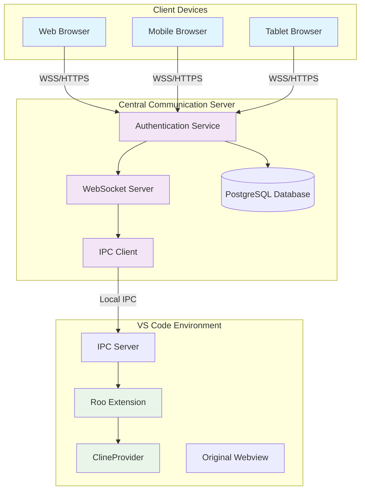

### 2.2 Communication Protocols

| Connection | Protocol | Security | Purpose |
|------------|----------|----------|---------|
| Client ↔ CCS | WebSocket Secure (WSS) | TLS 1.3 | Real-time bidirectional communication |
| Client ↔ CCS | HTTPS | TLS 1.3 | Authentication and REST API |
| CCS ↔ Extension | IPC (node-ipc) | Local process | Inter-process communication |
| CCS ↔ Database | PostgreSQL | SSL | Data persistence |

---

## 3. Detailed Component Architecture

### 3.1 Central Communication Server (CCS)

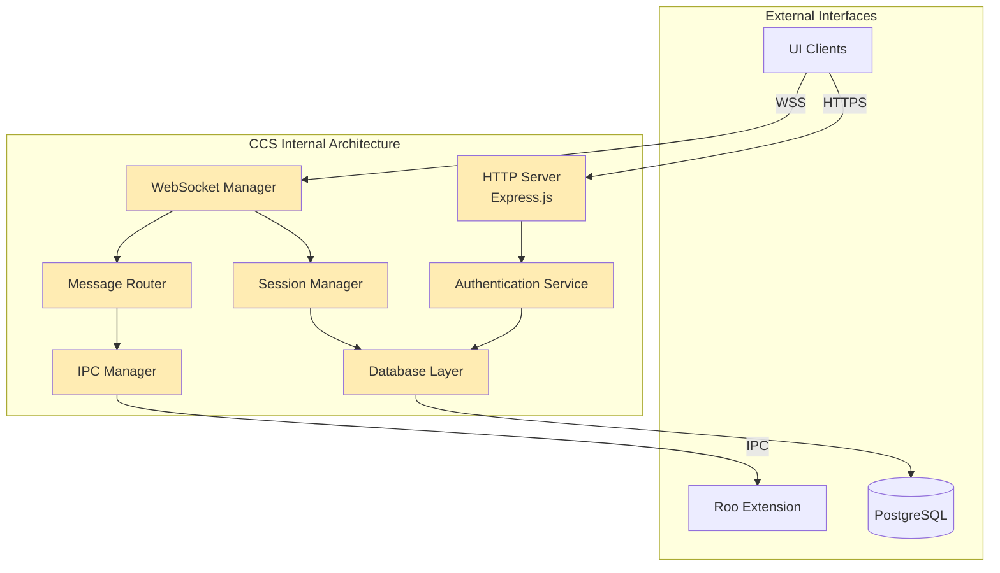

#### 3.1.1 Core Services

**Authentication Service**
- JWT token generation and validation
- User registration and login
- Session management
- Rate limiting and security

**WebSocket Manager**
- Connection lifecycle management
- Message broadcasting
- Heartbeat/ping-pong
- Connection cleanup

**Message Router**
- Message type parsing
- Routing logic
- Request/response correlation
- Error handling

**IPC Manager**
- Connection to Roo extension
- Message serialization
- Connection recovery
- Error handling

### 3.2 UI Client Architecture

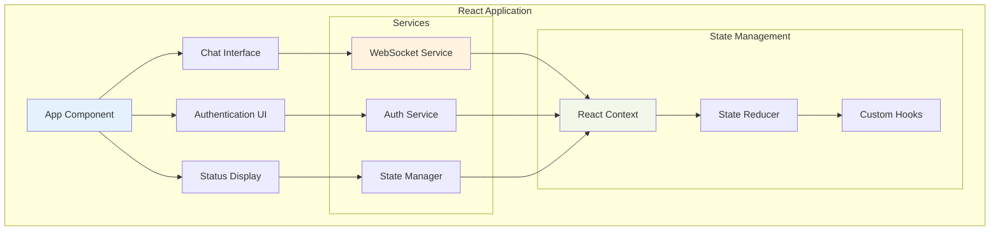

#### 3.2.1 Key Components

**WebSocket Service**
- Connection management
- Message sending/receiving
- Automatic reconnection
- Error handling

**State Manager**
- Centralized state management
- State synchronization
- Optimistic updates
- Conflict resolution

**Chat Interface**
- Message input/output
- Streaming response display
- Task status indicators
- Mobile-optimized controls

### 3.3 Roo Extension Modifications

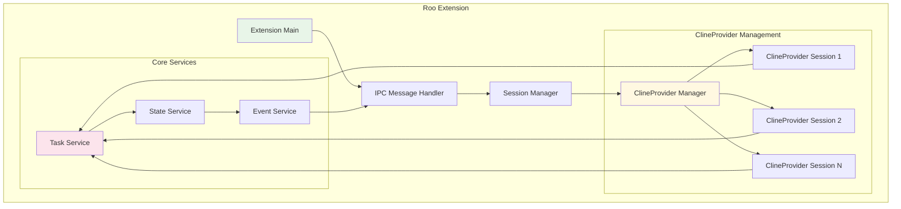

#### 3.3.1 Session Management

**Session Isolation**
- Each remote UI gets dedicated ClineProvider instance
- Isolated conversation history and state
- Independent task execution
- Resource cleanup on session end

**Headless Operation**
- ClineProvider operates without webview dependency
- Programmatic task execution
- Event-driven state updates
- Structured data return

---

## 4. Data Flow Architecture

### 4.1 Task Submission Flow

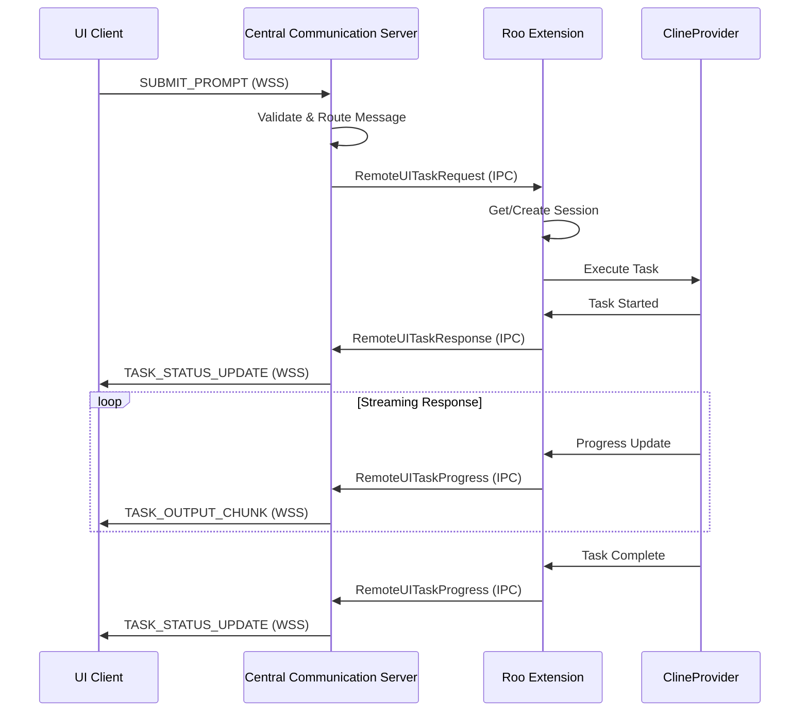

### 4.2 State Synchronization Flow

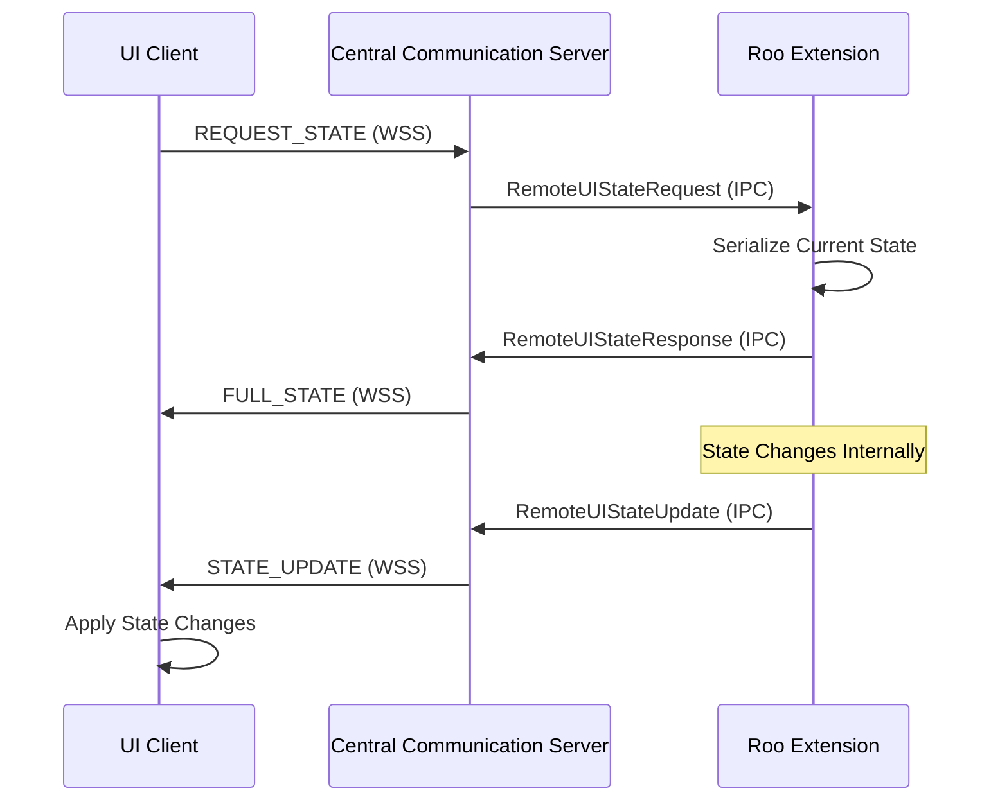

### 4.3 Authentication Flow

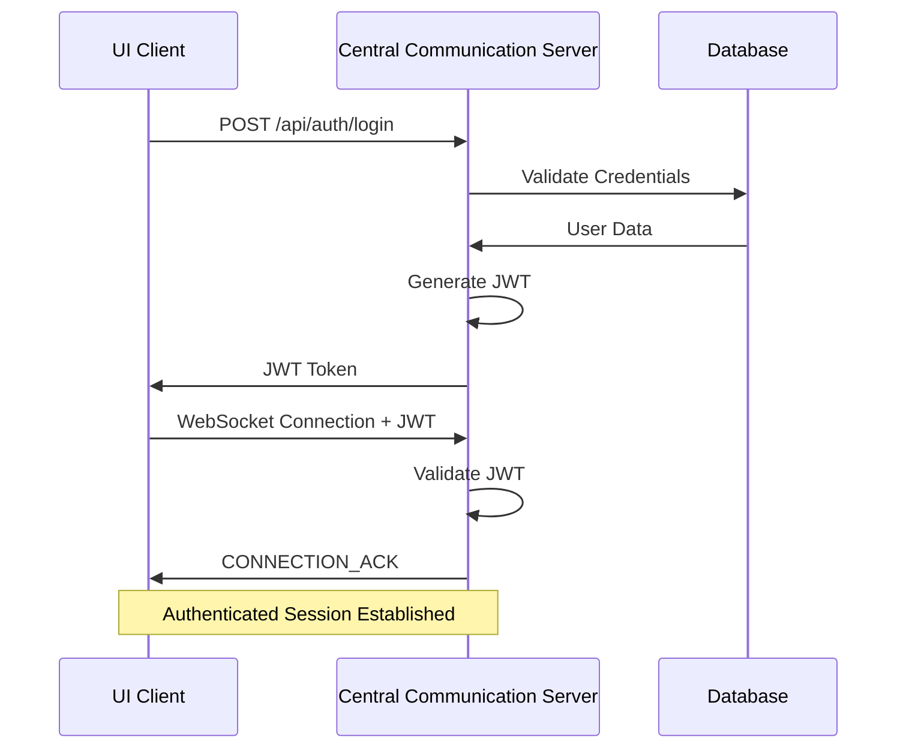

---

## 5. Security Architecture

### 5.1 Security Layers

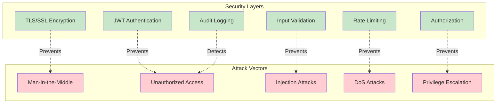

### 5.2 Security Controls

| Layer | Control | Implementation |
|-------|---------|----------------|
| Transport | TLS 1.3 | HTTPS/WSS with valid certificates |
| Authentication | JWT | Signed tokens with expiration |
| Authorization | Role-based | User permissions and session validation |
| Input Validation | Sanitization | All inputs validated and sanitized |
| Rate Limiting | Token bucket | Per-user and per-IP rate limits |
| Audit | Logging | All security events logged |

---

## 6. Scalability Architecture

### 6.1 Horizontal Scaling Strategy

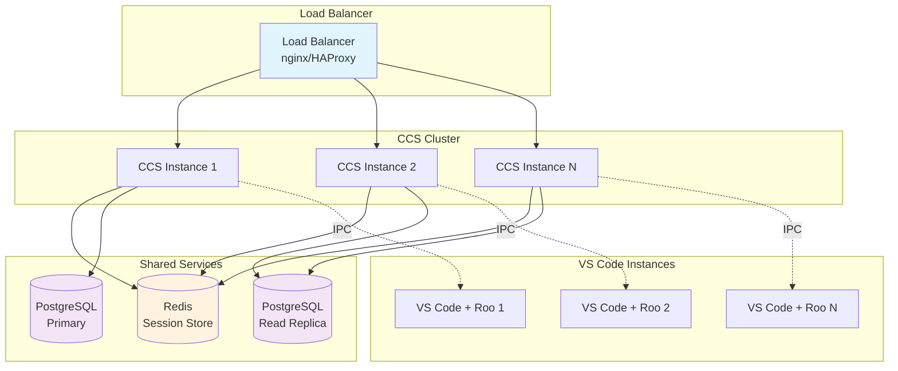

### 6.2 Performance Considerations

**Connection Management**
- WebSocket connection pooling
- Efficient message routing
- Connection cleanup and resource management
- Heartbeat optimization

**Database Optimization**
- Connection pooling
- Read replicas for scaling
- Proper indexing strategy
- Query optimization

**Caching Strategy**
- Redis for session data
- Application-level caching
- Static asset caching
- Database query caching

---

## 7. Deployment Architecture

### 7.1 Production Deployment

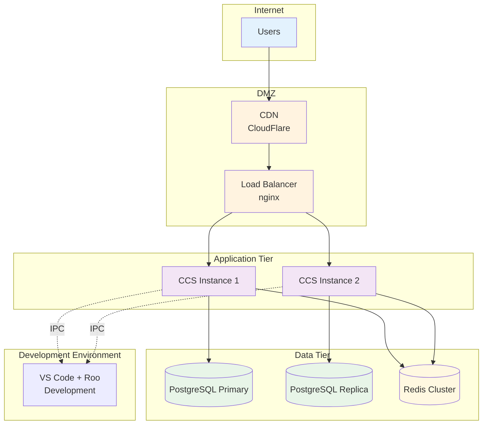

### 7.2 Development Environment

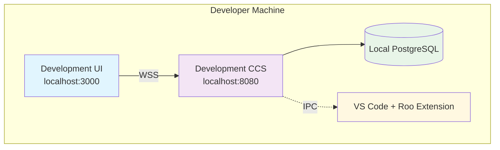

### 7.3 Container Architecture

```dockerfile
# Example Docker Compose Structure
version: '3.8'
services:
  ccs:
    build: ./central-communication-server
    ports:
      - "8080:8080"
    environment:
      - DATABASE_URL=postgresql://user:pass@db:5432/roo_remote
      - JWT_SECRET=your-secret-key
    depends_on:
      - db
      - redis
  
  ui:
    build: ./remote-ui-client
    ports:
      - "3000:3000"
    environment:
      - REACT_APP_CCS_URL=ws://localhost:8080
  
  db:
    image: postgres:14
    environment:
      - POSTGRES_DB=roo_remote
      - POSTGRES_USER=user
      - POSTGRES_PASSWORD=pass
    volumes:
      - postgres_data:/var/lib/postgresql/data
  
  redis:
    image: redis:7-alpine
    ports:
      - "6379:6379"

volumes:
  postgres_data:
```

---

## 8. Technology Stack Details

### 8.1 Central Communication Server

| Component | Technology | Version | Purpose |
|-----------|------------|---------|---------|
| Runtime | Node.js | 18+ | JavaScript runtime |
| Framework | Express.js | 4.18+ | HTTP server framework |
| WebSocket | ws | 8.0+ | WebSocket implementation |
| Database ORM | Prisma | 5.0+ | Database access layer |
| Authentication | jsonwebtoken | 9.0+ | JWT implementation |
| IPC | node-ipc | 10.0+ | Inter-process communication |
| Validation | joi | 17.0+ | Input validation |
| Logging | winston | 3.8+ | Structured logging |

### 8.2 UI Client

| Component | Technology | Version | Purpose |
|-----------|------------|---------|---------|
| Framework | React | 18+ | UI framework |
| Language | TypeScript | 5.0+ | Type safety |
| Build Tool | Vite | 4.0+ | Fast development and building |
| Styling | Tailwind CSS | 3.3+ | Utility-first CSS |
| State Management | React Context | Built-in | State management |
| WebSocket | Native WebSocket | Built-in | Real-time communication |
| HTTP Client | fetch | Built-in | API requests |
| Testing | Vitest | 0.34+ | Unit testing |

### 8.3 Roo Extension

| Component | Technology | Version | Purpose |
|-----------|------------|---------|---------|
| Language | TypeScript | 5.0+ | Type safety |
| IPC | @roo-code/types | Current | Existing IPC infrastructure |
| Event System | EventEmitter | Built-in | Event-driven architecture |
| Session Management | Custom | New | Multi-session support |

---

## 9. Performance Specifications

### 9.1 Response Time Requirements

| Operation | Target | Maximum | Notes |
|-----------|--------|---------|-------|
| Authentication | < 100ms | 500ms | Login/token validation |
| WebSocket Connection | < 200ms | 1s | Initial connection establishment |
| Message Routing | < 50ms | 200ms | CCS message processing |
| State Synchronization | < 100ms | 500ms | Full state transfer |
| Task Submission | < 100ms | 300ms | Prompt submission to Roo |

### 9.2 Throughput Requirements

| Metric | Target | Maximum | Notes |
|--------|--------|---------|-------|
| Concurrent Connections | 50 | 100 | WebSocket connections per CCS instance |
| Messages per Second | 1000 | 2000 | Total message throughput |
| Database Queries | 500/s | 1000/s | Database operation rate |
| Memory Usage | < 512MB | 1GB | Per CCS instance |
| CPU Usage | < 50% | 80% | Per CCS instance |

### 9.3 Scalability Targets

| Component | Initial | Target | Maximum |
|-----------|---------|--------|---------|
| CCS Instances | 1 | 3 | 10 |
| Concurrent Users | 10 | 50 | 200 |
| Database Connections | 10 | 50 | 100 |
| Redis Memory | 100MB | 500MB | 2GB |

---

## 10. Monitoring and Observability

### 10.1 Metrics Collection

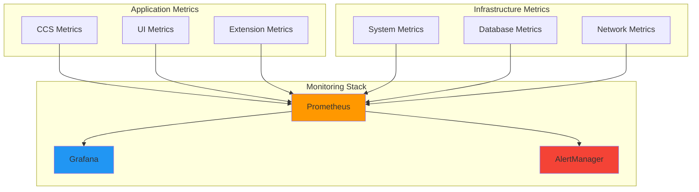

### 10.2 Key Performance Indicators (KPIs)

**System Health**
- Service uptime and availability
- Response time percentiles (P50, P95, P99)
- Error rates and types
- Resource utilization (CPU, memory, disk)

**User Experience**
- Connection success rate
- Message delivery latency
- Session duration
- Feature usage patterns

**Business Metrics**
- Active user count
- Session frequency
- Feature adoption rates
- User satisfaction scores

### 10.3 Alerting Strategy

| Alert | Threshold | Severity | Action |
|-------|-----------|----------|--------|
| Service Down | 0% availability | Critical | Immediate response |
| High Error Rate | > 5% errors | High | Investigate within 15 min |
| High Latency | P95 > 1s | Medium | Investigate within 1 hour |
| Resource Usage | > 80% CPU/Memory | Medium | Scale or optimize |
| Database Issues | Connection failures | High | Database team notification |

---

## 11. Disaster Recovery and Business Continuity

### 11.1 Backup Strategy

**Database Backups**
- Daily full backups
- Hourly incremental backups
- Point-in-time recovery capability
- Cross-region backup replication

**Application Backups**
- Configuration files
- SSL certificates
- Application logs
- User session data (Redis)

### 11.2 Recovery Procedures

**Service Recovery**
- Automated health checks and restart
- Load balancer failover
- Database failover to replica
- Session state recovery from Redis

**Data Recovery**
- Database restore from backup
- Configuration restore
- Log file recovery
- User data integrity verification

### 11.3 Business Continuity

**Minimal Service Level**
- Read-only access during maintenance
- Graceful degradation of features
- User notification of service status
- Estimated recovery time communication

---

## 12. Security Implementation Details

### 12.1 Authentication Flow

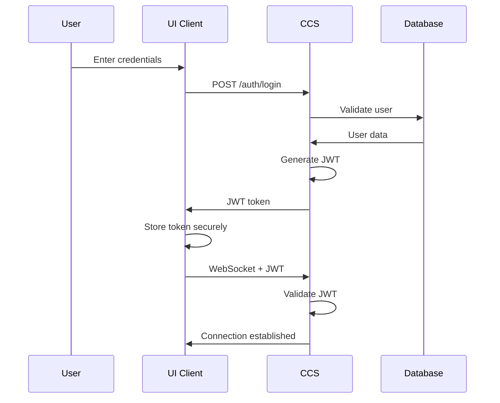

### 12.2 Authorization Matrix

| Role | Authentication | WebSocket Access | Task Submission | Admin Functions |
|------|----------------|------------------|-----------------|-----------------|
| User | Required | Yes | Yes | No |
| Admin | Required | Yes | Yes | Yes |
| Guest | No | No | No | No |

### 12.3 Security Headers

```javascript
// Security headers for CCS
app.use((req, res, next) => {
  res.setHeader('X-Content-Type-Options', 'nosniff');
  res.setHeader('X-Frame-Options', 'DENY');
  res.setHeader('X-XSS-Protection', '1; mode=block');
  res.setHeader('Strict-Transport-Security', 'max-age=31536000; includeSubDomains');
  res.setHeader('Content-Security-Policy', "default-src 'self'");
  next();
});
```

---

## 13. Conclusion

This system architecture provides a robust, scalable, and secure foundation for the Remote UI Access feature. The design emphasizes:

### 13.1 Key Architectural Principles

1. **Separation of Concerns**: Clear boundaries between UI, communication, and business logic
2. **Scalability**: Horizontal scaling capabilities for future growth
3. **Security**: Multiple layers of security controls
4. **Reliability**: Fault tolerance and recovery mechanisms
5. **Maintainability**: Modular design for easy updates and debugging

### 13.2 Success Factors

- **Real-time Communication**: WebSocket-based architecture ensures responsive user experience
- **Session Isolation**: Multiple users can work independently without interference
- **Mobile Optimization**: Responsive design supports various device types
- **Monitoring**: Comprehensive observability for operational excellence
- **Security**: Defense-in-depth approach protects against various threats

### 13.3 Future Considerations

- **Native Mobile Apps**: Architecture supports future native mobile development
- **Advanced Collaboration**: Foundation for multi-user collaboration features
- **AI Integration**: Extensible design for AI-powered enhancements
- **Enterprise Features**: Scalable architecture supports enterprise requirements

This architecture document serves as the technical blueprint for implementing the Remote UI Access feature, ensuring all stakeholders understand the system design and implementation approach.
