# Phase 3.2 GitHub Issues Breakdown

## Overview

**Phase:** 3.2 - UI Component & Cross-Device Communication Testing  
**Total Issues:** 4 (1 main + 3 subtasks)  
**Estimated Duration:** 4-5 days  
**Priority:** HIGH - Critical Path

## Main Phase Issue

### Issue #38: Phase 3.2 - UI Component & Cross-Device Communication Testing

**Title:** Phase 3.2 - UI Component & Cross-Device Communication Testing  
**Type:** Epic/Feature  
**Priority:** HIGH  
**Estimated Duration:** 4-5 days  
**Assignee:** Primary Development Team

**Description:**
Comprehensive testing phase to validate all UI components, command functionality, MCP integration, and establish cross-device communication capabilities for the Roo-Code extension.

**Acceptance Criteria:**

- [ ] All UI components render correctly and respond appropriately
- [ ] All 20+ registered commands execute successfully
- [ ] MCP server integration (ESLint, Prettier, PNPM) functional
- [ ] Conversation interface fully operational
- [ ] Cross-device communication framework established
- [ ] Performance benchmarks met or exceeded
- [ ] Comprehensive test documentation completed

**Dependencies:**

- Phase 3.1 Extension Activation Testing (Completed ✅)
- MCP servers operational
- Extension Development Host functional

**Labels:** `phase-3`, `testing`, `ui`, `cross-device`, `high-priority`

---

## Subtask Issues

### Issue #38.1: Phase 3.2.1 - UI Component Comprehensive Testing

**Title:** Phase 3.2.1 - UI Component Comprehensive Testing  
**Type:** Task  
**Priority:** HIGH  
**Estimated Duration:** 2 days  
**Parent Issue:** #38

**Description:**
Comprehensive testing of all UI components including webview rendering, interactive elements, state management, and responsive design validation.

**Acceptance Criteria:**

- [ ] All webview components render correctly across screen sizes
- [ ] Interactive elements (buttons, forms, menus) respond appropriately
- [ ] State management functions properly with persistence
- [ ] Error boundaries handle failures gracefully
- [ ] Accessibility compliance validated
- [ ] Performance meets <2s load time target

**Subtasks:**

- [ ] 3.2.1.1 - Webview Component Rendering Validation
- [ ] 3.2.1.2 - Interactive Element Response Testing
- [ ] 3.2.1.3 - State Management Functionality Testing
- [ ] 3.2.1.4 - Error Handling and Boundary Testing
- [ ] 3.2.1.5 - Responsive Design and Accessibility Testing

**Testing Scenarios:**

- Various screen resolutions (1920x1080, 1366x768, mobile sizes)
- Different VSCode themes (light, dark, high contrast)
- Multiple workspace configurations
- Large and small project structures

**Labels:** `ui-testing`, `webview`, `accessibility`, `performance`

---

### Issue #38.2: Phase 3.2.2 - Command System and MCP Integration Testing

**Title:** Phase 3.2.2 - Command System and MCP Integration Testing  
**Type:** Task  
**Priority:** HIGH  
**Estimated Duration:** 1.5 days  
**Parent Issue:** #38

**Description:**
Validation of all registered commands, keyboard shortcuts, context menus, and comprehensive MCP server integration testing.

**Acceptance Criteria:**

- [ ] All 20+ registered commands execute successfully
- [ ] Command palette integration functional
- [ ] Keyboard shortcuts operational
- [ ] Context menu actions working correctly
- [ ] MCP servers (ESLint, Prettier, PNPM) fully functional
- [ ] Conversation interface operational
- [ ] Error handling robust for all scenarios

**Subtasks:**

- [ ] 3.2.2.1 - Command Execution Validation (All 20+ Commands)
- [ ] 3.2.2.2 - Keyboard Shortcut and Context Menu Testing
- [ ] 3.2.2.3 - MCP Server Integration Testing (ESLint, Prettier, PNPM)
- [ ] 3.2.2.4 - Conversation Interface Functionality Testing
- [ ] 3.2.2.5 - Error Handling and Recovery Testing

**Command Categories to Test:**

- Core Extension Commands (newTask, mcpButtonClicked, etc.)
- File Operations Commands
- Workspace Management Commands
- Debug and Diagnostic Commands
- Integration and Sync Commands

**MCP Integration Tests:**

- ESLint: Code quality analysis operations
- Prettier: Code formatting operations
- PNPM: Package management tasks
- Error handling and recovery scenarios

**Labels:** `commands`, `mcp-integration`, `keyboard-shortcuts`, `conversation`

---

### Issue #38.3: Phase 3.2.3 - Cross-Device Communication and Remote UI Testing

**Title:** Phase 3.2.3 - Cross-Device Communication and Remote UI Testing  
**Type:** Task  
**Priority:** HIGH  
**Estimated Duration:** 1.5 days  
**Parent Issue:** #38

**Description:**
Establish and validate cross-device communication capabilities, remote UI framework, and multi-device state synchronization.

**Acceptance Criteria:**

- [ ] Remote UI framework operational
- [ ] Device discovery mechanisms functional
- [ ] Session synchronization working correctly
- [ ] Multi-device state management operational
- [ ] Security and authentication protocols validated
- [ ] Network resilience tested
- [ ] Performance meets <2s sync target

**Subtasks:**

- [ ] 3.2.3.1 - Remote UI Framework Validation
- [ ] 3.2.3.2 - Device Discovery and Connection Testing
- [ ] 3.2.3.3 - Multi-Device State Synchronization Testing
- [ ] 3.2.3.4 - Security and Authentication Protocol Testing
- [ ] 3.2.3.5 - Network Resilience and Performance Testing

**Cross-Device Scenarios:**

- Desktop to mobile communication
- Tablet interface adaptation
- Cross-platform compatibility
- Various network conditions
- Authentication and security scenarios

**Labels:** `cross-device`, `remote-ui`, `synchronization`, `security`, `performance`

---

## Issue Dependencies

```mermaid
graph TD
    A[#38 Phase 3.2 Main] --> B[#38.1 UI Component Testing]
    A --> C[#38.2 Command & MCP Testing]
    A --> D[#38.3 Cross-Device Testing]

    B --> B1[3.2.1.1 Webview Rendering]
    B --> B2[3.2.1.2 Interactive Elements]
    B --> B3[3.2.1.3 State Management]
    B --> B4[3.2.1.4 Error Handling]
    B --> B5[3.2.1.5 Responsive Design]

    C --> C1[3.2.2.1 Command Validation]
    C --> C2[3.2.2.2 Shortcuts & Menus]
    C --> C3[3.2.2.3 MCP Integration]
    C --> C4[3.2.2.4 Conversation Interface]
    C --> C5[3.2.2.5 Error Recovery]

    D --> D1[3.2.3.1 Remote UI Framework]
    D --> D2[3.2.3.2 Device Discovery]
    D --> D3[3.2.3.3 State Sync]
    D --> D4[3.2.3.4 Security Protocols]
    D --> D5[3.2.3.5 Network Resilience]
```

## Performance Targets

| Component          | Target | Measurement Method            |
| ------------------ | ------ | ----------------------------- |
| UI Component Load  | <2s    | Webview initialization time   |
| Command Execution  | <500ms | Individual command response   |
| Message Processing | <100ms | Chat interface responsiveness |
| MCP Tool Response  | <1s    | Server communication latency  |
| Cross-Device Sync  | <2s    | Multi-device state updates    |
| Memory Usage       | <300MB | Extension resource monitoring |

## Risk Assessment

### High Risk Items ⚠️

1. **Cross-Device Communication Complexity**

    - Complex multi-device scenarios may reveal integration issues
    - Mitigation: Systematic testing with fallback mechanisms

2. **Performance Under Load**
    - UI responsiveness may degrade with concurrent operations
    - Mitigation: Performance monitoring and optimization

### Medium Risk Items ⚠️

1. **MCP Server Integration**

    - Server communication failures affecting functionality
    - Mitigation: Robust error handling and retry mechanisms

2. **UI Component Compatibility**
    - Components may not render correctly across environments
    - Mitigation: Comprehensive cross-platform testing

## Success Metrics

### Quantitative Targets

- **UI Component Coverage:** >95% tested
- **Command Success Rate:** >98% successful execution
- **Cross-Device Sync Success:** >95% successful synchronization
- **Error Rate:** <2% of operations fail

### Qualitative Goals

- Smooth and intuitive user experience
- Consistent behavior across devices and sessions
- Responsive and efficient operation
- Seamless MCP tool integration

## Documentation Deliverables

### Test Reports

1. **UI Component Test Report** - `docs/testing/PHASE_3_2_UI_COMPONENT_REPORT.md`
2. **Command Functionality Report** - `docs/testing/PHASE_3_2_COMMAND_FUNCTIONALITY_REPORT.md`
3. **Cross-Device Communication Report** - `docs/testing/PHASE_3_2_CROSS_DEVICE_REPORT.md`
4. **Performance Analysis Report** - `docs/testing/PHASE_3_2_PERFORMANCE_REPORT.md`

### Issue Tracking

5. **Issues Log** - `docs/testing/PHASE_3_2_ISSUES_LOG.md`
6. **Phase 3.3 Preparation Guide** - `docs/tasks/PHASE_3_3_PREPARATION_GUIDE.md`

## Next Phase Preparation

Upon completion of Phase 3.2, the following will be prepared:

- Production integration testing requirements
- System performance optimization recommendations
- Cross-device deployment strategies
- User acceptance testing protocols

## Issue Creation Timeline

1. **Day 0:** Create main issue #38 and all subtask issues
2. **Day 1:** Begin Phase 3.2.1 (UI Component Testing)
3. **Day 3:** Begin Phase 3.2.2 (Command & MCP Testing)
4. **Day 4:** Begin Phase 3.2.3 (Cross-Device Testing)
5. **Day 5:** Complete all testing and documentation

## Labels and Milestones

### Labels to Use

- `phase-3` - Phase 3 related work
- `testing` - Testing activities
- `ui` - User interface related
- `cross-device` - Cross-device functionality
- `mcp-integration` - MCP server integration
- `performance` - Performance related
- `high-priority` - High priority items

### Milestone

- **Phase 3.2 Completion** - Target completion in 5 days
- Links to Phase 3.3 preparation milestone

---

**Status:** 🟡 READY FOR ISSUE CREATION  
**Next Action:** Create GitHub issues according to this breakdown  
**Estimated Total Effort:** 4-5 days with full team engagement
