# TASK-005.1.3: Real-Time Communication Features - Extended Scope

## 🎯 Task Overview

**Task ID:** TASK-005.1.3  
**Title:** Real-Time Communication Features - Production Fundamentals  
**Priority:** Critical  
**Duration:** 7 days (Quality over Speed)  
**Status:** 🚀 IN PROGRESS  
**Dependencies:** TASK-005.1.2 (Enhanced WebSocket Protocol) ✅ COMPLETED

## 📋 Objective

Complete the real-time communication layer with bulletproof fundamentals, comprehensive testing, and production-grade reliability. This extended scope ensures we have rock-solid foundations before moving to mobile integration.

### 🎯 Extended Scope Rationale

TASK-005.1.2 delivered more than originally planned, implementing several real-time components. This task now focuses on:

- **Completing missing core services** (Typing Indicators, Session Coordination, Event Broadcasting)
- **Comprehensive integration testing** with existing services
- **Production-grade validation** with load testing and performance guarantees
- **Complete documentation** and monitoring for production readiness

## 🏗️ Architecture Overview

```mermaid
graph TB
    subgraph "Real-Time Communication Layer - COMPLETE SYSTEM"
        A[Enhanced WebSocket Protocol] --> B[Real-Time Messaging ✅]
        A --> C[Presence Manager ✅]
        A --> D[Typing Indicators 🔄]
        A --> E[Session Coordinator 🔄]
        A --> F[Event Broadcasting 🔄]

        B --> G[Message Queue ✅]
        B --> H[Message Batcher ✅]
        B --> I[Compression Service ✅]

        C --> J[Device Presence ✅]
        C --> K[User Status ✅]

        D --> L[Typing State Manager 🔄]
        D --> M[Debounce Engine 🔄]

        E --> N[Session State Store 🔄]
        E --> O[Conflict Resolver 🔄]

        F --> P[Event Router 🔄]
        F --> Q[Subscription Manager 🔄]
    end

    subgraph "Testing & Validation Layer - NEW"
        R[Load Testing Suite 🔄]
        S[Integration Tests 🔄]
        T[Performance Monitors 🔄]
        U[Network Simulators 🔄]
    end

    A --> R
    B --> S
    C --> T
    D --> U
```

**Legend:** ✅ Completed in TASK-005.1.2 | 🔄 To be implemented/enhanced

## 🎯 Core Components Status & Implementation Plan

### ✅ COMPLETED (TASK-005.1.2)

1. **Real-Time Messaging Service** - Sub-100ms latency with stream management
2. **Presence Management System** - Multi-device presence tracking with broadcasting
3. **Enhanced WebSocket Protocol** - Production-ready orchestration layer
4. **Message Queue & Batching** - Priority-based queuing with intelligent batching
5. **Compression Service** - Multi-algorithm compression with auto-negotiation

### 🔄 TO IMPLEMENT (This Task)

#### 1. Typing Indicators Service (NEW)

- **Real-time typing notifications** with <30ms latency
- **Multi-user coordination** with conflict resolution
- **Debounced events** to optimize network usage
- **Automatic cleanup** of stale typing states
- **Cross-device synchronization** for seamless experience

#### 2. Session Coordinator (NEW)

- **Multi-user collaborative sessions** with state management
- **Conflict resolution** for concurrent operations
- **Session persistence** and recovery mechanisms
- **Cross-device session synchronization**
- **Session lifecycle management** (create, join, leave, destroy)

#### 3. Event Broadcasting System (NEW)

- **Real-time event distribution** with subscription management
- **Event filtering** and priority routing
- **Event replay** for offline clients
- **Persistent event storage** for session recovery
- **Event aggregation** and batching for efficiency

### 🧪 COMPREHENSIVE TESTING & VALIDATION (NEW)

#### 4. Integration Testing Suite

- **End-to-end communication** flow validation
- **Inter-service dependency** testing
- **Message flow integrity** verification
- **Error propagation** and recovery testing

#### 5. Performance Validation

- **Sub-100ms latency** verification under load
- **99.9% reliability** testing with network disruptions
- **Memory and CPU** usage profiling
- **Bandwidth optimization** validation

#### 6. Load & Stress Testing

- **100+ concurrent user** simulation
- **Network disruption** scenarios
- **High-frequency message** testing
- **Resource exhaustion** recovery

## 🚀 Technical Requirements - Production Standards

### Performance Guarantees (No Compromises)

- **Message Latency:** <100ms for critical messages (99th percentile)
- **Typing Indicators:** <30ms for typing events (95th percentile)
- **Presence Updates:** <50ms for status changes (99th percentile)
- **Session Sync:** <200ms for state synchronization (95th percentile)
- **Event Broadcasting:** <75ms for event distribution (99th percentile)

### Scalability Guarantees

- **Concurrent Users:** 100+ users per session with linear scaling
- **Message Throughput:** 1000+ messages per second sustained
- **Event Rate:** 500+ events per second with burst handling
- **Memory Usage:** <50MB per 100 concurrent users (monitored)
- **CPU Usage:** <10% for real-time processing (with alerts)

### Reliability Guarantees

- **Message Delivery:** 99.9% delivery guarantee under normal conditions
- **Network Resilience:** 99.5% reliability under network stress
- **Presence Accuracy:** 99.5% accurate presence state tracking
- **Session Consistency:** 100% state consistency with conflict resolution
- **Event Ordering:** Guaranteed event ordering with sequence validation
- **Failure Recovery:** <5 second recovery from disconnections
- **Zero Data Loss:** Complete message persistence during outages

### Quality Guarantees

- **Test Coverage:** 95%+ across all services and integration points
- **Memory Leaks:** Zero memory leaks under extended operation
- **Error Recovery:** Complete recovery from all failure modes
- **Cross-Platform:** Full compatibility across iOS/Android/Web
- **Production Monitoring:** Real-time metrics with alerting

## 📊 Implementation Plan - Extended Scope

### Phase 1: Complete Missing Core Services (Days 1-2)

#### Day 1: Typing Indicators Service

- **Morning:** Design typing state management architecture
- **Afternoon:** Implement real-time typing notifications with <30ms latency
- **Evening:** Add multi-user coordination and debounced events

#### Day 2: Session Coordinator & Event Broadcasting

- **Morning:** Build collaborative session management with conflict resolution
- **Afternoon:** Implement event broadcasting with subscription management
- **Evening:** Add session persistence and event replay capabilities

### Phase 2: Integration & System Validation (Days 3-4)

#### Day 3: Service Integration Testing

- **Morning:** End-to-end communication flow validation
- **Afternoon:** Inter-service dependency testing and message flow integrity
- **Evening:** Error propagation and recovery testing

#### Day 4: Performance Validation

- **Morning:** Sub-100ms latency verification under load
- **Afternoon:** 99.9% reliability testing with network disruptions
- **Evening:** Memory, CPU, and bandwidth optimization validation

### Phase 3: Comprehensive Testing Suite (Days 5-6)

#### Day 5: Load & Stress Testing

- **Morning:** 100+ concurrent user simulation setup
- **Afternoon:** Network disruption scenarios and high-frequency testing
- **Evening:** Resource exhaustion recovery and performance profiling

#### Day 6: Real-World Scenario Testing

- **Morning:** Mobile network simulation (3G/4G/5G/WiFi)
- **Afternoon:** Connection drops, recovery, and cross-platform compatibility
- **Evening:** Battery usage impact assessment and optimization

### Phase 4: Production Readiness (Day 7)

#### Day 7: Monitoring & Documentation

- **Morning:** Comprehensive metrics collection and real-time dashboards
- **Afternoon:** Alert systems and debugging tools implementation
- **Evening:** Complete API documentation and integration guides

## 🔧 Technical Implementation - Complete System

### Core Services Status

1. **Real-Time Message Service** (`real-time-messaging.ts`) ✅ COMPLETED
2. **Presence Management Service** (`presence-manager.ts`) ✅ COMPLETED
3. **Enhanced WebSocket Protocol** (`enhanced-websocket-protocol.ts`) ✅ COMPLETED
4. **Message Queue Service** (`message-queue.ts`) ✅ COMPLETED
5. **Message Batcher** (`message-batcher.ts`) ✅ COMPLETED
6. **Compression Service** (`compression.ts`) ✅ COMPLETED
7. **WebSocket Manager** (`websocket-manager.ts`) ✅ COMPLETED

### New Services to Build

8. **Typing Indicator Service** (`typing-indicators.ts`) 🔄 NEW
9. **Session Coordinator** (`session-coordinator.ts`) 🔄 NEW
10. **Event Broadcasting Service** (`event-broadcaster.ts`) 🔄 NEW

### Testing Infrastructure to Build

11. **Integration Test Suite** (`integration-tests/`) 🔄 NEW
12. **Load Testing Framework** (`load-tests/`) 🔄 NEW
13. **Performance Monitoring** (`monitoring/`) 🔄 NEW
14. **Network Simulation** (`network-simulation/`) 🔄 NEW

### Integration Points - Enhanced

- **Enhanced WebSocket Protocol** - Orchestrates all real-time services
- **Message Compression** - Optimizes all message payloads automatically
- **Message Batching** - Intelligently batches events by priority
- **Connection Management** - Handles reconnection for all services
- **Performance Monitoring** - Tracks metrics across all components

### Testing Requirements - Comprehensive

- **Unit Testing:** 95%+ coverage for all services
- **Integration Testing:** End-to-end communication flows
- **Load Testing:** 100+ concurrent users with realistic scenarios
- **Performance Testing:** Latency, throughput, and resource usage
- **Reliability Testing:** Network disruptions and failure recovery
- **Cross-Platform Testing:** iOS, Android, Web compatibility
- **Real-World Testing:** Mobile network conditions and battery impact

## ✅ Success Criteria - Production Standards

### Primary Goals (Must Achieve)

- [ ] **Complete Real-Time Communication Layer** with all 3 missing services
- [ ] **Sub-100ms latency** for critical messages (99th percentile verified)
- [ ] **<30ms typing indicators** with multi-user coordination
- [ ] **Bulletproof session coordination** with conflict resolution
- [ ] **Efficient event broadcasting** with subscription management
- [ ] **99.9% message delivery** guarantee under normal conditions
- [ ] **99.5% reliability** under network stress conditions

### Quality Assurance Goals (Non-Negotiable)

- [ ] **95%+ test coverage** across all services and integration points
- [ ] **Zero memory leaks** under extended operation (24+ hours)
- [ ] **Complete error recovery** from all identified failure modes
- [ ] **Cross-platform compatibility** verified on iOS/Android/Web
- [ ] **Production monitoring** with real-time metrics and alerting
- [ ] **Load testing validation** with 100+ concurrent users
- [ ] **Network resilience** testing with disruption scenarios

### Performance Benchmarks (Measured & Verified)

- [ ] **Message throughput:** 1000+ messages/second sustained
- [ ] **Event processing:** 500+ events/second with burst handling
- [ ] **Memory efficiency:** <50MB per 100 concurrent users
- [ ] **CPU optimization:** <10% usage for real-time processing
- [ ] **Network efficiency:** Optimized bandwidth usage with compression
- [ ] **Battery impact:** <5% per hour on mobile devices
- [ ] **Recovery time:** <5 seconds from disconnection to full recovery

### Documentation & Integration Goals

- [ ] **Complete API documentation** with examples and best practices
- [ ] **Integration guides** for mobile developers
- [ ] **Performance tuning** guidelines and optimization strategies
- [ ] **Troubleshooting playbooks** for common issues and edge cases
- [ ] **Monitoring dashboards** for production operations
- [ ] **Testing frameworks** for ongoing validation
- [ ] **Production deployment** guides and checklists

## 📚 Deliverables

### Code Implementation

- [ ] Real-time messaging service with streaming capabilities
- [ ] Presence management with multi-device coordination
- [ ] Typing indicators with debounced events
- [ ] Session coordination with conflict resolution
- [ ] Event broadcasting with subscription management

### Testing Suite

- [ ] Real-time communication test suite
- [ ] Performance benchmarking tests
- [ ] Concurrent user simulation tests
- [ ] Message ordering verification tests
- [ ] Session consistency validation tests

### Documentation

- [ ] Real-time communication API documentation
- [ ] Implementation guide for developers
- [ ] Performance optimization guidelines
- [ ] Troubleshooting and debugging guide
- [ ] Integration examples and best practices

## 🔗 Integration with Previous Tasks

### Builds Upon TASK-005.1.2

- **Enhanced WebSocket Protocol** - Provides reliable transport layer
- **Message Compression** - Optimizes real-time message payloads
- **Message Batching** - Handles non-critical real-time events efficiently
- **Connection Management** - Ensures stable connections for real-time features

### Enables Future Tasks

- **TASK-005.2.x** - Mobile application integration with real-time features
- **TASK-006.x** - Authentication integration with presence management
- **TASK-007.x** - Database integration for session persistence

## 📈 Business Impact

### User Experience Improvements

- **Instant feedback** for all user actions
- **Live collaboration** capabilities for team workflows
- **Real-time status** visibility for better coordination
- **Seamless session** continuity across devices

### Technical Benefits

- **Reduced perceived latency** through real-time updates
- **Enhanced collaboration** capabilities for teams
- **Improved user engagement** through live features
- **Foundation for advanced** real-time features

## 🎯 Next Steps After Completion

1. **Integration testing** with mobile applications
2. **Performance optimization** based on real-world usage
3. **Advanced features** like screen sharing and voice chat
4. **Analytics integration** for real-time usage metrics

---

**Ready to begin implementation of real-time communication features building on the enhanced WebSocket protocol foundation.**
