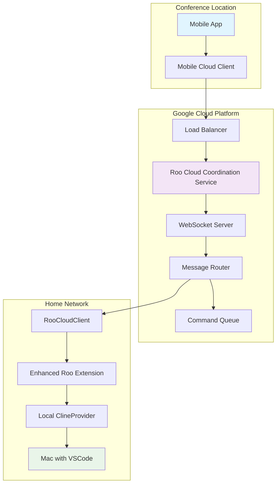
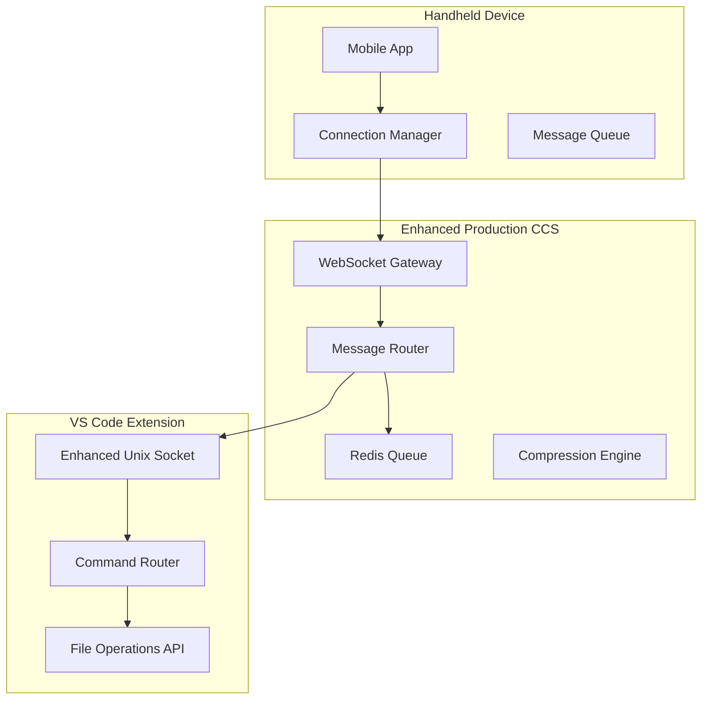

# TASK-005: Mobile-First Extension Communication

**Epic**: Handheld Device Integration  
**Priority**: High  
**Status**: Planning  
**Estimated Duration**: 4 weeks  
**Dependencies**: TASK-004 (Production CCS)

---

## 🎯 **Objective**

Enhance the production Communication & Control Server (CCS) with mobile-optimized protocols, connection management, and extension integration to support reliable communication between handheld devices and VS Code extensions.

## 📋 **Overview**

This task transforms the current production CCS into a mobile-first communication platform that can handle the unique challenges of handheld device integration:

- **Intermittent Connectivity**: Mobile devices frequently lose and regain network connections
- **Bandwidth Constraints**: Mobile networks have limited bandwidth and variable latency
- **Battery Optimization**: Communication protocols must be efficient to preserve battery life
- **Cross-Network Communication**: Devices may connect from different networks and locations
- **Cloud Coordination**: Integration with Roo Cloud Coordination Service (RCCS) for device relay
- **Real-World Scenarios**: Support for "conference remote control" use cases

## 🌐 **Cloud Integration Architecture**

This task integrates with the **Roo Cloud Coordination Service (RCCS)** to enable real-world scenarios like controlling your home Mac from a mobile device at a conference:



**Key Integration Points**:

- **Mobile App** connects to **Cloud Service** via WebSocket
- **Cloud Service** routes commands to **Home Mac** via persistent connection
- **Home Mac** executes Roo tasks and streams results back through cloud
- **Real-time Updates** flow from Mac → Cloud → Mobile for live progress

## 🏗️ **Architecture Overview**



## 📊 **Success Metrics**

- **Connection Reliability**: 99.9% uptime for mobile connections
- **Message Delivery**: <100ms latency for critical messages
- **Reconnection Speed**: <5 seconds for automatic reconnection
- **Bandwidth Efficiency**: 60% reduction in data usage through compression
- **Battery Impact**: <5% battery usage per hour of active use

---

## 🔧 **TASK-005.1: Enhanced WebSocket Protocol**

### **Objective**

Design and implement a mobile-optimized WebSocket protocol with compression, batching, and priority handling.

### **Duration**: 1 week

### **Assignee**: Backend Developer

### **Labels**: `backend`, `protocol`, `mobile`

#### **TASK-005.1.1: Design Mobile-Optimized Message Format**

**Estimate**: 2 days  
**Priority**: Critical

**Description**:
Create a new message format optimized for mobile constraints with device identification, compression support, and priority handling.

**Technical Requirements**:

```typescript
interface MobileMessage {
	// Message Identification
	id: string
	correlationId?: string
	timestamp: number

	// Routing Information
	source: {
		deviceId: string
		userId: string
		deviceType: "mobile" | "desktop" | "web"
	}

	destination: {
		target: "extension" | "device" | "broadcast"
		deviceId?: string
	}

	// Message Content
	type: MessageType
	payload: any

	// Mobile Optimization
	priority: "critical" | "high" | "normal" | "low"
	ttl?: number
	compression?: "gzip" | "brotli"
	batchId?: string
}
```

**Acceptance Criteria**:

- [ ] Message format supports all mobile constraints
- [ ] Backward compatibility with existing protocol
- [ ] Complete TypeScript type definitions
- [ ] Message validation and sanitization
- [ ] Protocol versioning support

**Implementation Steps**:

1. Define TypeScript interfaces for mobile messages
2. Create message validation schemas
3. Implement protocol versioning
4. Add backward compatibility layer
5. Create comprehensive unit tests

#### **TASK-005.1.2: Implement Message Compression**

**Estimate**: 2 days  
**Priority**: High

**Description**:
Add gzip/brotli compression middleware to reduce bandwidth usage for mobile devices.

**Technical Requirements**:

- Support for gzip and brotli compression
- Automatic compression negotiation based on client capabilities
- Compression threshold configuration (don't compress small messages)
- Performance monitoring and metrics

**Acceptance Criteria**:

- [ ] 60% reduction in message size for typical payloads
- [ ] Automatic compression negotiation
- [ ] Configurable compression thresholds
- [ ] Performance metrics and monitoring
- [ ] Fallback to uncompressed for unsupported clients

**Implementation Steps**:

1. Add compression middleware to WebSocket server
2. Implement compression negotiation protocol
3. Add compression configuration options
4. Create performance monitoring
5. Add comprehensive testing

#### **TASK-005.1.3: Create Message Batching System**

**Estimate**: 3 days  
**Priority**: High

**Description**:
Implement message batching to reduce network requests and improve efficiency for mobile devices.

**Technical Requirements**:

- Configurable batch size and timeout
- Priority-aware batching (don't delay critical messages)
- Batch compression for additional efficiency
- Batch acknowledgment and error handling

**Acceptance Criteria**:

- [ ] 70% reduction in network requests
- [ ] Configurable batching parameters
- [ ] Priority-aware batching logic
- [ ] Reliable batch delivery and acknowledgment
- [ ] Graceful handling of batch failures

**Implementation Steps**:

1. Design batch message format
2. Implement batching logic with timeouts
3. Add priority-aware batching
4. Create batch acknowledgment system
5. Add error handling and recovery

---

## 🔧 **TASK-005.2: Connection Management System**

### **Objective**

Implement robust connection management with auto-reconnection, message queuing, and health monitoring.

### **Duration**: 1 week

### **Assignee**: Backend Developer

### **Labels**: `backend`, `networking`, `reliability`

#### **TASK-005.2.1: Implement Auto-Reconnection Logic**

**Estimate**: 3 days  
**Priority**: Critical

**Description**:
Create intelligent auto-reconnection with exponential backoff, network change detection, and connection state management.

**Technical Requirements**:

```typescript
interface ConnectionManager {
	state: "connecting" | "connected" | "disconnected" | "reconnecting"
	reconnect: {
		maxAttempts: number
		backoffStrategy: "exponential" | "linear"
		baseDelay: number
		maxDelay: number
	}
	networkMonitor: {
		connectionType: "wifi" | "cellular" | "none"
		isOnline: boolean
	}
}
```

**Acceptance Criteria**:

- [ ] 99% connection recovery rate
- [ ] Exponential backoff with jitter
- [ ] Network change detection
- [ ] Connection state persistence
- [ ] Graceful handling of server restarts

**Implementation Steps**:

1. Implement connection state machine
2. Add exponential backoff algorithm
3. Create network change detection
4. Add connection persistence
5. Implement comprehensive testing

#### **TASK-005.2.2: Create Message Queuing System**

**Estimate**: 2 days  
**Priority**: High

**Description**:
Implement Redis-based message queuing for offline scenarios and reliable message delivery.

**Technical Requirements**:

- Redis-based persistent message queue
- Per-device message queues
- Queue size limits and overflow handling
- Message TTL and cleanup

**Acceptance Criteria**:

- [ ] No message loss during disconnections
- [ ] Configurable queue size limits
- [ ] Automatic message cleanup
- [ ] Queue monitoring and metrics
- [ ] Graceful queue overflow handling

**Implementation Steps**:

1. Set up Redis queue infrastructure
2. Implement per-device queuing
3. Add queue size management
4. Create message TTL handling
5. Add monitoring and metrics

#### **TASK-005.2.3: Implement Heartbeat Protocol**

**Estimate**: 2 days  
**Priority**: Medium

**Description**:
Create keep-alive mechanism with connection health monitoring and automatic cleanup.

**Technical Requirements**:

- Configurable heartbeat intervals
- Connection health scoring
- Automatic dead connection cleanup
- Heartbeat failure detection and recovery

**Acceptance Criteria**:

- [ ] Detect disconnections within 30 seconds
- [ ] Configurable heartbeat intervals
- [ ] Automatic connection cleanup
- [ ] Health monitoring dashboard
- [ ] Graceful heartbeat failure handling

**Implementation Steps**:

1. Implement heartbeat protocol
2. Add connection health monitoring
3. Create automatic cleanup logic
4. Add health monitoring dashboard
5. Implement failure recovery

---

## 🔧 **TASK-005.3: Enhanced Extension Integration**

### **Objective**

Enhance the VS Code extension integration with improved Unix socket protocol, command routing, and file operations.

### **Duration**: 1 week

### **Assignee**: Extension Developer

### **Labels**: `extension`, `api`, `integration`

#### **TASK-005.3.1: Enhance Unix Socket Protocol**

**Estimate**: 3 days  
**Priority**: High

**Description**:
Improve Unix socket reliability, add protocol versioning, and implement socket reconnection logic.

**Technical Requirements**:

- Enhanced error handling and recovery
- Protocol versioning for backward compatibility
- Socket reconnection with backoff
- Performance monitoring and metrics

**Acceptance Criteria**:

- [ ] 99.9% socket reliability
- [ ] Protocol versioning support
- [ ] Automatic socket reconnection
- [ ] Comprehensive error handling
- [ ] Performance monitoring

**Implementation Steps**:

1. Enhance socket error handling
2. Add protocol versioning
3. Implement reconnection logic
4. Add performance monitoring
5. Create comprehensive tests

#### **TASK-005.3.2: Create Command Routing System**

**Estimate**: 2 days  
**Priority**: High

**Description**:
Implement command validation, routing, execution tracking, and response correlation.

**Technical Requirements**:

```typescript
interface CommandRouter {
	validate: (command: Command) => ValidationResult
	route: (command: Command) => Promise<CommandResult>
	track: (commandId: string) => CommandStatus
	correlate: (requestId: string, response: any) => void
}
```

**Acceptance Criteria**:

- [ ] All commands properly validated and routed
- [ ] Command execution tracking
- [ ] Response correlation and timeout handling
- [ ] Command queue management
- [ ] Error handling and recovery

**Implementation Steps**:

1. Design command validation schema
2. Implement routing logic
3. Add execution tracking
4. Create response correlation
5. Add error handling

#### **TASK-005.3.3: Implement File Operations API**

**Estimate**: 2 days  
**Priority**: Medium

**Description**:
Create comprehensive file operations API with real-time monitoring and change events.

**Technical Requirements**:

- File reading, writing, and navigation
- Real-time file change monitoring
- File tree navigation API
- Binary file handling

**Acceptance Criteria**:

- [ ] Complete file operations support
- [ ] Real-time change monitoring
- [ ] Efficient file tree navigation
- [ ] Binary file handling
- [ ] Performance optimization

**Implementation Steps**:

1. Implement file operations API
2. Add file change monitoring
3. Create file tree navigation
4. Add binary file support
5. Optimize performance

---

## 🔧 **TASK-005.4: Testing and Documentation**

### **Objective**

Create comprehensive testing suite, API documentation, and mobile SDK for developers.

### **Duration**: 1 week

### **Assignee**: QA Engineer + Technical Writer

### **Labels**: `testing`, `documentation`, `qa`

#### **TASK-005.4.1: Create Integration Test Suite**

**Estimate**: 3 days  
**Priority**: High

**Description**:
Develop comprehensive testing covering mobile communication, connection reliability, and performance.

**Test Coverage**:

- End-to-end mobile communication tests
- Connection reliability and recovery tests
- Performance and load testing
- Error handling and edge cases
- Cross-platform compatibility tests

**Acceptance Criteria**:

- [ ] 95% test coverage
- [ ] Automated test execution
- [ ] Performance benchmarking
- [ ] Cross-platform testing
- [ ] Continuous integration setup

#### **TASK-005.4.2: Write API Documentation**

**Estimate**: 2 days  
**Priority**: Medium

**Description**:
Create complete API documentation with examples and integration guides.

**Documentation Requirements**:

- Complete mobile API specification
- Protocol documentation with examples
- Integration guide for mobile developers
- Troubleshooting and FAQ section

**Acceptance Criteria**:

- [ ] Complete API documentation
- [ ] Code examples and tutorials
- [ ] Integration guides
- [ ] Troubleshooting documentation
- [ ] Interactive API explorer

#### **TASK-005.4.3: Develop Mobile SDK**

**Estimate**: 2 days  
**Priority**: Medium

**Description**:
Create JavaScript/TypeScript SDK and React Native wrapper components for mobile development.

**SDK Requirements**:

- JavaScript/TypeScript SDK
- React Native wrapper components
- Example implementations
- Comprehensive documentation

**Acceptance Criteria**:

- [ ] Functional mobile SDK
- [ ] React Native components
- [ ] Example applications
- [ ] SDK documentation
- [ ] NPM package publication

---

## 📋 **Dependencies**

### **Internal Dependencies**

- **TASK-004**: Production CCS must be complete
- **Redis Infrastructure**: Required for message queuing
- **PostgreSQL**: Required for connection logging

### **External Dependencies**

- **Mobile Development Environment**: React Native setup
- **Testing Infrastructure**: Mobile testing capabilities
- **Documentation Platform**: API documentation hosting

---

## 🎯 **Acceptance Criteria**

### **Technical Requirements**

- [ ] Mobile-optimized WebSocket protocol implemented
- [ ] 99.9% connection reliability achieved
- [ ] 60% bandwidth reduction through compression
- [ ] Auto-reconnection within 5 seconds
- [ ] Message queuing with no data loss

### **Performance Requirements**

- [ ] <100ms latency for critical messages
- [ ] <5% battery usage per hour
- [ ] 70% reduction in network requests
- [ ] Support for 1000+ concurrent mobile connections
- [ ] 99.9% message delivery success rate

### **Quality Requirements**

- [ ] 95% test coverage
- [ ] Complete API documentation
- [ ] Mobile SDK available
- [ ] Cross-platform compatibility
- [ ] Production monitoring and alerting

---

## 📊 **Testing Strategy**

### **Unit Testing**

- Message format validation
- Compression algorithms
- Connection management logic
- Command routing functionality

### **Integration Testing**

- End-to-end mobile communication
- Extension integration
- Database operations
- Redis queue operations

### **Performance Testing**

- Load testing with 1000+ connections
- Bandwidth usage measurement
- Battery usage profiling
- Latency benchmarking

### **Mobile Testing**

- iOS and Android compatibility
- Network switching scenarios
- Offline/online transitions
- Battery optimization validation

---

## 📈 **Monitoring and Metrics**

### **Key Performance Indicators**

- Connection success rate
- Message delivery latency
- Bandwidth usage per device
- Battery usage metrics
- Error rates and types

### **Monitoring Dashboard**

- Real-time connection status
- Message queue depths
- Performance metrics
- Error tracking and alerting
- Device health monitoring

---

## 🚀 **Deployment Plan**

### **Phase 1: Development Environment**

- Set up enhanced development environment
- Deploy to staging with test devices
- Validate core functionality

### **Phase 2: Beta Testing**

- Limited beta with select devices
- Performance monitoring and optimization
- Bug fixes and improvements

### **Phase 3: Production Deployment**

- Gradual rollout to production
- Full monitoring and alerting
- Performance optimization

---

**Task Created**: June 22, 2025  
**Last Updated**: June 22, 2025  
**Status**: Planning  
**Next Review**: Weekly during implementation
