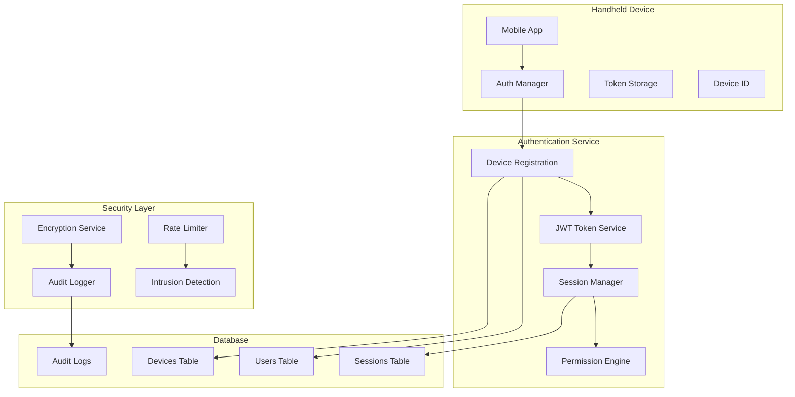
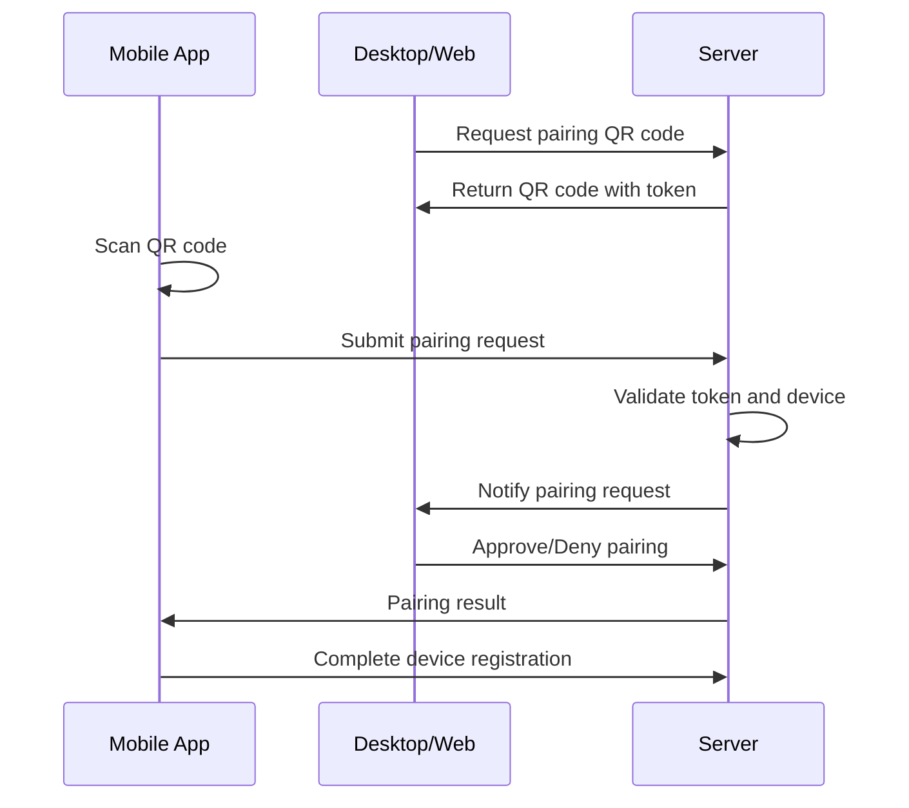

# TASK-006: Cross-Device Authentication & Security

**Epic**: Handheld Device Integration  
**Priority**: High  
**Status**: Planning  
**Estimated Duration**: 3 weeks  
**Dependencies**: TASK-005 (Mobile-First Extension Communication)

---

## 🎯 **Objective**

Implement comprehensive cross-device authentication and security infrastructure to enable secure handheld device integration with VS Code extensions. This includes device management, session handling, and advanced security features optimized for mobile environments.

## 📋 **Overview**

This task establishes the security foundation for handheld device integration by implementing:

- **Device Management**: Secure device registration, pairing, and permission management
- **Cross-Device Authentication**: JWT-based authentication optimized for mobile devices
- **Session Management**: Seamless session handling across multiple devices
- **Advanced Security**: End-to-end encryption, audit logging, and intrusion detection

## 🏗️ **Architecture Overview**



## 📊 **Success Metrics**

- **Security**: Zero security breaches during implementation
- **Authentication Speed**: <500ms for device authentication
- **Session Reliability**: 99.9% session persistence across devices
- **Token Management**: Automatic token refresh with 99% success rate
- **Device Management**: Support for 10+ devices per user

---

## 🔧 **TASK-006.1: Device Management System**

### **Objective**

Implement secure device registration, QR code pairing, and granular device permissions.

### **Duration**: 1 week

### **Assignee**: Backend Developer

### **Labels**: `backend`, `authentication`, `security`

#### **TASK-006.1.1: Implement Device Registration API**

**Estimate**: 3 days  
**Priority**: Critical

**Description**:
Create secure device registration system with device fingerprinting, verification, and metadata management.

**Technical Requirements**:

```typescript
interface DeviceRegistration {
	deviceInfo: {
		deviceId: string
		deviceName: string
		deviceType: "mobile" | "desktop" | "web"
		platform: string
		version: string
		capabilities: string[]
	}
	fingerprint: {
		hardwareId: string
		screenResolution: string
		timezone: string
		language: string
	}
	security: {
		publicKey: string
		encryptionSupport: string[]
		biometricSupport: boolean
	}
}
```

**API Endpoints**:

```typescript
POST /api/devices/register
POST /api/devices/verify
GET /api/devices/list
PUT /api/devices/:deviceId
DELETE /api/devices/:deviceId
```

**Acceptance Criteria**:

- [ ] Secure device registration flow
- [ ] Device fingerprinting for security
- [ ] Device metadata storage and management
- [ ] Device verification and approval process
- [ ] Support for device updates and management

**Implementation Steps**:

1. Design device registration schema
2. Implement device fingerprinting
3. Create registration API endpoints
4. Add device verification process
5. Implement device management features

#### **TASK-006.1.2: Create QR Code Pairing System**

**Estimate**: 2 days  
**Priority**: High

**Description**:
Implement secure QR code-based device pairing for easy and secure device setup.

**Technical Requirements**:

- QR code generation with time-limited tokens
- Secure pairing token exchange
- Device capability negotiation
- Pairing verification and confirmation

**Pairing Flow**:



**Acceptance Criteria**:

- [ ] Secure QR code generation
- [ ] Time-limited pairing tokens (5 minutes)
- [ ] Device capability negotiation
- [ ] User approval workflow
- [ ] Secure token exchange

**Implementation Steps**:

1. Implement QR code generation service
2. Create pairing token management
3. Add device capability negotiation
4. Implement approval workflow
5. Add security validation

#### **TASK-006.1.3: Implement Device Permissions**

**Estimate**: 2 days  
**Priority**: High

**Description**:
Create role-based access control system with granular permissions per device type and user preferences.

**Permission System**:

```typescript
interface DevicePermissions {
	deviceId: string
	userId: string
	permissions: {
		fileAccess: {
			read: boolean
			write: boolean
			paths: string[]
		}
		commands: {
			execute: boolean
			allowedCommands: string[]
			restrictedCommands: string[]
		}
		system: {
			monitoring: boolean
			configuration: boolean
			debugging: boolean
		}
	}
	restrictions: {
		timeBasedAccess: TimeRestriction[]
		networkRestrictions: NetworkRestriction[]
		rateLimits: RateLimit[]
	}
}
```

**Acceptance Criteria**:

- [ ] Granular device permissions
- [ ] Role-based access control
- [ ] Permission inheritance and overrides
- [ ] Time-based access restrictions
- [ ] Network-based restrictions

**Implementation Steps**:

1. Design permission schema
2. Implement permission engine
3. Add role-based access control
4. Create permission inheritance
5. Add restriction mechanisms

---

## 🔧 **TASK-006.2: Session Management**

### **Objective**

Implement cross-device session management with JWT tokens, automatic refresh, and session synchronization.

### **Duration**: 1 week

### **Assignee**: Backend Developer

### **Labels**: `backend`, `sessions`, `jwt`

#### **TASK-006.2.1: Implement Cross-Device Sessions**

**Estimate**: 3 days  
**Priority**: Critical

**Description**:
Create session management system that maintains user state across multiple devices with conflict resolution.

**Session Architecture**:

```typescript
interface UserSession {
	sessionId: string
	userId: string
	devices: {
		deviceId: string
		lastActive: Date
		status: "active" | "inactive" | "suspended"
		capabilities: string[]
	}[]
	sharedState: {
		preferences: UserPreferences
		workspaceState: WorkspaceState
		recentFiles: string[]
		commandHistory: Command[]
	}
	synchronization: {
		lastSync: Date
		conflictResolution: "latest-wins" | "manual" | "merge"
		pendingChanges: Change[]
	}
}
```

**Acceptance Criteria**:

- [ ] Seamless cross-device sessions
- [ ] Session state synchronization
- [ ] Conflict resolution mechanisms
- [ ] Device status tracking
- [ ] Session persistence and recovery

**Implementation Steps**:

1. Design session data model
2. Implement session synchronization
3. Add conflict resolution logic
4. Create device status tracking
5. Add session persistence

#### **TASK-006.2.2: Create Token Refresh Mechanism**

**Estimate**: 2 days  
**Priority**: High

**Description**:
Implement automatic JWT token refresh optimized for mobile devices with offline support.

**Token Management**:

```typescript
interface TokenManager {
	accessToken: {
		token: string
		expiresAt: Date
		refreshThreshold: number // Refresh when 80% expired
	}
	refreshToken: {
		token: string
		expiresAt: Date
		rotationPolicy: "on-use" | "time-based"
	}
	deviceToken: {
		token: string
		deviceId: string
		capabilities: string[]
	}
}
```

**Acceptance Criteria**:

- [ ] Automatic token refresh
- [ ] Refresh token rotation
- [ ] Offline token validation
- [ ] Token revocation and blacklisting
- [ ] 99% refresh success rate

**Implementation Steps**:

1. Implement JWT token service
2. Add automatic refresh logic
3. Create token rotation mechanism
4. Add offline token validation
5. Implement token revocation

#### **TASK-006.2.3: Implement Session Security**

**Estimate**: 2 days  
**Priority**: High

**Description**:
Add session encryption, hijacking prevention, and concurrent session management.

**Security Features**:

- Session encryption and protection
- Session hijacking detection
- Concurrent session limits
- Suspicious activity detection
- Session invalidation mechanisms

**Acceptance Criteria**:

- [ ] Encrypted session storage
- [ ] Session hijacking prevention
- [ ] Concurrent session limits (5 devices max)
- [ ] Suspicious activity detection
- [ ] Automatic session invalidation

**Implementation Steps**:

1. Implement session encryption
2. Add hijacking detection
3. Create session limits
4. Add activity monitoring
5. Implement invalidation logic

---

## 🔧 **TASK-006.3: Security Enhancement**

### **Objective**

Implement advanced security features including end-to-end encryption, audit logging, and intrusion detection.

### **Duration**: 1 week

### **Assignee**: Security Engineer

### **Labels**: `security`, `encryption`, `monitoring`

#### **TASK-006.3.1: Implement End-to-End Encryption**

**Estimate**: 3 days  
**Priority**: High

**Description**:
Add end-to-end encryption for sensitive data transmission between devices and servers.

**Encryption Architecture**:

```typescript
interface EncryptionService {
	keyManagement: {
		generateKeyPair: () => KeyPair
		exchangeKeys: (deviceId: string) => Promise<SharedKey>
		rotateKeys: (keyId: string) => Promise<void>
	}
	encryption: {
		encrypt: (data: any, key: string) => EncryptedData
		decrypt: (encryptedData: EncryptedData, key: string) => any
		sign: (data: any, privateKey: string) => Signature
		verify: (data: any, signature: Signature, publicKey: string) => boolean
	}
	protocols: {
		messageEncryption: boolean
		fileEncryption: boolean
		commandEncryption: boolean
	}
}
```

**Acceptance Criteria**:

- [ ] E2E encryption for sensitive operations
- [ ] Secure key exchange and management
- [ ] Key rotation and lifecycle management
- [ ] Performance optimization for mobile
- [ ] Backward compatibility support

**Implementation Steps**:

1. Design encryption architecture
2. Implement key management system
3. Add encryption/decryption services
4. Create key exchange protocol
5. Optimize for mobile performance

#### **TASK-006.3.2: Create Audit Logging System**

**Estimate**: 2 days  
**Priority**: Medium

**Description**:
Implement comprehensive audit logging for security events, user actions, and system activities.

**Audit System**:

```typescript
interface AuditLog {
	eventId: string
	timestamp: Date
	userId: string
	deviceId: string
	eventType: "auth" | "access" | "command" | "file" | "system"
	action: string
	resource: string
	result: "success" | "failure" | "blocked"
	metadata: {
		ipAddress: string
		userAgent: string
		location?: GeoLocation
		riskScore: number
	}
	context: {
		sessionId: string
		requestId: string
		correlationId: string
	}
}
```

**Acceptance Criteria**:

- [ ] Comprehensive audit logging
- [ ] Tamper-proof log storage
- [ ] Real-time log analysis
- [ ] Compliance reporting
- [ ] Log retention and archival

**Implementation Steps**:

1. Design audit log schema
2. Implement logging service
3. Add real-time analysis
4. Create compliance reports
5. Add retention policies

#### **TASK-006.3.3: Implement Rate Limiting and Monitoring**

**Estimate**: 2 days  
**Priority**: Medium

**Description**:
Add comprehensive rate limiting, intrusion detection, and security monitoring.

**Security Monitoring**:

```typescript
interface SecurityMonitor {
	rateLimiting: {
		perUser: RateLimit
		perDevice: RateLimit
		perEndpoint: RateLimit
		adaptive: boolean
	}
	intrusionDetection: {
		failedLoginThreshold: number
		suspiciousPatterns: Pattern[]
		geoLocationAnomalies: boolean
		deviceFingerprintChanges: boolean
	}
	alerting: {
		realTimeAlerts: boolean
		escalationRules: EscalationRule[]
		notificationChannels: string[]
	}
}
```

**Acceptance Criteria**:

- [ ] Adaptive rate limiting
- [ ] Real-time intrusion detection
- [ ] Automated threat response
- [ ] Security monitoring dashboard
- [ ] Alert escalation system

**Implementation Steps**:

1. Implement rate limiting service
2. Add intrusion detection
3. Create monitoring dashboard
4. Add automated responses
5. Implement alerting system

---

## 📋 **Database Schema**

### **Users Table**

```sql
CREATE TABLE users (
    id UUID PRIMARY KEY DEFAULT gen_random_uuid(),
    email VARCHAR(255) UNIQUE NOT NULL,
    password_hash VARCHAR(255) NOT NULL,
    display_name VARCHAR(100),
    preferences JSONB DEFAULT '{}',
    security_settings JSONB DEFAULT '{}',
    created_at TIMESTAMP DEFAULT NOW(),
    updated_at TIMESTAMP DEFAULT NOW(),
    last_login TIMESTAMP,
    status VARCHAR(20) DEFAULT 'active'
);
```

### **Devices Table**

```sql
CREATE TABLE devices (
    id UUID PRIMARY KEY DEFAULT gen_random_uuid(),
    user_id UUID REFERENCES users(id) ON DELETE CASCADE,
    device_name VARCHAR(100) NOT NULL,
    device_type VARCHAR(20) NOT NULL,
    device_info JSONB DEFAULT '{}',
    fingerprint JSONB DEFAULT '{}',
    permissions JSONB DEFAULT '{}',
    last_seen TIMESTAMP DEFAULT NOW(),
    is_active BOOLEAN DEFAULT true,
    is_trusted BOOLEAN DEFAULT false,
    created_at TIMESTAMP DEFAULT NOW(),
    UNIQUE(user_id, device_name)
);
```

### **Sessions Table**

```sql
CREATE TABLE sessions (
    id UUID PRIMARY KEY DEFAULT gen_random_uuid(),
    user_id UUID REFERENCES users(id) ON DELETE CASCADE,
    device_id UUID REFERENCES devices(id) ON DELETE CASCADE,
    access_token_hash VARCHAR(255) NOT NULL,
    refresh_token_hash VARCHAR(255) NOT NULL,
    session_data JSONB DEFAULT '{}',
    expires_at TIMESTAMP NOT NULL,
    last_activity TIMESTAMP DEFAULT NOW(),
    ip_address INET,
    user_agent TEXT,
    created_at TIMESTAMP DEFAULT NOW(),
    INDEX(user_id, device_id)
);
```

### **Audit Logs Table**

```sql
CREATE TABLE audit_logs (
    id UUID PRIMARY KEY DEFAULT gen_random_uuid(),
    user_id UUID REFERENCES users(id) ON DELETE SET NULL,
    device_id UUID REFERENCES devices(id) ON DELETE SET NULL,
    event_type VARCHAR(50) NOT NULL,
    action VARCHAR(100) NOT NULL,
    resource VARCHAR(200),
    result VARCHAR(20) NOT NULL,
    metadata JSONB DEFAULT '{}',
    ip_address INET,
    user_agent TEXT,
    created_at TIMESTAMP DEFAULT NOW(),
    INDEX(user_id, created_at),
    INDEX(event_type, created_at)
);
```

---

## 📋 **Dependencies**

### **Internal Dependencies**

- **TASK-005**: Mobile-First Extension Communication must be complete
- **PostgreSQL Database**: Required for user and session storage
- **Redis**: Required for session caching and rate limiting

### **External Dependencies**

- **JWT Library**: For token generation and validation
- **Encryption Library**: For end-to-end encryption
- **QR Code Library**: For device pairing
- **Audit Logging Infrastructure**: For compliance and monitoring

---

## 🎯 **Acceptance Criteria**

### **Security Requirements**

- [ ] Zero security vulnerabilities in authentication flow
- [ ] End-to-end encryption for sensitive data
- [ ] Comprehensive audit logging for all security events
- [ ] Rate limiting and intrusion detection active
- [ ] Device permissions properly enforced

### **Performance Requirements**

- [ ] <500ms authentication response time
- [ ] 99.9% session persistence across devices
- [ ] 99% token refresh success rate
- [ ] Support for 10+ devices per user
- [ ] <100ms permission check latency

### **Usability Requirements**

- [ ] QR code pairing completes in <30 seconds
- [ ] Seamless cross-device session transitions
- [ ] Intuitive device management interface
- [ ] Clear security status indicators
- [ ] Graceful handling of authentication failures

---

## 📊 **Testing Strategy**

### **Security Testing**

- Penetration testing for authentication flows
- Token security and expiration testing
- Session hijacking prevention validation
- Device permission enforcement testing
- Encryption key management testing

### **Performance Testing**

- Authentication latency under load
- Concurrent session handling
- Token refresh performance
- Database query optimization
- Rate limiting effectiveness

### **Integration Testing**

- Cross-device session synchronization
- QR code pairing end-to-end flow
- Extension integration with authentication
- Mobile app authentication flow
- Offline authentication scenarios

### **Compliance Testing**

- Audit log completeness and accuracy
- Data retention policy compliance
- Privacy regulation compliance
- Security standard adherence
- Encryption standard validation

---

## 📈 **Monitoring and Metrics**

### **Security Metrics**

- Authentication success/failure rates
- Token refresh success rates
- Session hijacking attempts detected
- Rate limiting triggers
- Intrusion detection alerts

### **Performance Metrics**

- Authentication response times
- Session synchronization latency
- Database query performance
- Token generation/validation times
- Device registration completion rates

### **Business Metrics**

- Active devices per user
- Cross-device usage patterns
- Authentication method preferences
- Security incident frequency
- User satisfaction with security features

---

## 🚀 **Deployment Plan**

### **Phase 1: Core Authentication (Week 1)**

- Deploy device registration and basic authentication
- Implement JWT token service
- Set up basic session management
- Deploy to staging environment

### **Phase 2: Advanced Security (Week 2)**

- Deploy QR code pairing system
- Implement device permissions
- Add session security features
- Enable audit logging

### **Phase 3: Production Security (Week 3)**

- Deploy end-to-end encryption
- Enable intrusion detection
- Implement rate limiting
- Full production deployment with monitoring

---

## 🔒 **Security Considerations**

### **Data Protection**

- All passwords hashed with bcrypt (12+ rounds)
- Sensitive data encrypted at rest and in transit
- PII data properly anonymized in logs
- Secure key storage and rotation

### **Access Control**

- Principle of least privilege enforced
- Regular access reviews and audits
- Multi-factor authentication support
- Device trust levels and restrictions

### **Compliance**

- GDPR compliance for EU users
- SOC 2 Type II controls implementation
- Regular security assessments
- Incident response procedures

---

**Task Created**: June 22, 2025  
**Last Updated**: June 22, 2025  
**Status**: Planning  
**Next Review**: Weekly during implementation
