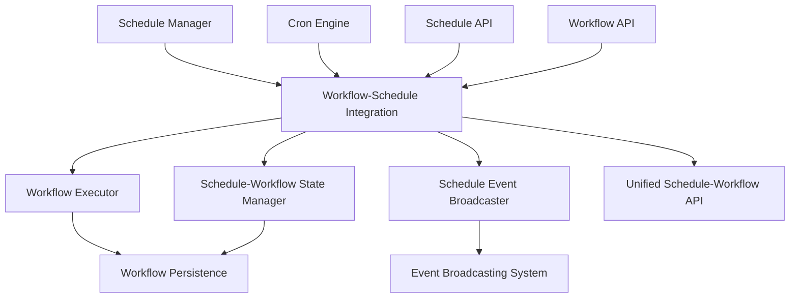

# 🔗 TASK-008.1.4.2: Workflow-Schedule Integration Implementation

## 📋 **TASK OVERVIEW**

**Task ID**: TASK-008.1.4.2  
**Phase**: Phase 4 - Advanced Orchestration  
**Priority**: High  
**Estimated Duration**: 1.5 days  
**Dependencies**: TASK-008.1.4.1 (Core Scheduling Engine)  
**Branch**: `feature/phase-4-advanced-orchestration`

## 🎯 **OBJECTIVES**

### **Primary Goals**

- Integrate the Core Scheduling Engine with existing Workflow Execution system
- Create seamless schedule-triggered workflow execution
- Implement schedule-workflow state synchronization
- Add real-time schedule status updates via event broadcasting
- Extend REST API for unified schedule-workflow operations

### **Success Criteria**

- **Integration Latency**: <20ms from schedule trigger to workflow start
- **State Synchronization**: <10ms for schedule-workflow state updates
- **Event Broadcasting**: <5ms for real-time status updates
- **API Response**: <50ms for combined schedule-workflow operations
- **Test Coverage**: 100% integration test coverage

## 🏗️ **ARCHITECTURE OVERVIEW**

### **Integration Components**



### **Integration Points**

- **Schedule Manager** ↔ **Workflow Executor**: Direct execution triggering
- **Schedule State** ↔ **Workflow State**: Bidirectional state synchronization
- **Schedule Events** ↔ **Event Broadcasting**: Real-time status updates
- **Schedule API** ↔ **Workflow API**: Unified management interface

## 📊 **IMPLEMENTATION BREAKDOWN**

### **Core Integration Service**

#### **Files to Create**

- `production-ccs/src/services/workflow-schedule-integration.ts` - Main integration service
- `production-ccs/src/services/schedule-execution-handler.ts` - Handle schedule-triggered executions
- `production-ccs/src/services/schedule-workflow-state.ts` - Manage state synchronization
- `production-ccs/src/services/schedule-event-broadcaster.ts` - Real-time schedule events

#### **Technical Specifications**

```typescript
interface WorkflowScheduleIntegration {
	// Integration lifecycle
	initialize(): Promise<void>
	start(): Promise<void>
	stop(): Promise<void>

	// Schedule-workflow operations
	createScheduledWorkflow(config: ScheduledWorkflowConfig): Promise<string>
	updateScheduledWorkflow(id: string, updates: Partial<ScheduledWorkflowConfig>): Promise<void>
	deleteScheduledWorkflow(id: string): Promise<void>

	// Execution management
	triggerScheduledExecution(scheduleId: string): Promise<string>
	cancelScheduledExecution(executionId: string): Promise<void>

	// State synchronization
	syncScheduleWorkflowState(scheduleId: string, workflowId: string): Promise<void>
	getScheduleWorkflowStatus(scheduleId: string): Promise<ScheduleWorkflowStatus>

	// Event handling
	onScheduleTriggered(callback: (event: ScheduleTriggeredEvent) => void): void
	onWorkflowCompleted(callback: (event: WorkflowCompletedEvent) => void): void
}

interface ScheduledWorkflowConfig {
	id: string
	workflowId: string
	scheduleId: string
	name: string
	description?: string
	enabled: boolean
	executionConfig: WorkflowExecutionConfig
	scheduleConfig: ScheduleDefinition
	metadata: Record<string, any>
}

interface ScheduleWorkflowStatus {
	scheduleId: string
	workflowId: string
	scheduleStatus: ScheduleStatus
	lastExecution?: WorkflowExecutionSummary
	nextExecution?: Date
	executionHistory: WorkflowExecutionSummary[]
	metrics: ScheduleWorkflowMetrics
}
```

### **Schedule Execution Handler**

#### **Responsibilities**

- Process schedule triggers and initiate workflow executions
- Handle execution context and parameter passing
- Manage execution queuing and prioritization
- Track execution lifecycle and status updates

#### **Technical Specifications**

```typescript
interface ScheduleExecutionHandler {
	// Execution handling
	handleScheduleTrigger(trigger: ScheduleTrigger): Promise<WorkflowExecution>
	prepareExecutionContext(scheduleId: string, workflowId: string): Promise<ExecutionContext>

	// Queue management
	enqueueExecution(execution: ScheduledExecution): Promise<void>
	dequeueExecution(): Promise<ScheduledExecution | null>

	// Status tracking
	trackExecutionProgress(executionId: string, status: ExecutionStatus): Promise<void>
	updateScheduleMetrics(scheduleId: string, execution: WorkflowExecution): Promise<void>
}

interface ScheduleTrigger {
	scheduleId: string
	workflowId: string
	triggerTime: Date
	triggerType: "cron" | "manual" | "event"
	context: Record<string, any>
}

interface ScheduledExecution {
	id: string
	scheduleId: string
	workflowId: string
	priority: number
	scheduledTime: Date
	context: ExecutionContext
	retryPolicy: RetryPolicy
}
```

### **Schedule-Workflow State Manager**

#### **Responsibilities**

- Synchronize schedule and workflow states
- Handle state transitions and updates
- Manage execution history and metrics
- Ensure data consistency across systems

#### **Technical Specifications**

```typescript
interface ScheduleWorkflowStateManager {
	// State synchronization
	syncStates(scheduleId: string, workflowId: string): Promise<void>
	updateScheduleState(scheduleId: string, state: ScheduleState): Promise<void>
	updateWorkflowState(workflowId: string, state: WorkflowState): Promise<void>

	// History management
	recordExecution(execution: WorkflowExecution): Promise<void>
	getExecutionHistory(scheduleId: string, limit?: number): Promise<WorkflowExecution[]>

	// Metrics tracking
	updateMetrics(scheduleId: string, metrics: ScheduleMetrics): Promise<void>
	getScheduleMetrics(scheduleId: string): Promise<ScheduleMetrics>
}

interface ScheduleState {
	id: string
	status: "active" | "paused" | "disabled" | "error"
	lastExecution?: Date
	nextExecution?: Date
	executionCount: number
	errorCount: number
	lastError?: string
}

interface ScheduleMetrics {
	totalExecutions: number
	successfulExecutions: number
	failedExecutions: number
	averageExecutionTime: number
	lastExecutionDuration: number
	uptime: number
}
```

### **Schedule Event Broadcasting**

#### **Responsibilities**

- Broadcast schedule-related events in real-time
- Integrate with existing event broadcasting system
- Provide WebSocket updates for schedule status
- Handle event filtering and subscription management

#### **Technical Specifications**

```typescript
interface ScheduleEventBroadcaster {
	// Event broadcasting
	broadcastScheduleEvent(event: ScheduleEvent): Promise<void>
	broadcastWorkflowEvent(event: WorkflowEvent): Promise<void>

	// Subscription management
	subscribeToScheduleEvents(scheduleId: string, callback: EventCallback): string
	subscribeToWorkflowEvents(workflowId: string, callback: EventCallback): string
	unsubscribe(subscriptionId: string): void

	// WebSocket integration
	setupWebSocketHandlers(): void
	broadcastToWebSocket(event: ScheduleEvent | WorkflowEvent): void
}

interface ScheduleEvent {
	type: "schedule.triggered" | "schedule.completed" | "schedule.failed" | "schedule.paused" | "schedule.resumed"
	scheduleId: string
	workflowId?: string
	timestamp: Date
	data: Record<string, any>
}

interface WorkflowEvent {
	type: "workflow.started" | "workflow.completed" | "workflow.failed" | "workflow.step.completed"
	workflowId: string
	scheduleId?: string
	executionId: string
	timestamp: Date
	data: Record<string, any>
}
```

## 🔧 **API INTEGRATION**

### **Extended Schedule Endpoints**

```typescript
// Enhanced schedule management with workflow integration
POST   /api/schedules/workflows           - Create scheduled workflow
GET    /api/schedules/:id/workflow        - Get schedule-workflow details
PUT    /api/schedules/:id/workflow        - Update scheduled workflow
DELETE /api/schedules/:id/workflow        - Delete scheduled workflow

// Schedule-workflow operations
POST   /api/schedules/:id/trigger         - Manual trigger with workflow context
GET    /api/schedules/:id/executions      - Get execution history
GET    /api/schedules/:id/status          - Get combined schedule-workflow status

// Workflow-schedule operations
GET    /api/workflows/:id/schedules       - Get schedules for workflow
POST   /api/workflows/:id/schedule        - Create schedule for workflow
```

### **WebSocket Events**

```typescript
// Real-time schedule events
interface ScheduleWebSocketEvents {
	"schedule:triggered": ScheduleTriggeredEvent
	"schedule:completed": ScheduleCompletedEvent
	"schedule:failed": ScheduleFailedEvent
	"workflow:started": WorkflowStartedEvent
	"workflow:completed": WorkflowCompletedEvent
	"workflow:step:completed": WorkflowStepCompletedEvent
}

// Event subscription
ws.subscribe("schedule:*", scheduleId)
ws.subscribe("workflow:*", workflowId)
ws.subscribe("execution:*", executionId)
```

## 🧪 **TESTING STRATEGY**

### **Integration Tests**

#### **Files to Create**

- `production-ccs/src/tests/workflow-schedule-integration.test.ts` - Main integration tests
- `production-ccs/src/tests/schedule-execution-handler.test.ts` - Execution handler tests
- `production-ccs/src/tests/schedule-workflow-state.test.ts` - State management tests
- `production-ccs/src/tests/schedule-event-broadcaster.test.ts` - Event broadcasting tests

#### **Test Coverage Requirements**

```typescript
describe("Workflow-Schedule Integration", () => {
	describe("Integration Service", () => {
		// Service lifecycle tests
		test("should initialize integration service")
		test("should start and stop integration service")

		// Schedule-workflow operations
		test("should create scheduled workflow")
		test("should update scheduled workflow")
		test("should delete scheduled workflow")

		// State synchronization
		test("should sync schedule and workflow states")
		test("should handle state conflicts")
	})

	describe("Execution Handler", () => {
		// Trigger handling
		test("should handle cron triggers")
		test("should handle manual triggers")
		test("should handle event triggers")

		// Execution management
		test("should prepare execution context")
		test("should enqueue executions with priority")
		test("should track execution progress")
	})

	describe("State Manager", () => {
		// State synchronization
		test("should sync schedule and workflow states")
		test("should update metrics correctly")
		test("should maintain execution history")

		// Error handling
		test("should handle state sync failures")
		test("should recover from inconsistent states")
	})

	describe("Event Broadcasting", () => {
		// Event broadcasting
		test("should broadcast schedule events")
		test("should broadcast workflow events")
		test("should handle WebSocket connections")

		// Subscription management
		test("should manage event subscriptions")
		test("should filter events correctly")
	})
})
```

### **Performance Tests**

```typescript
describe("Integration Performance", () => {
	test("should trigger workflow within 20ms of schedule")
	test("should sync states within 10ms")
	test("should broadcast events within 5ms")
	test("should handle 100+ concurrent executions")
	test("should maintain <50ms API response times")
})
```

### **Error Scenario Tests**

```typescript
describe("Error Scenarios", () => {
	test("should handle workflow execution failures")
	test("should handle database connection failures")
	test("should handle event broadcasting failures")
	test("should recover from partial state updates")
	test("should handle schedule-workflow conflicts")
})
```

## 📁 **FILE STRUCTURE**

```
production-ccs/src/
├── services/
│   ├── workflow-schedule-integration.ts    # Main integration service
│   ├── schedule-execution-handler.ts       # Schedule-triggered execution
│   ├── schedule-workflow-state.ts          # State synchronization
│   └── schedule-event-broadcaster.ts       # Real-time events
├── routes/
│   ├── scheduled-workflows.ts              # Schedule-workflow API
│   └── schedule-executions.ts              # Execution management API
├── controllers/
│   ├── scheduled-workflows.ts              # Schedule-workflow controllers
│   └── schedule-executions.ts              # Execution controllers
├── middleware/
│   └── schedule-workflow-auth.ts           # Authorization middleware
└── tests/
    ├── workflow-schedule-integration.test.ts   # Integration tests
    ├── schedule-execution-handler.test.ts      # Execution tests
    ├── schedule-workflow-state.test.ts         # State tests
    └── schedule-event-broadcaster.test.ts      # Event tests
```

## 📈 **SUCCESS METRICS**

### **Performance Requirements**

- ✅ **Integration Latency**: <20ms from schedule trigger to workflow start
- ✅ **State Sync**: <10ms for schedule-workflow state updates
- ✅ **Event Broadcasting**: <5ms for real-time status updates
- ✅ **API Response**: <50ms for combined operations
- ✅ **Throughput**: 100+ scheduled executions per minute

### **Functional Requirements**

- ✅ **Schedule-Workflow Creation**: Unified creation and management
- ✅ **Execution Triggering**: Automatic and manual trigger support
- ✅ **State Synchronization**: Bidirectional state consistency
- ✅ **Event Broadcasting**: Real-time status updates
- ✅ **Error Handling**: Comprehensive failure recovery

### **Quality Requirements**

- ✅ **Test Coverage**: 100% integration test coverage
- ✅ **Code Quality**: ESLint/Prettier compliant, TypeScript strict mode
- ✅ **Documentation**: Complete API documentation and usage examples
- ✅ **Integration**: Seamless integration with existing systems

## 🚀 **IMPLEMENTATION TIMELINE**

### **Day 1: Core Integration (8 hours)**

**Morning (4 hours)**:

- Implement `workflow-schedule-integration.ts` main integration service
- Create `schedule-execution-handler.ts` for trigger handling
- Add integration type definitions to `scheduling.ts`
- Set up basic service lifecycle and initialization

**Afternoon (4 hours)**:

- Implement `schedule-workflow-state.ts` state synchronization
- Create `schedule-event-broadcaster.ts` for real-time events
- Add WebSocket integration for schedule events
- Create basic integration tests

### **Day 2: API Integration & Testing (4 hours)**

**Morning (2 hours)**:

- Implement REST API endpoints for schedule-workflow operations
- Create controllers for unified schedule-workflow management
- Add authentication middleware for schedule operations

**Afternoon (2 hours)**:

- Complete comprehensive test suite with 100% coverage
- Performance testing and optimization
- Integration validation with existing systems
- Documentation completion and final validation

## 🔄 **DEPENDENCIES & INTEGRATION**

### **Required Dependencies**

- **TASK-008.1.4.1**: Core Scheduling Engine (✅ Completed)
- **TASK-008.1.2**: Multi-Step Execution Engine (✅ Completed)
- **TASK-008.1.3**: Workflow Persistence Layer (✅ Completed)
- **Phase 3**: Event Broadcasting System (✅ Completed)
- **Phase 3**: WebSocket Manager (✅ Completed)

### **Integration Checkpoints**

- **Schedule Manager**: Use existing schedule management from TASK-008.1.4.1
- **Workflow Executor**: Integrate with existing execution engine from TASK-008.1.2
- **Persistence Layer**: Leverage workflow persistence from TASK-008.1.3
- **Event System**: Connect to Phase 3 event broadcasting infrastructure
- **WebSocket Events**: Extend existing WebSocket system for schedule updates

## 📋 **DELIVERABLES CHECKLIST**

### **Code Deliverables**

- [ ] **Integration Service**: `workflow-schedule-integration.ts` main service
- [ ] **Execution Handler**: `schedule-execution-handler.ts` trigger processing
- [ ] **State Manager**: `schedule-workflow-state.ts` state synchronization
- [ ] **Event Broadcaster**: `schedule-event-broadcaster.ts` real-time events
- [ ] **REST API**: Enhanced schedule endpoints with workflow integration
- [ ] **Test Suite**: 100% coverage integration tests

### **Documentation Deliverables**

- [ ] **Integration Guide**: How to use schedule-workflow integration
- [ ] **API Documentation**: Extended schedule API reference
- [ ] **Event Documentation**: Schedule event types and WebSocket integration
- [ ] **Performance Guide**: Optimization recommendations
- [ ] **Troubleshooting Guide**: Common integration issues and solutions

### **Quality Assurance**

- [ ] **Code Quality**: ESLint/Prettier compliant, TypeScript strict mode
- [ ] **Performance**: All latency and throughput targets met
- [ ] **Integration**: Seamless integration with existing Phase 4 components
- [ ] **Reliability**: Comprehensive error handling and state recovery
- [ ] **Security**: Proper authentication and authorization for schedule operations

## 🎯 **COMPLETION CRITERIA**

### **Functional Validation**

- ✅ **Schedule-Workflow Creation**: Unified creation and management interface
- ✅ **Execution Triggering**: Automatic schedule-triggered workflow execution
- ✅ **State Synchronization**: Bidirectional schedule-workflow state consistency
- ✅ **Event Broadcasting**: Real-time schedule and workflow status updates
- ✅ **API Integration**: Extended REST API with schedule-workflow operations

### **Performance Validation**

- ✅ **Integration Latency**: <20ms from schedule trigger to workflow start
- ✅ **State Sync**: <10ms for schedule-workflow state updates
- ✅ **Event Broadcasting**: <5ms for real-time status updates
- ✅ **API Response**: <50ms for combined schedule-workflow operations
- ✅ **Throughput**: 100+ scheduled executions per minute

### **Integration Validation**

- ✅ **Schedule Manager**: Seamless integration with Core Scheduling Engine
- ✅ **Workflow Executor**: Successful workflow execution triggering
- ✅ **Persistence Layer**: Consistent state management across systems
- ✅ **Event System**: Real-time event broadcasting integration
- ✅ **WebSocket Events**: Live schedule status updates via WebSocket

This implementation will bridge the Core Scheduling Engine with the existing Workflow Execution system, creating a unified workflow orchestration platform with automated scheduling capabilities. The integration provides the foundation for advanced scheduling features and completes the core workflow automation infrastructure for Phase 4.
