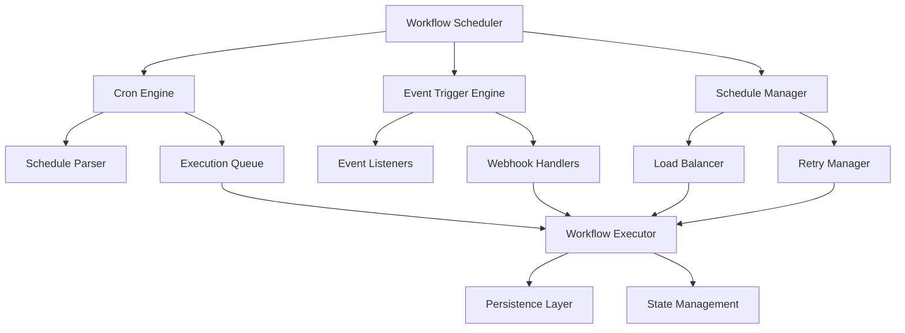

# 🕒 TASK-008.1.4: Workflow Scheduling System Implementation

## 📋 **TASK OVERVIEW**

**Task ID**: TASK-008.1.4  
**Phase**: Phase 4 - Advanced Orchestration  
**Priority**: Critical  
**Estimated Duration**: 6 days  
**Dependencies**: TASK-008.1.3 (Workflow Persistence Layer)  
**Branch**: `feature/phase-4-advanced-orchestration`

## 🎯 **OBJECTIVES**

### **Primary Goals**

- Implement production-ready workflow scheduling system
- Enable cron-based scheduling with timezone support
- Add event-driven triggers for real-time workflow execution
- Create smart scheduling optimization with load balancing
- Ensure reliable execution with failure recovery and retry mechanisms

### **Success Criteria**

- **Performance**: <50ms trigger response time, <10ms schedule evaluation
- **Scalability**: Support 1,000+ active schedules, 100+ workflows per minute
- **Reliability**: 99.9% schedule execution success rate
- **Test Coverage**: 100% across all scheduling components

## 🏗️ **ARCHITECTURE OVERVIEW**

### **Core Components**



### **Integration Points**

- **Existing Workflow Executor**: Seamless integration with TASK-008.1.2
- **Persistence Layer**: Leverage TASK-008.1.3 database operations
- **Command Queue**: Integration with Phase 3 command queue system
- **WebSocket Events**: Real-time schedule status updates

## 📊 **SUBTASK BREAKDOWN**

### **TASK-008.1.4.1: Core Scheduling Engine**

**Duration**: 2 days  
**Priority**: Critical

#### **Deliverables**

- **Cron Expression Engine**: Parse and validate complex cron patterns
- **Schedule Manager**: CRUD operations for schedule lifecycle
- **Next Execution Calculator**: Efficient calculation with timezone support
- **Schedule Validation**: Ensure schedules are valid and don't conflict

#### **Files to Create**

- `production-ccs/src/services/workflow-scheduler.ts` - Main scheduling service
- `production-ccs/src/services/cron-engine.ts` - Cron expression handling
- `production-ccs/src/services/schedule-manager.ts` - Schedule lifecycle management
- `production-ccs/src/types/scheduling.ts` - Scheduling-specific type definitions

#### **Technical Specifications**

```typescript
interface WorkflowScheduler {
	// Schedule management
	createSchedule(schedule: ScheduleDefinition): Promise<string>
	updateSchedule(scheduleId: string, updates: Partial<ScheduleDefinition>): Promise<void>
	deleteSchedule(scheduleId: string): Promise<void>

	// Execution control
	start(): Promise<void>
	stop(): Promise<void>
	pause(scheduleId: string): Promise<void>
	resume(scheduleId: string): Promise<void>

	// Monitoring
	getScheduleStatus(scheduleId: string): Promise<ScheduleStatus>
	getExecutionHistory(scheduleId: string): Promise<ExecutionHistory[]>
}

interface ScheduleDefinition {
	id: string
	workflowId: string
	name: string
	cronExpression: string
	timezone: string
	enabled: boolean
	startDate?: Date
	endDate?: Date
	maxExecutions?: number
	retryPolicy: RetryPolicy
	metadata: ScheduleMetadata
}
```

#### **Performance Targets**

- **Schedule Processing**: <10ms per schedule evaluation
- **Cron Parsing**: <1ms per expression validation
- **Memory Usage**: <50MB for 1,000 active schedules
- **CPU Usage**: <5% baseline overhead

### **TASK-008.1.4.2: Event-Driven Triggers**

**Duration**: 1.5 days  
**Priority**: High

#### **Deliverables**

- **Event Trigger Engine**: Process event-based workflow triggers
- **Webhook Handler**: Secure webhook endpoints for external systems
- **Event Bus Integration**: Connect to existing event broadcasting system
- **Trigger Authentication**: Ensure trigger authenticity and authorization

#### **Files to Create**

- `production-ccs/src/services/event-trigger-engine.ts` - Event-based workflow triggers
- `production-ccs/src/services/webhook-trigger-handler.ts` - Webhook trigger processing
- `production-ccs/src/middleware/trigger-auth.ts` - Trigger authentication middleware
- `production-ccs/src/routes/triggers.ts` - Trigger management endpoints

#### **Technical Specifications**

```typescript
interface EventTriggerEngine {
	// Event handling
	registerEventTrigger(trigger: EventTriggerDefinition): Promise<string>
	processEvent(event: WorkflowEvent): Promise<void>

	// Webhook handling
	createWebhookEndpoint(config: WebhookConfig): Promise<string>
	validateWebhookSignature(payload: any, signature: string): boolean

	// Integration
	connectEventBus(eventBus: EventBroadcaster): void
	subscribeToEvents(eventTypes: string[]): void
}

interface EventTriggerDefinition {
	id: string
	workflowId: string
	eventType: string
	filters: Record<string, any>
	authentication: TriggerAuth
	retryPolicy: RetryPolicy
}
```

#### **Performance Targets**

- **Trigger Response**: <50ms from trigger to execution start
- **Webhook Processing**: <100ms per webhook request
- **Event Throughput**: 1,000+ events per minute
- **Authentication**: <10ms per auth validation

### **TASK-008.1.4.3: Smart Execution Management**

**Duration**: 1.5 days  
**Priority**: High

#### **Deliverables**

- **Execution Queue**: Prioritized queue for workflow execution
- **Load Balancer**: Distribute execution load across resources
- **Retry Manager**: Intelligent retry with exponential backoff
- **Resource Monitor**: Prevent resource exhaustion

#### **Files to Create**

- `production-ccs/src/services/execution-queue.ts` - Prioritized execution queue
- `production-ccs/src/services/schedule-optimizer.ts` - Load balancing and optimization
- `production-ccs/src/services/retry-manager.ts` - Failure recovery and retry logic
- `production-ccs/src/services/resource-monitor.ts` - Resource usage monitoring

#### **Technical Specifications**

```typescript
interface ExecutionQueue {
	// Queue management
	enqueue(execution: ScheduledExecution): Promise<void>
	dequeue(): Promise<ScheduledExecution | null>
	peek(): Promise<ScheduledExecution | null>

	// Priority handling
	setPriority(executionId: string, priority: number): Promise<void>
	reorder(): Promise<void>

	// Monitoring
	getQueueSize(): Promise<number>
	getQueueStats(): Promise<QueueStats>
}

interface ScheduleOptimizer {
	// Load balancing
	optimizeScheduleDistribution(): Promise<void>
	balanceExecutionLoad(): Promise<void>

	// Resource management
	checkResourceAvailability(): Promise<ResourceStatus>
	allocateResources(execution: ScheduledExecution): Promise<boolean>

	// Performance optimization
	analyzeExecutionPatterns(): Promise<OptimizationReport>
	suggestScheduleAdjustments(): Promise<ScheduleAdjustment[]>
}
```

#### **Performance Targets**

- **Queue Operations**: <5ms per enqueue/dequeue
- **Load Balancing**: <20ms per optimization cycle
- **Resource Allocation**: <10ms per allocation check
- **Throughput**: 100+ executions per minute

### **TASK-008.1.4.4: Integration & Testing**

**Duration**: 1 day  
**Priority**: Critical

#### **Deliverables**

- **Comprehensive Test Suite**: Unit and integration tests
- **REST API Endpoints**: Schedule management API
- **Performance Testing**: Validate latency and throughput targets
- **Integration Testing**: End-to-end scheduling workflows

#### **Files to Create**

- `production-ccs/src/tests/workflow-scheduler.test.ts` - Scheduler test suite
- `production-ccs/src/tests/event-trigger-engine.test.ts` - Event trigger tests
- `production-ccs/src/tests/execution-queue.test.ts` - Queue management tests
- `production-ccs/src/routes/schedules.ts` - Schedule management API
- `production-ccs/src/controllers/schedules.ts` - Schedule controllers

#### **Test Coverage Requirements**

- **Unit Tests**: 100% coverage for all scheduling components
- **Integration Tests**: End-to-end scheduling workflows
- **Performance Tests**: Load testing with 1,000+ schedules
- **Error Scenario Tests**: Failure recovery and retry validation

#### **API Endpoints**

```typescript
// Schedule Management
POST   /api/schedules              - Create new schedule
GET    /api/schedules              - List schedules
GET    /api/schedules/:id          - Get schedule details
PUT    /api/schedules/:id          - Update schedule
DELETE /api/schedules/:id          - Delete schedule

// Schedule Control
POST   /api/schedules/:id/pause    - Pause schedule
POST   /api/schedules/:id/resume   - Resume schedule
POST   /api/schedules/:id/trigger  - Manual trigger

// Monitoring
GET    /api/schedules/:id/history  - Execution history
GET    /api/schedules/:id/status   - Schedule status
GET    /api/schedules/stats        - System statistics
```

## 🔧 **TECHNICAL SPECIFICATIONS**

### **Database Integration**

Leverages existing `workflow_schedules` table from TASK-008.1.3:

```sql
-- Existing table structure
CREATE TABLE workflow_schedules (
  id UUID PRIMARY KEY DEFAULT uuid_generate_v4(),
  workflow_id UUID NOT NULL REFERENCES workflows(id),
  name VARCHAR(255) NOT NULL,
  cron_expression VARCHAR(100) NOT NULL,
  timezone VARCHAR(50) DEFAULT 'UTC',
  enabled BOOLEAN DEFAULT true,
  start_date TIMESTAMP WITH TIME ZONE,
  end_date TIMESTAMP WITH TIME ZONE,
  max_executions INTEGER,
  execution_count INTEGER DEFAULT 0,
  last_execution TIMESTAMP WITH TIME ZONE,
  next_execution TIMESTAMP WITH TIME ZONE,
  created_by VARCHAR(255) NOT NULL,
  created_at TIMESTAMP WITH TIME ZONE DEFAULT NOW(),
  updated_at TIMESTAMP WITH TIME ZONE DEFAULT NOW()
);
```

### **Performance Optimization**

- **Cron Library**: Use `node-cron` for reliable cron parsing
- **Timezone Handling**: Leverage `moment-timezone` for accurate timezone calculations
- **Queue Implementation**: Redis-backed priority queue for scalability
- **Caching Strategy**: Redis cache for frequently accessed schedules
- **Connection Pooling**: Efficient database connection management

### **Error Handling**

- **Retry Policies**: Configurable exponential backoff
- **Dead Letter Queue**: Failed executions for manual review
- **Circuit Breaker**: Prevent cascade failures
- **Monitoring**: Comprehensive error tracking and alerting

## 🧪 **TESTING STRATEGY**

### **Unit Testing**

- **Cron Engine**: Expression parsing and validation
- **Schedule Manager**: CRUD operations and lifecycle
- **Event Triggers**: Event processing and webhook handling
- **Execution Queue**: Queue operations and prioritization

### **Integration Testing**

- **End-to-End Workflows**: Complete scheduling to execution flow
- **Database Integration**: Persistence layer compatibility
- **WebSocket Events**: Real-time status updates
- **API Functionality**: REST endpoint validation

### **Performance Testing**

- **Load Testing**: 1,000+ concurrent schedules
- **Stress Testing**: Resource exhaustion scenarios
- **Latency Testing**: Sub-50ms execution validation
- **Scalability Testing**: Linear scaling verification

### **Error Scenario Testing**

- **Network Failures**: Webhook delivery failures
- **Database Outages**: Persistence layer failures
- **Resource Exhaustion**: Memory and CPU limits
- **Invalid Schedules**: Malformed cron expressions

## 📁 **FILE STRUCTURE**

```
production-ccs/src/
├── services/
│   ├── workflow-scheduler.ts          # Main scheduling service
│   ├── cron-engine.ts                 # Cron expression handling
│   ├── schedule-manager.ts            # Schedule lifecycle management
│   ├── event-trigger-engine.ts        # Event-based triggers
│   ├── webhook-trigger-handler.ts     # Webhook processing
│   ├── execution-queue.ts             # Prioritized execution queue
│   ├── schedule-optimizer.ts          # Load balancing
│   ├── retry-manager.ts               # Failure recovery
│   └── resource-monitor.ts            # Resource monitoring
├── types/
│   └── scheduling.ts                  # Scheduling type definitions
├── routes/
│   ├── schedules.ts                   # Schedule management API
│   └── triggers.ts                    # Trigger management API
├── controllers/
│   └── schedules.ts                   # Schedule controllers
├── middleware/
│   └── trigger-auth.ts                # Trigger authentication
└── tests/
    ├── workflow-scheduler.test.ts     # Scheduler tests
    ├── event-trigger-engine.test.ts   # Event trigger tests
    ├── execution-queue.test.ts        # Queue tests
    └── scheduling-integration.test.ts # Integration tests
```

## 📈 **SUCCESS METRICS**

### **Functional Requirements**

- ✅ **Cron Scheduling**: Support standard and extended cron expressions
- ✅ **Event Triggers**: Webhook and internal event-based triggers
- ✅ **Schedule Management**: Full CRUD operations via API
- ✅ **Execution Control**: Start, stop, pause, resume capabilities
- ✅ **Failure Recovery**: Automatic retry with configurable policies

### **Performance Requirements**

- ✅ **Latency**: <50ms average execution start time
- ✅ **Throughput**: 100+ scheduled executions per minute
- ✅ **Scalability**: 1,000+ concurrent active schedules
- ✅ **Reliability**: 99.9% schedule execution success rate

### **Quality Requirements**

- ✅ **Test Coverage**: 100% unit and integration test coverage
- ✅ **Code Quality**: ESLint/Prettier compliant, TypeScript strict mode
- ✅ **Documentation**: Complete API documentation and usage examples
- ✅ **Integration**: Seamless integration with existing Phase 4 components

## 🚀 **IMPLEMENTATION TIMELINE**

### **Day 1-2: Core Scheduling Engine (TASK-008.1.4.1)**

**Day 1**:

- Implement `workflow-scheduler.ts` main service
- Create `cron-engine.ts` for expression parsing
- Add `scheduling.ts` type definitions

**Day 2**:

- Implement `schedule-manager.ts` lifecycle management
- Add timezone support and validation
- Create basic unit tests

### **Day 3-4: Event Triggers & Execution (TASK-008.1.4.2 & TASK-008.1.4.3)**

**Day 3**:

- Implement `event-trigger-engine.ts` for event processing
- Create `webhook-trigger-handler.ts` for webhook endpoints
- Add `trigger-auth.ts` middleware for authentication
- Build `execution-queue.ts` prioritized queue

**Day 4**:

- Implement `schedule-optimizer.ts` load balancing
- Create `retry-manager.ts` failure recovery
- Add `resource-monitor.ts` resource tracking
- Integration testing with existing systems

### **Day 5-6: Integration & Testing (TASK-008.1.4.4)**

**Day 5**:

- Create comprehensive test suites for all components
- Implement REST API endpoints (`schedules.ts`, `triggers.ts`)
- Add schedule controllers and middleware
- Performance testing and optimization

**Day 6**:

- End-to-end integration testing
- Documentation completion
- Final validation and bug fixes
- Deployment preparation

## 🔄 **DEPENDENCIES & INTEGRATION**

### **Required Dependencies**

- **TASK-008.1.3**: Workflow Persistence Layer (✅ Completed)
- **TASK-008.1.2**: Multi-Step Execution Engine (✅ Completed)
- **TASK-008.1.1**: Workflow Definition Schema (✅ Completed)
- **Phase 3**: Command Queue System (✅ Completed)
- **Database Infrastructure**: PostgreSQL with orchestration schema (✅ Ready)

### **Integration Checkpoints**

- **Database Schema**: Leverage existing `workflow_schedules` table
- **Workflow Executor**: Use existing execution engine from TASK-008.1.2
- **Event System**: Integrate with Phase 3 event broadcasting
- **WebSocket Events**: Real-time schedule status updates
- **Authentication**: Use existing JWT authentication system

## 📋 **DELIVERABLES CHECKLIST**

### **Code Deliverables**

- [ ] **Core Scheduling Engine**: `workflow-scheduler.ts`, `cron-engine.ts`, `schedule-manager.ts`
- [ ] **Event Trigger System**: `event-trigger-engine.ts`, `webhook-trigger-handler.ts`
- [ ] **Execution Management**: `execution-queue.ts`, `schedule-optimizer.ts`, `retry-manager.ts`
- [ ] **REST API**: `schedules.ts` routes, `schedules.ts` controllers
- [ ] **Type Definitions**: `scheduling.ts` comprehensive types
- [ ] **Test Suite**: 100% coverage across all components

### **Documentation Deliverables**

- [ ] **API Documentation**: Complete scheduling API reference
- [ ] **Integration Guide**: How to integrate with existing systems
- [ ] **Usage Examples**: Common scheduling patterns and use cases
- [ ] **Performance Guide**: Optimization and scaling recommendations
- [ ] **Troubleshooting Guide**: Common issues and solutions

### **Quality Assurance**

- [ ] **Code Quality**: ESLint/Prettier compliant, TypeScript strict mode
- [ ] **Performance**: All latency and throughput targets met
- [ ] **Security**: Webhook authentication and input validation
- [ ] **Reliability**: Comprehensive error handling and recovery
- [ ] **Scalability**: Load testing with 1,000+ schedules

## 🎯 **COMPLETION CRITERIA**

### **Functional Validation**

- ✅ **Cron Scheduling**: All standard and extended cron expressions supported
- ✅ **Event Triggers**: Webhook and internal event triggers functional
- ✅ **Schedule Management**: Full CRUD operations via REST API
- ✅ **Execution Control**: Start, stop, pause, resume operations working
- ✅ **Failure Recovery**: Automatic retry with exponential backoff

### **Performance Validation**

- ✅ **Trigger Response**: <50ms average execution start time
- ✅ **Schedule Processing**: <10ms per schedule evaluation
- ✅ **Throughput**: 100+ scheduled executions per minute
- ✅ **Scalability**: 1,000+ concurrent active schedules
- ✅ **Resource Usage**: <5% CPU overhead, <50MB memory for 1K schedules

### **Integration Validation**

- ✅ **Database Integration**: Seamless persistence layer operations
- ✅ **Workflow Executor**: Successful workflow execution triggering
- ✅ **Event System**: Real-time event broadcasting integration
- ✅ **API Compatibility**: RESTful endpoints following project standards
- ✅ **Authentication**: Secure access control and authorization

This implementation will complete the **Advanced Workflow Engine** foundation, bringing Phase 4 to 100% completion for the core orchestration system. The scheduling system provides the final piece needed for production-ready workflow automation with enterprise-grade reliability and performance.
