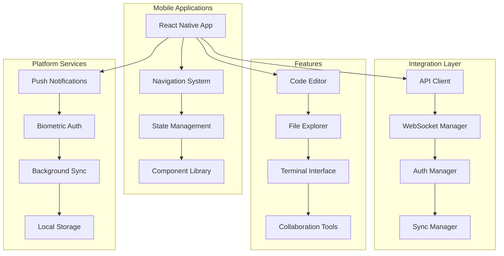

# TASK-008: Mobile Application Development

**Epic**: Handheld Device Integration  
**Priority**: Medium  
**Status**: Planning  
**Estimated Duration**: 4 weeks  
**Dependencies**: TASK-005, TASK-006, TASK-007

---

## 🎯 **Objective**

Develop comprehensive mobile applications for iOS and Android that provide full VS Code extension integration, real-time collaboration, and optimized user experience for handheld devices.

## 📋 **Overview**

This task creates the mobile frontend applications that complete the handheld device integration by implementing:

- **Cross-Platform Mobile Apps**: React Native applications for iOS and Android
- **VS Code Integration**: Full extension communication and file operations
- **Real-time Collaboration**: Live editing and synchronization capabilities
- **Optimized UX**: Mobile-first design with touch-optimized interfaces

## 🏗️ **Architecture Overview**



## 📊 **Success Metrics**

- **Performance**: <3 second app launch time
- **User Experience**: >4.5 star app store rating
- **Functionality**: 95% feature parity with desktop extension
- **Reliability**: <1% crash rate
- **Adoption**: 80% user retention after 30 days

---

## 🔧 **TASK-008.1: Core Mobile Application**

### **Objective**

Develop React Native application with navigation, state management, and core infrastructure.

### **Duration**: 1 week

### **Assignee**: Mobile Developer

### **Labels**: `mobile`, `react-native`, `frontend`

#### **TASK-008.1.1: Set Up React Native Project**

**Estimate**: 2 days  
**Priority**: Critical

**Description**:
Initialize React Native project with proper configuration, dependencies, and development environment.

**Project Structure**:

```
mobile-app/
├── src/
│   ├── components/          # Reusable UI components
│   ├── screens/            # Screen components
│   ├── navigation/         # Navigation configuration
│   ├── services/           # API and business logic
│   ├── store/              # State management
│   ├── utils/              # Utility functions
│   ├── hooks/              # Custom React hooks
│   └── types/              # TypeScript definitions
├── android/                # Android-specific code
├── ios/                    # iOS-specific code
├── __tests__/              # Test files
└── docs/                   # Documentation
```

**Core Dependencies**:

```json
{
	"dependencies": {
		"react-native": "^0.72.0",
		"@react-navigation/native": "^6.1.0",
		"@react-navigation/stack": "^6.3.0",
		"@reduxjs/toolkit": "^1.9.0",
		"react-redux": "^8.1.0",
		"react-native-vector-icons": "^10.0.0",
		"react-native-gesture-handler": "^2.12.0",
		"react-native-reanimated": "^3.3.0",
		"react-native-safe-area-context": "^4.7.0",
		"react-native-screens": "^3.22.0"
	}
}
```

**Acceptance Criteria**:

- [ ] React Native project properly initialized
- [ ] TypeScript configuration complete
- [ ] Development environment set up
- [ ] Basic navigation structure implemented
- [ ] State management configured

**Implementation Steps**:

1. Initialize React Native project with TypeScript
2. Configure development environment
3. Set up basic project structure
4. Install and configure core dependencies
5. Create initial navigation setup

#### **TASK-008.1.2: Implement Navigation System**

**Estimate**: 2 days  
**Priority**: High

**Description**:
Create comprehensive navigation system with tab navigation, stack navigation, and deep linking.

**Navigation Architecture**:

```typescript
interface NavigationStructure {
	AuthStack: {
		Login: undefined
		Register: undefined
		ForgotPassword: undefined
	}
	MainTabs: {
		Editor: undefined
		Files: undefined
		Terminal: undefined
		Settings: undefined
	}
	EditorStack: {
		CodeEditor: { fileId: string }
		FilePreview: { fileId: string }
		SearchResults: { query: string }
	}
	ModalStack: {
		DeviceSettings: undefined
		Collaboration: { sessionId: string }
		FileUpload: undefined
	}
}
```

**Deep Linking Support**:

```typescript
const linking = {
	prefixes: ["roocode://"],
	config: {
		screens: {
			Editor: "editor/:fileId",
			Files: "files/:path",
			Terminal: "terminal",
			Collaboration: "collab/:sessionId",
		},
	},
}
```

**Acceptance Criteria**:

- [ ] Tab navigation for main features
- [ ] Stack navigation for detailed views
- [ ] Modal navigation for overlays
- [ ] Deep linking support
- [ ] Navigation state persistence

**Implementation Steps**:

1. Configure React Navigation
2. Create tab navigation structure
3. Implement stack navigators
4. Add modal navigation
5. Set up deep linking

#### **TASK-008.1.3: Create State Management**

**Estimate**: 3 days  
**Priority**: High

**Description**:
Implement Redux Toolkit for state management with proper slices, middleware, and persistence.

**State Architecture**:

```typescript
interface RootState {
	auth: {
		user: User | null
		tokens: AuthTokens | null
		isAuthenticated: boolean
		devices: Device[]
	}
	editor: {
		openFiles: OpenFile[]
		activeFileId: string | null
		editorSettings: EditorSettings
		searchResults: SearchResult[]
	}
	files: {
		currentPath: string
		fileTree: FileNode[]
		recentFiles: RecentFile[]
		syncStatus: SyncStatus
	}
	collaboration: {
		activeSessions: CollabSession[]
		participants: Participant[]
		sharedCursors: CursorPosition[]
	}
	app: {
		isOnline: boolean
		syncQueue: SyncOperation[]
		notifications: Notification[]
		settings: AppSettings
	}
}
```

**Redux Slices**:

```typescript
// Auth slice
const authSlice = createSlice({
	name: "auth",
	initialState,
	reducers: {
		loginSuccess: (state, action) => {
			state.user = action.payload.user
			state.tokens = action.payload.tokens
			state.isAuthenticated = true
		},
		logout: (state) => {
			state.user = null
			state.tokens = null
			state.isAuthenticated = false
		},
	},
})
```

**Acceptance Criteria**:

- [ ] Redux store properly configured
- [ ] State slices for all features
- [ ] Middleware for async actions
- [ ] State persistence
- [ ] Type-safe state access

**Implementation Steps**:

1. Configure Redux Toolkit store
2. Create state slices for each feature
3. Implement async thunks for API calls
4. Add state persistence
5. Create typed hooks for state access

---

## 🔧 **TASK-008.2: VS Code Integration Features**

### **Objective**

Implement core VS Code integration features including code editing, file management, and terminal access.

### **Duration**: 1.5 weeks

### **Assignee**: Mobile Developer + Backend Developer

### **Labels**: `mobile`, `integration`, `editor`

#### **TASK-008.2.1: Implement Code Editor**

**Estimate**: 4 days  
**Priority**: Critical

**Description**:
Create mobile-optimized code editor with syntax highlighting, auto-completion, and touch gestures.

**Editor Features**:

```typescript
interface CodeEditor {
	syntax: {
		highlighting: boolean
		language: string
		theme: EditorTheme
	}
	editing: {
		autoComplete: boolean
		bracketMatching: boolean
		lineNumbers: boolean
		wordWrap: boolean
	}
	mobile: {
		touchGestures: TouchGesture[]
		virtualKeyboard: KeyboardConfig
		zoomSupport: boolean
		selectionHandles: boolean
	}
	collaboration: {
		realTimeEditing: boolean
		cursorSharing: boolean
		changeTracking: boolean
	}
}
```

**Touch Gestures**:

- **Single Tap**: Place cursor
- **Double Tap**: Select word
- **Triple Tap**: Select line
- **Long Press**: Show context menu
- **Pinch**: Zoom in/out
- **Two-finger Scroll**: Navigate code

**Acceptance Criteria**:

- [ ] Syntax highlighting for 20+ languages
- [ ] Touch-optimized editing experience
- [ ] Auto-completion and IntelliSense
- [ ] Find and replace functionality
- [ ] Real-time collaboration support

**Implementation Steps**:

1. Integrate Monaco Editor for React Native
2. Implement syntax highlighting
3. Add touch gesture support
4. Create auto-completion system
5. Add collaboration features

#### **TASK-008.2.2: Create File Management System**

**Estimate**: 3 days  
**Priority**: High

**Description**:
Implement comprehensive file management with tree view, search, and file operations.

**File Management Features**:

```typescript
interface FileManager {
	explorer: {
		treeView: boolean
		searchFiles: (query: string) => Promise<FileResult[]>
		filterByType: (extensions: string[]) => FileNode[]
		sortOptions: SortOption[]
	}
	operations: {
		createFile: (path: string, content: string) => Promise<void>
		deleteFile: (path: string) => Promise<void>
		renameFile: (oldPath: string, newPath: string) => Promise<void>
		moveFile: (source: string, destination: string) => Promise<void>
	}
	sync: {
		uploadFile: (file: File) => Promise<void>
		downloadFile: (path: string) => Promise<Buffer>
		syncStatus: (path: string) => SyncStatus
	}
}
```

**File Explorer UI**:

- **Tree View**: Hierarchical file structure
- **List View**: Flat file listing with details
- **Search**: Global file search with filters
- **Recent Files**: Quick access to recently opened files
- **Favorites**: Bookmarked files and folders

**Acceptance Criteria**:

- [ ] Intuitive file tree navigation
- [ ] Fast file search and filtering
- [ ] Complete file operations support
- [ ] Sync status indicators
- [ ] Offline file access

**Implementation Steps**:

1. Create file tree component
2. Implement file operations
3. Add search and filtering
4. Create sync indicators
5. Add offline support

#### **TASK-008.2.3: Implement Terminal Interface**

**Estimate**: 3 days  
**Priority**: Medium

**Description**:
Create mobile terminal interface with command execution and output display.

**Terminal Features**:

```typescript
interface Terminal {
	interface: {
		commandInput: boolean
		outputDisplay: boolean
		historyNavigation: boolean
		autoComplete: boolean
	}
	execution: {
		runCommand: (command: string) => Promise<CommandResult>
		killProcess: (pid: number) => Promise<void>
		getProcessList: () => Promise<Process[]>
	}
	mobile: {
		virtualKeyboard: boolean
		gestureSupport: boolean
		fontSize: number
		colorScheme: ColorScheme
	}
}
```

**Mobile Optimizations**:

- **Virtual Keyboard**: Custom keyboard with common commands
- **Command Shortcuts**: Quick access to frequent commands
- **Output Formatting**: Mobile-friendly text display
- **Gesture Support**: Scroll, zoom, and selection gestures

**Acceptance Criteria**:

- [ ] Full terminal command execution
- [ ] Mobile-optimized interface
- [ ] Command history and auto-completion
- [ ] Process management
- [ ] Real-time output streaming

**Implementation Steps**:

1. Create terminal UI component
2. Implement command execution
3. Add mobile optimizations
4. Create command shortcuts
5. Add process management

---

## 🔧 **TASK-008.3: Real-time Collaboration**

### **Objective**

Implement real-time collaboration features with live editing, cursor sharing, and session management.

### **Duration**: 1 week

### **Assignee**: Mobile Developer

### **Labels**: `mobile`, `collaboration`, `real-time`

#### **TASK-008.3.1: Implement Live Editing**

**Estimate**: 3 days  
**Priority**: High

**Description**:
Create real-time collaborative editing with operational transformation and conflict resolution.

**Collaboration Architecture**:

```typescript
interface CollaborationEngine {
	editing: {
		applyOperation: (operation: EditOperation) => void
		transformOperation: (op1: EditOperation, op2: EditOperation) => EditOperation
		broadcastChange: (change: EditorChange) => Promise<void>
	}
	cursors: {
		updateCursor: (position: CursorPosition) => void
		showRemoteCursors: (cursors: RemoteCursor[]) => void
		hideCursor: (userId: string) => void
	}
	awareness: {
		broadcastPresence: (presence: UserPresence) => Promise<void>
		updateParticipants: (participants: Participant[]) => void
		handleUserJoin: (user: User) => void
		handleUserLeave: (userId: string) => void
	}
}
```

**Operational Transformation**:

```typescript
interface EditOperation {
	type: "insert" | "delete" | "retain"
	position: number
	content?: string
	length?: number
	userId: string
	timestamp: number
}
```

**Acceptance Criteria**:

- [ ] Real-time text synchronization
- [ ] Conflict-free collaborative editing
- [ ] Remote cursor visibility
- [ ] User presence indicators
- [ ] Operational transformation

**Implementation Steps**:

1. Implement operational transformation
2. Add real-time synchronization
3. Create cursor sharing
4. Add presence awareness
5. Handle conflict resolution

#### **TASK-008.3.2: Create Session Management**

**Estimate**: 2 days  
**Priority**: Medium

**Description**:
Implement collaboration session management with invitations and permissions.

**Session Management**:

```typescript
interface SessionManager {
	sessions: {
		createSession: (config: SessionConfig) => Promise<CollabSession>
		joinSession: (sessionId: string) => Promise<void>
		leaveSession: (sessionId: string) => Promise<void>
		endSession: (sessionId: string) => Promise<void>
	}
	invitations: {
		sendInvitation: (email: string, sessionId: string) => Promise<void>
		acceptInvitation: (invitationId: string) => Promise<void>
		declineInvitation: (invitationId: string) => Promise<void>
	}
	permissions: {
		setPermissions: (userId: string, permissions: Permission[]) => Promise<void>
		getPermissions: (userId: string) => Promise<Permission[]>
		revokeAccess: (userId: string) => Promise<void>
	}
}
```

**Acceptance Criteria**:

- [ ] Session creation and management
- [ ] User invitation system
- [ ] Permission-based access control
- [ ] Session persistence
- [ ] Real-time participant updates

**Implementation Steps**:

1. Create session management API
2. Implement invitation system
3. Add permission controls
4. Create session persistence
5. Add participant management

#### **TASK-008.3.3: Add Voice and Video Chat**

**Estimate**: 2 days  
**Priority**: Low

**Description**:
Integrate voice and video chat capabilities for enhanced collaboration.

**Communication Features**:

```typescript
interface CommunicationService {
	voice: {
		startVoiceCall: (sessionId: string) => Promise<void>
		endVoiceCall: () => Promise<void>
		muteAudio: (muted: boolean) => Promise<void>
		adjustVolume: (level: number) => Promise<void>
	}
	video: {
		startVideoCall: (sessionId: string) => Promise<void>
		endVideoCall: () => Promise<void>
		toggleCamera: (enabled: boolean) => Promise<void>
		switchCamera: () => Promise<void>
	}
	screen: {
		shareScreen: () => Promise<void>
		stopScreenShare: () => Promise<void>
		requestScreenShare: (userId: string) => Promise<void>
	}
}
```

**Acceptance Criteria**:

- [ ] Voice chat integration
- [ ] Video call support
- [ ] Screen sharing capabilities
- [ ] Audio/video controls
- [ ] Cross-platform compatibility

**Implementation Steps**:

1. Integrate WebRTC for communication
2. Add voice chat features
3. Implement video calling
4. Add screen sharing
5. Create communication controls

---

## 🔧 **TASK-008.4: Platform Integration & Optimization**

### **Objective**

Implement platform-specific features, performance optimizations, and app store preparation.

### **Duration**: 0.5 weeks

### **Assignee**: Mobile Developer

### **Labels**: `mobile`, `platform`, `optimization`

#### **TASK-008.4.1: Implement Platform Features**

**Estimate**: 2 days  
**Priority**: Medium

**Description**:
Add platform-specific features like push notifications, biometric authentication, and background sync.

**Platform Features**:

```typescript
interface PlatformServices {
	notifications: {
		requestPermission: () => Promise<boolean>
		scheduleNotification: (notification: Notification) => Promise<void>
		handleNotificationTap: (handler: NotificationHandler) => void
	}
	biometrics: {
		isAvailable: () => Promise<boolean>
		authenticate: (reason: string) => Promise<boolean>
		getSupportedTypes: () => Promise<BiometricType[]>
	}
	background: {
		registerBackgroundTask: (task: BackgroundTask) => Promise<void>
		syncInBackground: () => Promise<void>
		handleAppStateChange: (handler: AppStateHandler) => void
	}
	storage: {
		secureStore: (key: string, value: string) => Promise<void>
		secureRetrieve: (key: string) => Promise<string>
		clearSecureStorage: () => Promise<void>
	}
}
```

**Acceptance Criteria**:

- [ ] Push notification support
- [ ] Biometric authentication
- [ ] Background sync capabilities
- [ ] Secure storage implementation
- [ ] App state management

**Implementation Steps**:

1. Set up push notifications
2. Implement biometric authentication
3. Add background sync
4. Create secure storage
5. Handle app state changes

#### **TASK-008.4.2: Performance Optimization**

**Estimate**: 1 day  
**Priority**: High

**Description**:
Optimize app performance for smooth user experience and efficient resource usage.

**Optimization Areas**:

- **Bundle Size**: Code splitting and lazy loading
- **Memory Usage**: Efficient state management and cleanup
- **Rendering**: Optimized list rendering and animations
- **Network**: Request batching and caching
- **Battery**: Background task optimization

**Performance Metrics**:

```typescript
interface PerformanceMetrics {
	startup: {
		coldStartTime: number
		warmStartTime: number
		timeToInteractive: number
	}
	runtime: {
		memoryUsage: number
		cpuUsage: number
		batteryUsage: number
		networkUsage: number
	}
	user: {
		frameRate: number
		responseTime: number
		crashRate: number
	}
}
```

**Acceptance Criteria**:

- [ ] <3 second app launch time
- [ ] <100MB memory usage
- [ ] 60fps smooth animations
- [ ] <1% crash rate
- [ ] Optimized battery usage

**Implementation Steps**:

1. Implement code splitting
2. Optimize memory usage
3. Add performance monitoring
4. Optimize rendering
5. Reduce battery consumption

#### **TASK-008.4.3: App Store Preparation**

**Estimate**: 1 day  
**Priority**: Medium

**Description**:
Prepare applications for App Store and Google Play Store submission.

**Store Requirements**:

- **App Icons**: Multiple sizes for different devices
- **Screenshots**: App Store and Play Store screenshots
- **Metadata**: App descriptions, keywords, and categories
- **Privacy Policy**: Data usage and privacy compliance
- **App Store Guidelines**: Compliance with store policies

**Acceptance Criteria**:

- [ ] App icons for all required sizes
- [ ] Store screenshots and metadata
- [ ] Privacy policy and compliance
- [ ] App store guideline compliance
- [ ] Beta testing preparation

**Implementation Steps**:

1. Create app icons and assets
2. Generate store screenshots
3. Write app descriptions
4. Create privacy policy
5. Prepare for beta testing

---

## 📋 **Dependencies**

### **Internal Dependencies**

- **TASK-005**: Mobile-First Extension Communication
- **TASK-006**: Cross-Device Authentication
- **TASK-007**: Database Integration & Synchronization
- **Production CCS**: Backend infrastructure

### **External Dependencies**

- **React Native Development Environment**: iOS and Android setup
- **App Store Accounts**: Apple Developer and Google Play Console
- **Push Notification Services**: Firebase Cloud Messaging
- **WebRTC Services**: For voice/video communication

---

## 🎯 **Acceptance Criteria**

### **Functionality Requirements**

- [ ] 95% feature parity with desktop extension
- [ ] Real-time collaboration support
- [ ] Offline functionality for 24 hours
- [ ] Cross-platform compatibility (iOS/Android)
- [ ] Complete VS Code integration

### **Performance Requirements**

- [ ] <3 second app launch time
- [ ] <1% crash rate
- [ ] 60fps smooth animations
- [ ] <100MB memory usage
- [ ] Optimized battery consumption

### **User Experience Requirements**

- [ ] Intuitive mobile-first design
- [ ] Touch-optimized interactions
- [ ] Accessibility compliance
- [ ] > 4.5 star app store rating
- [ ] 80% user retention after 30 days

---

## 📊 **Testing Strategy**

### **Unit Testing**

- Component functionality testing
- State management testing
- API integration testing
- Utility function testing

### **Integration Testing**

- End-to-end user flows
- Cross-device synchronization
- Real-time collaboration
- Authentication flows

### **Performance Testing**

- App launch time measurement
- Memory usage profiling
- Battery usage analysis
- Network performance testing

### **Device Testing**

- iOS device compatibility
- Android device compatibility
- Different screen sizes
- Various OS versions

---

## 📈 **Monitoring and Analytics**

### **Performance Metrics**

- App launch times
- Crash rates and error tracking
- Memory and CPU usage
- Network request performance

### **User Metrics**

- Daily/monthly active users
- Feature usage analytics
- User retention rates
- Session duration and frequency

### **Business Metrics**

- App store ratings and reviews
- Download and installation rates
- User engagement metrics
- Support ticket volume

---

## 🚀 **Deployment Plan**

### **Phase 1: Core App (Week 1)**

- Deploy basic React Native app
- Implement navigation and state management
- Set up development environment
- Create basic UI components

### **Phase 2: VS Code Integration (Week 2-2.5)**

- Deploy code editor functionality
- Add file management system
- Implement terminal interface
- Enable extension communication

### **Phase 3: Collaboration (Week 3)**

- Deploy real-time editing
- Add session management
- Implement voice/video chat
- Enable cross-device sync

### **Phase 4: Platform & Store (Week 4)**

- Add platform-specific features
- Optimize performance
- Prepare for app store submission
- Conduct beta testing

---

## 📱 **App Store Information**

### **App Metadata**

- **Name**: Roo Code Mobile
- **Category**: Developer Tools
- **Target Audience**: Software developers and programmers
- **Supported Platforms**: iOS 13+, Android 8+

### **Key Features**

- Mobile code editing with syntax highlighting
- Real-time collaboration with team members
- File synchronization across devices
- Terminal access and command execution
- VS Code extension integration

### **Privacy and Security**

- End-to-end encryption for sensitive data
- Biometric authentication support
- Secure token storage
- GDPR compliance
- Privacy-first design

---

**Task Created**: June 22, 2025  
**Last Updated**: June 22, 2025  
**Status**: Planning  
**Next Review**: Weekly during implementation
